> 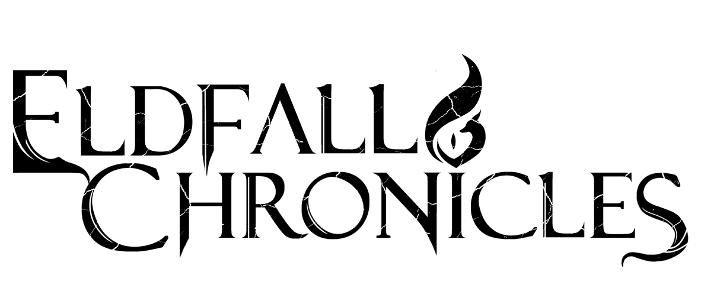

######## A Skirmish Miniatures Wargame

######### Core Rules v1.6

> Created by Freecompany d.o.o.

1

###  TABLE OF CONTENTS

[FOREWORD 4](#foreword)

[INTRODUCTION 5](#introduction)

CORE GAME ELEMENTS. 6

MODELS 6

MODEL PROFILES 6

DICE ROLLS 17

[ATTRIBUTE ROLL 17](#_TOC_250007)

[ATTACK ROLL 17](#_TOC_250006)

[DAMAGE ROLL 17](#_TOC_250005)

[REROLL 17](#_TOC_250004)

[MODIFIERS 18](#_TOC_250003)

DISTANCE & MEASUREMENT 18

MODES OF MEASURING 18

BASE CONTACT 19

[MOVEMENT 20](#_TOC_250002)

GENERAL RULES OF 20

MOVEMENT 20

LINE OF SIGHT 20

AWARENESS 22

STATES 22

ACTIONS 22

ACTIVATION POINTS 23

ACTIVE & REACTIVE ROLE 24

REACH (RCH) 24

CASTING AURA 24

TEMPLATES & AoE 25

TEMPLATE KINDS &

PLACEMENT 25

STRIKES & HITS 26

STRIKES & TEMPLATES 27

CRITICAL HIT 27

CONFRONTATION 28

CONFRONTATION ROLL 28

DAMAGE & WOUNDS 28

FALL DAMAGE 29

SPELLS & MAGIC 30

MANA COUNTERS 30

THE 5 TYPES OF SPELLS 30

PLAYING THE GAME 33

GAME SETUP 33

QUEST SELECTION 33

DETERMINE THE GAME SIZE . 33 CREATING A PARTY 33

LEADER 34

UPGRADES 34

FIELD SETUP 34

[PLAYER COUNT 35](#_TOC_250001)

FORMAT OF PLAY 35

INITIATIVE CHECK 36

DEPLOYMENT 36

GAME SEQUENCE 37

TURN PHASE 38

ACTIVE PLAYER 38

REACTIVE PLAYER 38

[TACTICAL PHASE 39](#_TOC_250000)

ACTIVATION SEQUENCE 39

1)  ACTIVATION STEP 39

2)  MOVEMENT STEP 39

3)  REACTION STEP 40

REACTION 40

ATTACK OF OPPORTUNITY 40

REACTION AGAINST SHROUDED OR FLYING MODELS 41

4)  ACTION STEP 41

5)  RESOLUTION STEP 42

HOSTILES 43

TURN ORDER OF HOSTILES 43

2

> HOSTILE TURN 44
>
> RULES IN GENERAL EFFECT 47
>
> ADVANCED RULES 47
>
> BROKEN MORALE 47
>
> CHARACTERS 47
>
> END OF THE GAME 47
>
> FRIENDLY FIRE 47
>
> MONSTER FACTIONS 48
>
> NEWER EDITIONS OF THE GAME’S RULES 48
>
> PRIORITY OVER THE
>
> CORE RULES 48
>
> RECOVERY CHECK 48
>
> LIST OF MOVEMENT 49
>
> NORMAL MOVEMENT 49
>
> IDLE 49
>
> SPECIAL MOVEMENT 49
>
> CLIMB 49
>
> WALK 49
>
> JUMP 50
>
> RUN 50
>
> LIST OF ACTIONS 51
>
> NORMAL ACTIONS 51
>
> ASSIST 51
>
> ATTACK 51
>
> MELEE ATTACK 52
>
> RANGED ATTACK 53
>
> DEATH BLOW 55
>
> DODGE 55
>
> INTERACT 56
>
> NOTHING 56
>
> PERCEIVE 56
>
> TRADE 56
>
> SPECIAL ACTIONS 57
>
> ISSUE A DUEL 57
>
> RITUAL 58
>
> UNCOVER 58
>
> STATES 59
>
> CLASSES 63
>
> SKILLS 65
>
> TRAITS 68
>
> COMBAT ARTS 73
>
> ENVIRONMENTS 74
>
> ENVIRONMENT TYPES 74
>
> MOUNTED RULES 77
>
> SETTING UP YOUR
>
> FIELD 79
>
> SCHEMES 80
>
> UPGRADES 86
>
> SAMPLE QUESTS 94
>
> USEFUL TIPS 99
>
> GLOSSARY 100
>
> MAJOR FACTIONS &
>
> PLAY-STYLES 102
>
> WHAT NEXT? 104
>
> INDEX 107

######### 3

#  Foreword 

> Welcome to Eldfall Chronicles, a skirmish game set in the fantastical world of Calad. Here, players lead bands of adventurers on dangerous quests in pursuit of glory, treasure, and their own ambitions. Handpicked individuals from across the realms come together to forge stories of conflict and discovery.
>
> Whether facing one another in tactical skirmishes or joining forces against the game itself, players must rely on skill and cunning to overcome the challenges ahead. Victory belongs not only to the strongest force, but to the player who best adapts to the unfolding battle.
>
> Before each game, players agree on a quest and a point limit, then recruit, equip, and customize their party from a wide range of models and upgrades. Once warbands are assembled and the battlefield prepared, initiative determines the order of deployment and play, and the
>
> battle begins.
>
> At the heart of Eldfall Chronicles lies a dynamic system of activations and reactions. As the active player directs their models across the battlefield, opponents can react to their movements, disrupting plans, seizing opportunities, and turning even the simplest maneuver into a tense encounter. Every decision matters, from positioning to choosing when to commit to combat or press on toward an objective.
>
> The rules that follow contain everything needed to play Eldfall Chronicles skirmish wargame. We encourage you to read through them to familiarize yourself with the game’s unique flow and mechanics before embarking on your first quest.
>
> The adventure does not end on the skirmish battlefield. Be sure to explore the Dungeon Crawl mode of Eldfall Chronicles, where unlikely heroes embark on perilous journeys shaped by player choice. Narrative
>
> progression, ancient secrets, and legendary foes await those bold enough to carve their own path through the Chronicles.

######### 4

#  Introduction 

> Eldfall Chronicles – Skirmish Miniatures Wargame is a tactical tabletop game focused on small warband battles. Each player commands a compact force of adventurers—typically 3 to 6 models—undertaking quest-driven scenarios.
>
> Rival factions compete for dominance across the world of Calad. Explore their lore, discover their unique playstyles, and choose the one you will lead.
>
> Play competitively, cooperatively, or solo.
>
> Monsters, as well as other models, can use Hostile Behavior rules, allowing you to play against the game itself.
>
> The game features dynamic, reactive combat where every action can be answered, keeping both players constantly engaged. Games are fast-paced and balanced, designed for both new and experienced players, with most matches lasting 30–60 minutes.
>
> Battlefields can be set up in any style, though tournament
>
> games are typically played on a 3’ × 3’ area.
>
> The Skirmish Wargame is ideal for competitive 1v1 play. Each season features its own leaderboards and evolving competitive Quests.

5

> **CORE GAME ELEMENTS**

Core Game Elements

> **MODELS**
>
> **MODEL PROFILES**
>
> A model is an individual entity with its own profile and is represented by a miniature or a token on the field.
>
> Models represent the individuals and adventurers that have roles or professions in the world of Eldfall Chronicles. Every model (miniature and its profile) has unique characteristics, pros and cons, skills, weapons, synergies with other party members, fighting styles etc. They are indispensable party members, bringing unique elements to the table; each one is suited to different tasks, excels in different situations and allows different approaches.
>
> A model profile indicates capabilities of the model it represents, its stats, attributes and abilities. The model profiles are displayed on the cards like the ones on pages 7 and 12.
>
> Below is an example of a profile card
>
> with the basic attributes explained.
>
> The numbers floating over certain areas on the sample profile cards point to specific information, explained in related segments on pages 7-16.
>
> A Companion App called **Guild Hall** is available on our webpage, making it easy to look up model profiles and related information.

######### 6

> **CORE GAME ELEMENTS**

Front oF thE CArd

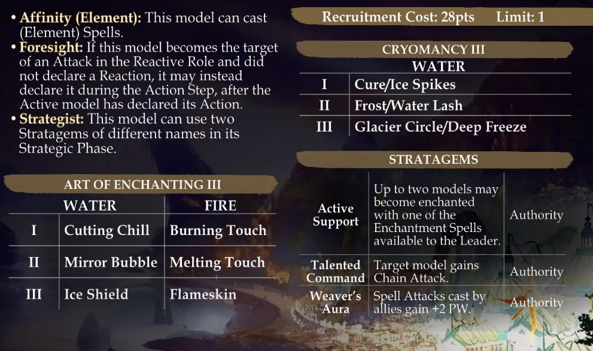

######### 7

> **CORE GAME ELEMENTS**

**1: NAME**

> The name of the model.
>
> **2: CLASS**
>
> Each model is assigned at least one Class, which, to an extent, defines its role on the field.
>
> (See page 63 for list of Classes.)
>
> **3: ATTRIBUTES**
>
> Attributes define a model’s default capabilities, also referred to as “stats”. The likelihood of a dice roll success, used to simulate various Actions performed by the model,
>
> is primarily based on the model’s attribute value.
>
> **Attribute MeAning**
>
> **StA (StAMinA)**
>
> Indicates the default number of Activation Points a model receives at the beginning of its every turn and how swiftly it can wield certain Items.
>
> **SPD (SPeeD)**
>
> Indicates the default distance that a model can cross on the field when moving, indicating up to how many inches on the field the model can move.
>
> **ArM (ArMor)**
>
> Indicates the default amount of natural or artificial protection the model has
>
> in order to cope with the received Power of a Hit.
>
> **HP (HeAltH PointS)**
>
> Indicates the default health of a model, or in other words, how many Wounds it can withstand before becoming Incapacitated.
>
> **oFF (oFFenSe)**
>
> Indicates a model’s default capability when making a Melee Attack in its Active Role.
>
> **DeF (DeFenSe)**
>
> Indicates a model’s default capability when making a Melee Attack in its Reactive Role.
>
> **ACC (ACCurACy)**
>
> Indicates a model’s default capability with ranged projectile Weapons used when performing Ranged Attacks.
>
> **int (intelleCt)**
>
> Indicates a model’s default mental dexterity and often its capability of casting Spells and perceiving its surroundings.
>
> **Ag (Agility)**
>
> Indicates a model’s default physical nimbleness and kinesthetic capability used when avoiding incoming Attacks (with Dodge) and escaping certain dangers.
>
> **t (tougHneSS)**
>
> Indicates a model’s default physical strength and endurance.
>
> **M (MorAle)**
>
> Indicates a model’s default mental fortitude.

######### 8

> **4: SIZE**
>
> Indicates the model’s volume on the field. Size value is represented by the corresponding Hitbox (size shown in mm below - images are not true to scale). The sizes of models, from the smallest to the largest, are categorized in the following order:
>
> Small (S) (25mmx25mm)
>
> \< Medium (M) (32mmx45mm)
>
> \< Large (L) (40mmx45mm)
>
> \< Huge (H) (50mmx50mm)
>
> \< Gigantic (G) (60mmx60mm)
>
> \< Colossal (C) (80mmx80mm)
>
> \< Monstrous/Epic (E) (100mmx100mm)
>
> **Hitbox AnD Size**
>
> Every model in the game has a Hitbox of a certain Size assigned to it. As miniatures come stylized in various forms and poses, the Hitboxes are
>
> a standardized indicator used to determine the model’s height and volume on the field.
>
> The Hitbox’s volume is cylindrical, of the same width as the model’s base and the height defined by its Size.
>
> A model’s Size is important when determining where the model is. And in determining if and how it can move across narrow spaces, elevation, etc. More importantly, the Hitbox plays the biggest factor when drawing Line of Sight *(See page 20)*.
>
> Hint: When in doubt, after the Movement or Action was declared, a player can substitute the selected model with a Hitbox
>
> -e.g. cutout- of the corresponding Size (displayed on the model’s profile), in order to confirm the validity of Movement, Line of Sight, possibility of an Attack, etc.
>
> 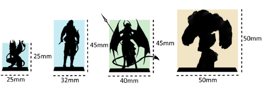
>
> **CORE GAME ELEMENTS**

**5: RECRUITMENT COST**

> The amount of Recruitment Points (RP) a player has to spend to recruit the model when creating a Party.
>
> **6: LIMIT**
>
> Indicates how many models of the same profile can be recruited into a single Party.
>
> **7: TRAITS**
>
> Traits are **passive abilities** that are always in effect while the model
>
> is present on the field. They are explained on the back of the profile card most of the time. (See list on page 68 and online.)
>
> A Trait is applied to the model, its Actions and Movement automatically at all times.
>
> A Trait’s effect cannot be disregarded volitionally.
>
> Some Traits can have more than one level. The level of a Trait is represented by the roman numerals next to the name of the Trait. It **grants the effect of all lower levels** of the same Trait to the model –
>
> the effects of Traits with multiple levels **stack**.

######### 9

> **CORE GAME ELEMENTS**

If there is no roman numeral next to the Trait, it is considered as level I.

> Sometimes an Ability, Item or Spell can have a Trait. Any Hits or Wounds caused by such an Ability,
>
> Item or Spell will also have this Trait.
>
> Oni Clans Faction Starter
>
> **8: SKILLS**
>
> Skills are **optional abilities** a model can use and benefit from in certain situations. They are explained on the back of the profile card most of the time. (See list on page 65 and online.)

<table style="width:42%;">
<colgroup>
<col style="width: 41%" />
</colgroup>
<thead>
<tr>
<th><blockquote>

Example 1: A model that has Resourceful II can automatically benefit from the Resourceful I effect in addition to the effect granted by Resourceful II.

Example 2: A model suffers a Wound that was inflicted by a Greatsword. Greatsword has the Bleed Trait which further causes the wounded model to enter the Bleeding State.

</blockquote></th>
</tr>
</thead>
<tbody>
</tbody>
</table>

A model **cannot** use the same Skill

> **more than once** per Activation. Some Skills can have more than one level. The level of a Skill is represented by the roman numerals next to the name of the Skill. It automatically **grants access to**
>
> **all lower levels** of the Skill to the User – the effects of Skills with multiple levels **stack**. If there is no roman numeral next to the Skill, it is considered as level I.

<table style="width:41%;">
<colgroup>
<col style="width: 41%" />
</colgroup>
<thead>
<tr>
<th><blockquote>

Example: A model that has Stealth II can automatically benefit from the Stealth I effect in addition to the effect granted by Stealth II.

</blockquote></th>
</tr>
</thead>
<tbody>
</tbody>
</table>

10

10

> **CORE GAME ELEMENTS**

**9: COMBAT ARTS**

> Combat Arts display a form of combat the model excels in and in which it developed a certain level of mastery.
>
> Some models have access to a variety of combat abilities organized into Combat Arts charts. (See list on page
>
> 73 and online.) Combat Arts consist of levels, where the model has access to all levels up to the model’s listed level of that Combat Art.
>
> If a model has access to **several Combat Arts**, it may **select only one** at a time. Moreover, a model can add the **effect of only one** of the Combat Art **levels** to its Attack.

<table style="width:42%;">
<colgroup>
<col style="width: 41%" />
</colgroup>
<thead>
<tr>
<th><blockquote>

Example 1: A model that has Resourceful II can automatically benefit from the Resourceful I effect in addition to the effect granted by Resourceful II.

Example 2: A model suffers a Wound that was inflicted by a Greatsword. Greatsword has the Bleed Trait which further causes the wounded model to enter the Bleeding State.

</blockquote></th>
</tr>
</thead>
<tbody>
</tbody>
</table>

<table style="width:42%;">
<colgroup>
<col style="width: 6%" />
<col style="width: 35%" />
<col style="width: 0%" />
</colgroup>
<thead>
<tr>
<th colspan="3" style="text-align: center;"><blockquote>

Example 3: Fencing III - Selected level’s effect is applied to this model’s Melee Attack.

</blockquote></th>
</tr>
</thead>
<tbody>
<tr>
<td style="text-align: center;"><blockquote>

I

</blockquote></td>
<td colspan="2"><blockquote>

Masterful Parry: Target’s Melee Attack suffers

-3 modifier.

</blockquote></td>
</tr>
<tr>
<td style="text-align: center;"><blockquote>

II

</blockquote></td>
<td colspan="2"><blockquote>

Harsh Riposte: Target’s Melee Attack suffers -1 Strike.

</blockquote></td>
</tr>
<tr>
<td style="text-align: center;"><blockquote>

III

</blockquote></td>
<td colspan="2"><blockquote>

Second Wind: User’s Melee Attack gains +1 Strike.

</blockquote></td>
</tr>
<tr>
<td style="text-align: center;"><blockquote>

IV

</blockquote></td>
<td colspan="2"><blockquote>

Grapple &amp; Thrash: User’s Melee Attack gains Knockdown.

</blockquote></td>
</tr>
<tr>
<td style="text-align: center;"><blockquote>

V

</blockquote></td>
<td colspan="2"><blockquote>

Striking the Gaps: User’s Melee Attack gains Ignore Armor.

</blockquote></td>
</tr>
<tr>
<td colspan="3" style="text-align: center;"></td>
</tr>
<tr>
<td colspan="2" style="text-align: center;"><blockquote>

Example 4: Fencing V - Selected level’s effect is applied to this model’s Melee Attack.

</blockquote></td>
<td></td>
</tr>
<tr>
<td style="text-align: center;"><blockquote>

I

</blockquote></td>
<td><blockquote>

Masterful Parry: Target’s Melee Attack suffers

-3 modifier.

</blockquote></td>
<td></td>
</tr>
<tr>
<td style="text-align: center;"><blockquote>

II

</blockquote></td>
<td><blockquote>

Harsh Riposte: Target’s Melee Attack suffers -1 Strike.

</blockquote></td>
<td></td>
</tr>
<tr>
<td style="text-align: center;"><blockquote>

III

</blockquote></td>
<td><blockquote>

Second Wind: User’s Melee Attack gains +1 Strike.

</blockquote></td>
<td></td>
</tr>
<tr>
<td style="text-align: center;"><blockquote>

IV

</blockquote></td>
<td><blockquote>

Grapple &amp; Thrash: User’s Melee Attack gains Knockdown.

</blockquote></td>
<td></td>
</tr>
<tr>
<td style="text-align: center;"><blockquote>

V

</blockquote></td>
<td><blockquote>

<strong>Striking the Gaps:</strong> User’s Melee Attack gains Ignore Armor.

</blockquote></td>
<td></td>
</tr>
<tr>
<td colspan="2" style="text-align: center;"></td>
<td></td>
</tr>
</tbody>
</table>

> **10: SPELLCRAFT**
>
> Some models have access to a variety of individual Spells, or Spells organized into Spellcraft charts.
>
> *(See Spellbook document online.)* Similarly to Combat Art charts, Spellcrafts consist of levels, where the model has access to all levels up to the
>
> model’s listed level of that Spellcraft. However, it can only cast Spells of the same **Element** as it has access to *(see Spells & Magic, page 30)*.

<table style="width:42%;">
<colgroup>
<col style="width: 41%" />
</colgroup>
<thead>
<tr>
<th><blockquote>

Example: A model has the Art of Sorcery III listed in the Spellcraft section and Affinity (Fire) under its Traits. Therefore, it can

cast Spells of level III or lower from the Art of Sorcery chart, but only those of the Fire Element.

</blockquote></th>
</tr>
</thead>
<tbody>
</tbody>
</table>

> **11: SPECIAL**
>
> Some models have unique abilities displayed in this section.

######### 11

> **CORE GAME ELEMENTS**

Front oF thE CArd

> 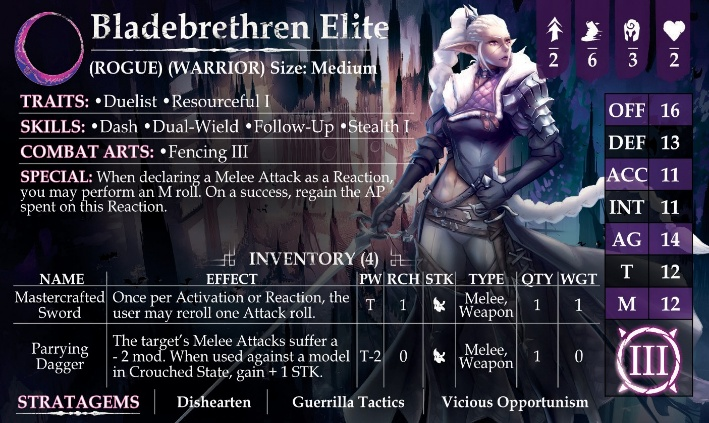

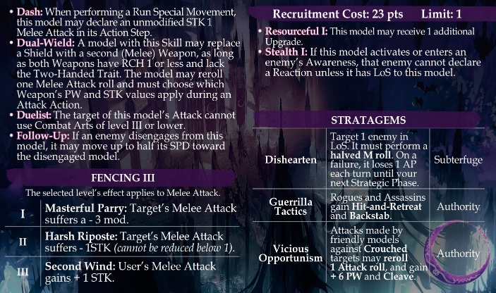

> **12: STRATAGEMS**
>
> Stratagems are Abilities only the **Leader of a Party** *(see page 34)* may use during their Strategic Phase. If the Leader becomes Incapacitated or Dead (States), that Party can no longer use Stratagems. During their Strategic Phase, a player may
>
> select **1 Stratagem** and apply its effect.
>
> If the player does not specify what Stratagem the Leader is using, the default is the one listed highest in the Leader’s Stratagem chart.
>
> Available Stratagems can be found on the Model Profile of the selected Leader.
>
> There are two types of Stratagems. **Authority Stratagems** affect models in your Party. **Subterfuge Stratagems** affect enemy models (models of your opponent’s Party).
>
> Unless specified otherwise,
>
> after a Stratagem is applied, its effect lasts until the player’s next Strategic Phase.
>
> Stratagems have infinite Reach.
>
> Models of your Party without the same Affiliation as the Leader cannot benefit from that Leader’s Authority Stratagems.

######### 12

> **13: INVENTORY (X)**
>
> It represents the available space a model has for carrying Items. The value X represents the total weight or number of Items a model can carry on itself.
>
> If the total Quantity or total Weight of Items in the model’s Inventory **exceeds the X value**, the model becomes over- encumbered and **may not perform any Movement or Special Action**.
>
> If an Item has “/” marked as its Quantity and Weight, it fills no space in the model’s Inventory.
>
> When a model activates *(see Activation Step, page 39)*, it may drop any number of Items, except its default Items. If the
>
> 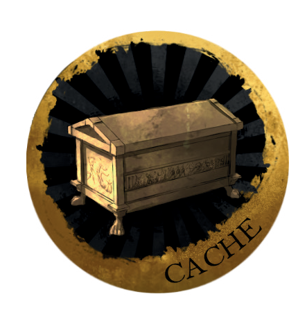Items are dropped, they are represented by a Cache/Loot token and are placed in Base Contact with the model that dropped them. A model may pick up the Items by Interacting with the Catche/Loot token.
>
> **14: ITEMS**
>
> **CORE GAME ELEMENTS**

Items grant models various abilities.

> A model can only have one Item from each Item Category equipped at a time.
>
> A model may equip or unequip Items once per Activation (or Reaction).
>
> If the player does not specify what a model has equipped and the model has multiple Items of the same category in its Inventory, the default equipped Item (of each category)
>
> is the one listed highest in the Inventory - the **Primary Weapon**.
>
> Note: unless somehow removed, the Items that are already in the model’s Inventory have to be included
>
> when calculating the total Weight and Quantity.
>
> QTY (Quantity): indicates the amount of an Item a model has in its Inventory.
>
> WGT (Weight): indicates the heaviness of a single Item in the model’s Inventory (or how
>
> cumbersome it is to carry around). Note that Weight is multiplied with Quantity when checking the total Weight of Items in the model’s Inventory, unless the Weight of an Item is 0. (Then only Quantity counts towards Total Weight).

######### 13

> **CORE GAME ELEMENTS**

**ITEMS ARE DIVIDED INTO 4 CATEGORIES DEPENDING ON THEIR APPLICATION AND EFFECT:**

> **WeAPon CAtegorieS**
>
> **WeAPonS**
>
> Weapons give an Attack the specified amount of Reach (RCH), Strike (STK),
>
> Power (PW), and effects when equipped.
>
> **SHielDS**
>
> Shields provide a **passive** effect when equipped. A model may choose to use an equipped Shield to perform an **Attack** instead of a Weapon, Spell or another Item (more on this in the Melee Attack section, *page 52*).
>
> **ACCeSSory**
>
> Accessories provide a **passive** effect when equipped. You do not need to unequip other Items to use an Accessory.
>
> **ConSuMAbleS**
>
> After use, no matter if the Action was successful or not, the Consumable Item must be **discarded** from the model’s Inventory. A model may use **only one Consumable of the same name** at a time. You do not need to unequip other Items to use a Consumable.
>
> Note: Some Items have Traits listed under their effects. Depending on a particular Trait, some might dictate the Item’s usage, while others affect targets when the Item is used.
>
> Note: Unless an Item has the Two-Handed Trait, it is used in one hand.
>
> Note: If a model has a Two-Handed Weapon listed highest in the model’s Inventory, while the Shield is listed second, the model will have the Two-Handed Weapon equipped and thus Shield unequipped.
>
> Example: The Throwing Trait on an Item means that such an Item can be used to perform a Ranged Attack, while the Bleed Trait forces a wounded target into the Bleeding State, etc.
>
> **EXAMPLES OF ITEMS AND THEIR PROFILES**
>
> **WeAPon 1:**

<table style="width:88%;">
<colgroup>
<col style="width: 12%" />
<col style="width: 15%" />
<col style="width: 10%" />
<col style="width: 11%" />
<col style="width: 8%" />
<col style="width: 11%" />
<col style="width: 8%" />
<col style="width: 9%" />
</colgroup>
<thead>
<tr>
<th><blockquote>

NAME

</blockquote></th>
<th style="text-align: center;"><blockquote>

EFFECT

</blockquote></th>
<th style="text-align: center;"><blockquote>

PW

</blockquote></th>
<th style="text-align: center;"><blockquote>

RCH

</blockquote></th>
<th><blockquote>

STK

</blockquote></th>
<th><blockquote>

TYPE

</blockquote></th>
<th style="text-align: center;"><blockquote>

QTY

</blockquote></th>
<th style="text-align: center;"><blockquote>

WGT

</blockquote></th>
</tr>
</thead>
<tbody>
<tr>
<td><blockquote>

Sword

</blockquote></td>
<td style="text-align: center;">-</td>
<td style="text-align: center;"><blockquote>

T

</blockquote></td>
<td style="text-align: center;"><blockquote>

1”

</blockquote></td>
<td><blockquote>

</blockquote></td>
<td><blockquote>

Melee, Weapon

</blockquote></td>
<td style="text-align: center;">1</td>
<td style="text-align: center;">1</td>
</tr>
</tbody>
</table>

> The Sword is a Weapon which can be used to perform Melee Attacks. It has no particular effect, with Power equal to the wearer’s Toughness, capable of hitting targets up to 1’’ away, and has an amount of Strikes equal to the wearer’s Stamina. In this case, Quantity and Weight imposed on the wearer’s Inventory is 1. *(More on Melee Attacks on page 52.)*

######### 14

> **CORE GAME ELEMENTS**

**WeAPon 2:**

<table style="width:88%;">
<colgroup>
<col style="width: 13%" />
<col style="width: 17%" />
<col style="width: 7%" />
<col style="width: 13%" />
<col style="width: 8%" />
<col style="width: 11%" />
<col style="width: 8%" />
<col style="width: 8%" />
</colgroup>
<thead>
<tr>
<th style="text-align: center;"><blockquote>

NAME

</blockquote></th>
<th style="text-align: center;"><blockquote>

EFFECT

</blockquote></th>
<th style="text-align: center;"><blockquote>

PW

</blockquote></th>
<th><blockquote>

RCH

</blockquote></th>
<th><blockquote>

STK

</blockquote></th>
<th><blockquote>

TYPE

</blockquote></th>
<th style="text-align: center;"><blockquote>

QTY

</blockquote></th>
<th style="text-align: center;"><blockquote>

WGT

</blockquote></th>
</tr>
</thead>
<tbody>
<tr>
<td style="text-align: center;"><blockquote>

Short Bow

</blockquote></td>
<td style="text-align: center;"><blockquote>

Two-Handed

</blockquote></td>
<td style="text-align: center;">T</td>
<td><blockquote>

0-20”: 0

21-40”: -6

</blockquote></td>
<td><blockquote>

</blockquote></td>
<td><blockquote>

Melee, Ranged

</blockquote></td>
<td style="text-align: center;"><blockquote>

1

</blockquote></td>
<td style="text-align: center;"><blockquote>

2

</blockquote></td>
</tr>
</tbody>
</table>

> In terms of damage, the Short Bow is similar to the Sword. However, unlike the Sword, the Short Bow is a Ranged Weapon, thus it can be used for Ranged Attacks. It has a Trait listed under its effects. Ranged Weapon’s Reach is different from other types of Weapons, as it displays sets of intervals with their respective modifiers imposed on the model’s Accuracy. The Short Bow is capable of attacking targets up to 40 inches away, but will impose a -6 negative modifier to the user’s Accuracy when shooting at targets that are more than 20 inches away. Its Strike is equal to the wearer’s Stamina 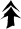. While its quantity is 1, the bow and its arrows take up a bit more of the model’s Inventory, thus its Weight is 2. *(More on Ranged Attack on page 53.)*
>
> **ACCeSSory:**

<table style="width:88%;">
<colgroup>
<col style="width: 13%" />
<col style="width: 20%" />
<col style="width: 6%" />
<col style="width: 8%" />
<col style="width: 7%" />
<col style="width: 14%" />
<col style="width: 8%" />
<col style="width: 8%" />
</colgroup>
<thead>
<tr>
<th style="text-align: center;"><blockquote>

NAME

</blockquote></th>
<th><blockquote>

EFFECT

</blockquote></th>
<th style="text-align: center;"><blockquote>

PW

</blockquote></th>
<th style="text-align: center;"><blockquote>

RCH

</blockquote></th>
<th style="text-align: center;"><blockquote>

STK

</blockquote></th>
<th style="text-align: center;"><blockquote>

TYPE

</blockquote></th>
<th><blockquote>

QTY

</blockquote></th>
<th style="text-align: center;"><blockquote>

WGT

</blockquote></th>
</tr>
</thead>
<tbody>
<tr>
<td style="text-align: center;"><blockquote>

Staff

of Sorceries

</blockquote></td>
<td><blockquote>

+1 Strike when casting Sorceries.

</blockquote></td>
<td>-</td>
<td>-</td>
<td>-</td>
<td><blockquote>

Accessory

</blockquote></td>
<td>1</td>
<td>2</td>
</tr>
</tbody>
</table>

> Staff of Sorceries is an Accessory. While it has no particular Power, Reach or Strike value, it grants its effect to the wearer as long as it is equipped.
>
> **SHielD:**

<table style="width:88%;">
<colgroup>
<col style="width: 12%" />
<col style="width: 20%" />
<col style="width: 8%" />
<col style="width: 8%" />
<col style="width: 7%" />
<col style="width: 11%" />
<col style="width: 9%" />
<col style="width: 9%" />
</colgroup>
<thead>
<tr>
<th><blockquote>

NAME

</blockquote></th>
<th><blockquote>

EFFECT

</blockquote></th>
<th style="text-align: center;"><blockquote>

PW

</blockquote></th>
<th><blockquote>

RCH

</blockquote></th>
<th style="text-align: center;"><blockquote>

STK

</blockquote></th>
<th><blockquote>

TYPE

</blockquote></th>
<th style="text-align: center;"><blockquote>

QTY

</blockquote></th>
<th style="text-align: center;"><blockquote>

WGT

</blockquote></th>
</tr>
</thead>
<tbody>
<tr>
<td>Shield</td>
<td><blockquote>

-3 to incoming Melee Attacks to the Front, +3 ARM against Ranged Attacks to the Front.

</blockquote></td>
<td>-</td>
<td><blockquote>

0”

</blockquote></td>
<td>-</td>
<td><blockquote>

Melee, Shield

</blockquote></td>
<td>1</td>
<td>2</td>
</tr>
</tbody>
</table>

> As defined in the rules above, when the wearer has a shield equipped, it automatically becomes affected by its effect. Therefore, any frontal Melee Attack towards the wearer will suffer a -3 modifier (namely to its Offense or Defense). In addition, the wearer will also have +3 Armor when dealing with frontal Ranged Attacks. Instead of attacking with a Weapon, the wearer may also attempt to perform a Shield Bash, damaging and knocking back the target. Note that in order to effectively use the Shield for a Melee Attack, the wearer should be in Base Contact with the target, as its Reach is 0’’.

######### 15

> **CORE GAME ELEMENTS**

**ConSuMAble:**

<table style="width:88%;">
<colgroup>
<col style="width: 13%" />
<col style="width: 14%" />
<col style="width: 6%" />
<col style="width: 13%" />
<col style="width: 7%" />
<col style="width: 16%" />
<col style="width: 7%" />
<col style="width: 7%" />
</colgroup>
<thead>
<tr>
<th style="text-align: center;"><blockquote>

NAME

</blockquote></th>
<th style="text-align: center;"><blockquote>

EFFECT

</blockquote></th>
<th><blockquote>

PW

</blockquote></th>
<th><blockquote>

RCH

</blockquote></th>
<th style="text-align: center;"><blockquote>

STK

</blockquote></th>
<th><blockquote>

TYPE

</blockquote></th>
<th style="text-align: center;"><blockquote>

QTY

</blockquote></th>
<th style="text-align: center;"><blockquote>

WGT

</blockquote></th>
</tr>
</thead>
<tbody>
<tr>
<td style="text-align: center;"><blockquote>

Grapeshot

</blockquote></td>
<td style="text-align: center;"><blockquote>

Targetless.

</blockquote></td>
<td><blockquote>

12

</blockquote></td>
<td><blockquote>

T, AoE:

Circular L

</blockquote></td>
<td style="text-align: center;">1</td>
<td><blockquote>

Ranged, Consumable

</blockquote></td>
<td style="text-align: center;">3</td>
<td style="text-align: center;">0</td>
</tr>
</tbody>
</table>

> Grapeshot is a bomb, a Consumable. It has Reach equal to the user’s Toughness and has an Area of Effect of a large circular template. When using it for a Ranged Attack, the Targetless Trait allows the user to target any area on the field within its Reach (model’s Toughness), while the AoE: Circular L will affect any model inside the Large Circular template, centered on the targeted area. Affected models suffer a Hit with Power 12 if the Grapeshot lands successfully (or if they somehow failed to avoid the impact).
>
> **15: AFFILIATION**
>
> Affiliation is indicated by a banner or crest on the model’s profile, displaying the
>
> factions to which this model may be recruited and to which it belongs.
>
> Models with **Neutral Affiliation can be recruited into any faction** (see “Neutral” banner below). Some models have a split banner or two crests, signifying two different factions, meaning that the model can be recruited into both factions. If one half represents the Neutral faction, it means that the model can be recruited by any faction as a neutral model, while it originally belongs to the other displayed faction (where it is recruited as a model of that faction).
>
> Note that the banners and/or crests always represent the affiliation of the related faction, even in other documents and on cards, such as the Upgrade, Hostile Behavior (AI), and Scheme cards.
>
>  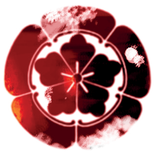 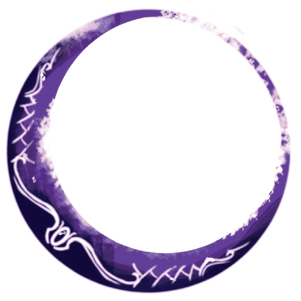 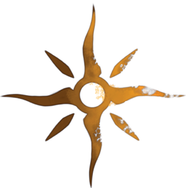
>
> **SAnD KingDoMS**
>
> **eMPire oF SogA**
>
> **CoAlition oF**
>
> **tHenion**
>
> **HeliAn leAgue**
>
> 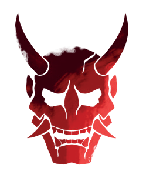 
>
> 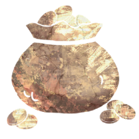**oni goblin**

######### 16

> **otHer exAMPle: WAter, eArtH eleMent (CreAtureS)**
>
> **DICE ROLLS**
>
> Whenever a model performs an Action *(Attack, Dodge, etc.)* that would require a roll, the player determines the success or fail of the Action
>
> by performing the corresponding dice rolls. Rolls are performed with 20-sided dice (D20).
>
> **ATTRIBUTE ROLL**

<table style="width:42%;">
<colgroup>
<col style="width: 41%" />
</colgroup>
<thead>
<tr>
<th><blockquote>

Example 1: In order to perform a successful Agility roll to Dodge an incoming Attack, the result of the dice roll should be equal to or lower than the modified AG attribute.

Example 2: Onitaoshi has AG 10, but suffers a negative modifier -3, which makes her modified AG 7. Onitaoshi has to roll 7 or less to successfully Dodge. <em>(More on modifiers on page 18.)</em>

</blockquote></th>
</tr>
</thead>
<tbody>
</tbody>
</table>

In order to perform a successful Attribute roll, the result of the dice roll should be **equal to or lower** than the modified attribute.

> **ATTACK ROLL**
>
> Each die rolled as part of an Attack is an Attack roll. A model rolls a number of Attack rolls equal to its Strike (STK).
>
> An Attack roll is successful if its result is equal to or lower than the modified attribute used for the Attack and it was not canceled during a Confrontation.
>
> Each successful Attack roll generates one Hit. A Hit requires the attacker to make a Damage roll.
>
> \
> **DAMAGE ROLL**
>
> **CORE GAME ELEMENTS**

To perform a Damage roll, roll a number of dice equal to the number of Hits.

> 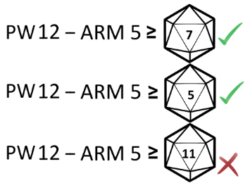For each die result that is **equal to or lower** than the **Power (PW)** of the used Weapon **minus the target’s Armor (ARM)** value, the target suffers one Wound.

<table style="width:42%;">
<colgroup>
<col style="width: 41%" />
</colgroup>
<thead>
<tr>
<th><blockquote>

Example: A Damage roll performed using the target model's Armor attribute with the received Hit’s Power =12. The example rolls with green check marks are successful Damage rolls that cause Wounds.

_ 5

</blockquote></th>
</tr>
</thead>
<tbody>
</tbody>
</table>

> **REROLL**
>
> After the dice are rolled, the player may reroll a selected number of dice (depending on the ability), completely negating their previous roll result.
>
> Note: Reroll is granted by certain abilities.

<figure>
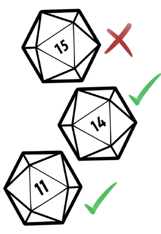
</figure>

<table style="width:11%;">
<colgroup>
<col style="width: 6%" />
<col style="width: 4%" />
</colgroup>
<thead>
<tr>
<th><blockquote>

OFF

</blockquote></th>
<th style="text-align: center;"><blockquote>

14

</blockquote></th>
</tr>
</thead>
<tbody>
<tr>
<td><blockquote>

DEF

</blockquote></td>
<td style="text-align: center;"><blockquote>

10

</blockquote></td>
</tr>
<tr>
<td><blockquote>

ACC

</blockquote></td>
<td style="text-align: center;"><blockquote>

8

</blockquote></td>
</tr>
<tr>
<td><blockquote>

INT

</blockquote></td>
<td style="text-align: center;"><blockquote>

10

</blockquote></td>
</tr>
<tr>
<td><blockquote>

AG

</blockquote></td>
<td style="text-align: center;"><blockquote>

10

</blockquote></td>
</tr>
<tr>
<td style="text-align: center;"><blockquote>

T

</blockquote></td>
<td style="text-align: center;"><blockquote>

13

</blockquote></td>
</tr>
<tr>
<td><blockquote>

M

</blockquote></td>
<td style="text-align: center;"><blockquote>

17

</blockquote></td>
</tr>
</tbody>
</table>

######### 17

> **MODIFIERS**
>
> **CORE GAME ELEMENTS**

Modifiers alter a model’s attribute and affect the outcome of dice roll results. Modifiers are numbers that are added to or subtracted from the model’s default attribute value. (Example: various Abilities, Items, Spells, Stratagems etc. may modify attributes.) All applicable bonuses and penalties stack and are applied cumulatively.

> They are applied **after the Action** has been declared and **before the rolls** are performed.
>
> If modifiers reduce an attribute to a **0**, the Action will result in an automatic **failure** (except for Damage rolls). An attribute cannot be modified below 0 (it cannot be negative). If an attribute
>
> is **increased over 20**, the roll result of **20**
>
> becomes a **Critical Hit**.
>
> When a halving or doubling modifier would be applied, the player **first subtracts or adds other modifiers**
>
> (if there are any) and **then halves or doubles** the modified attribute, **rounding it up**.
>
> Note: If an attribute is halved or doubled multiple times, the player rounds up after each instance of halving or doubling.
>
> If a roll would be both halved and doubled, the two modifiers cancel each other out.

<table style="width:42%;">
<colgroup>
<col style="width: 41%" />
</colgroup>
<thead>
<tr>
<th><blockquote>

Example: A model performs

an Attack roll using the Offence attribute, but suffers a -3 Attack modifier:

<strong>-3</strong>

</blockquote></th>
</tr>
</thead>
<tbody>
</tbody>
</table>

> **DISTANCE & MEASUREMENT**

During the game, all distances are measured in inches. To check the validity of Actions, Reach,

> Movement, modifiers, and similar, distances are normally measured **after** the relevant Movement, Action, or Reaction has been declared.
>
> **Pre-MeASuring**
>
> By agreement, players may pre-measure distances before
>
> declaring a Movement or Action/ Reaction, depending on the chosen measuring mode.
>
> The distance between models is measured in a straight line from the **closest points** of their Hitboxes.
>
> Figure 1: The distance between models.

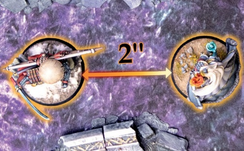

> The Movement distance is always measured from the same part of the model’s base *(See Example of correct measuring on page 20)*.

<table style="width:11%;">
<colgroup>
<col style="width: 6%" />
<col style="width: 4%" />
</colgroup>
<thead>
<tr>
<th style="text-align: center;"><blockquote>

OFF

</blockquote></th>
<th style="text-align: center;"><blockquote>

14

</blockquote></th>
</tr>
</thead>
<tbody>
<tr>
<td style="text-align: center;"><blockquote>

DEF

</blockquote></td>
<td style="text-align: center;"><blockquote>

10

</blockquote></td>
</tr>
<tr>
<td style="text-align: center;"><blockquote>

ACC

</blockquote></td>
<td style="text-align: center;"><blockquote>

8

</blockquote></td>
</tr>
<tr>
<td style="text-align: center;"><blockquote>

INT

</blockquote></td>
<td style="text-align: center;"><blockquote>

10

</blockquote></td>
</tr>
<tr>
<td style="text-align: center;"><blockquote>

AG

</blockquote></td>
<td style="text-align: center;"><blockquote>

10

</blockquote></td>
</tr>
<tr>
<td style="text-align: center;"><blockquote>

T

</blockquote></td>
<td style="text-align: center;"><blockquote>

13

</blockquote></td>
</tr>
<tr>
<td style="text-align: center;"><blockquote>

M

</blockquote></td>
<td style="text-align: center;"><blockquote>

17

</blockquote></td>
</tr>
</tbody>
</table>

When measuring the Movement, a player must measure the exact route of the model’s Movement.

> **MODES OF MEASURING**
>
> Before starting the game, players decide which one of the following modes of measuring they will implement:

######### 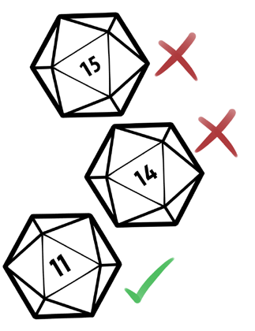18

> **CORE GAME ELEMENTS**

**ASSiSteD MoDe**

> The players can pre-measure any distance.
>
> **StAnDArD MoDe**
>
> Pre-measuring is limited. The player may pre-measure distances only within the Awareness of their models and the activated model’s Movement distance.
>
> Note: When a model is moving, the player is not allowed to pre-measure distances other than the Movement distance. They can measure other distances before the
>
> model’s Movement and after their model has completed the Movement.
>
> A player may not pre-measure the AoE effects by placing a template.
>
> **reAliSM MoDe**
>
> The players are not allowed to pre-measure any distances.
>
> Measuring should always be strictly related to the performed Action or Movement.
>
> For the sake of fairness towards other players, we advise clarity when measuring.
>
> **BASE CONTACT**
>
> Base Contact defines a situation where a model’s Hitbox is in physical contact with another model’s Hitbox, token, piece of scenery, etc.
>
> A model is always in Base Contact with itself.
>
> Figure 2: Models in Base Contact.

######### 19

> **CORE GAME ELEMENTS**

Movement types allow models to move in different ways across the field. There are two kinds of movement a model may declare

> \- **Normal Movement** and **Special Movement**. *See the list of Normal and Special Movement, page 49.*
>
> **GENERAL RULES OF MOVEMENT**
>
> A player may voluntarily move or place models only on **non-vertical** surfaces, unless stated otherwise (e.g. by performing Climb or Jump Special
>
> Movement, or if a model has a certain Ability that would allow that).
>
> The distance of the movement is, at the beginning and at the end of it, measured from the **same spot on the base**.
>
> Figure 1: Examples of correct measuring.
>
> When declaring a Movement, the player must clearly indicate the Movement path of the model.
>
> While a model is moving, it can
>
> **rotate** and has **360° Line of sight**.
>
> A model can **move through allied models**, but not through enemy models.
>
> The model’s Movement **automatically ends** if it enters **Base Contact** with an **enemy** model.
>
> **MOVEMENT**

A model may not end its Movement with its Hitbox within another model’s Hitbox.

> Unless Stated otherwise, an activated model, which declared a Special Movement, cannot perform any other Normal Action or Special Action during the same Activation Sequence.
>
> **lADDer**
>
> A Ladder is a predetermined vertical set of rungs, holds or steps that a model can use to move up a vertical surface. The model does not need to declare Climb Special Movement to use a Ladder.
>
> If a model is moving **vertically** up a Ladder (ladders, vines, walls with climbing holds, etc.) or over
>
> 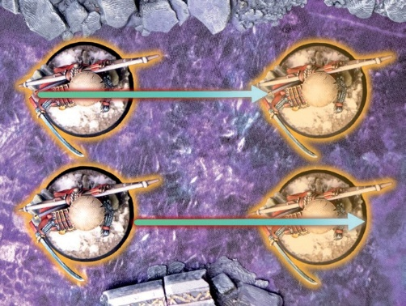a surface that is **narrower** than the model’s base size (e.g. a ramp etc.), Movement costs **double**.
>
> For example, moving up a 2’’ ladder will cost the model 4 SPD.
>
> A model can move over any scenery piece or obstacle smaller or of
>
> equal height as the model’s Hitbox without spending any additional Speed points.

########  LINE OF SIGHT 

> Line of Sight is crucial a term defining an imaginary straight line connecting the Hitboxes of two models.
>
> It defines whether a model can see the other model. To check it, simply draw an imaginary straight line from one model’s edge of the Hitbox to the edge of another model’s Hitbox.
>
> Unless specified otherwise, a model can draw Line of Sight only from its **Front** arc.

######### 20

> A model’s Hitbox is from the top divided into the Front and the Back section, each representing an arc of 180°. We recommend that players clearly mark Line of Sight arcs on each model’s base, defining the models’ Front
>
> and Back arcs.
>
> Figure 2: The orange area represents the Front arc of the model.
>
> Figure 3: The orange area represents LoS of the model. LoS is obscured by other models or scenery!
>
> **CORE GAME ELEMENTS**
>
> A model has Line of Sight to another model if it can draw an unobstructed imaginary straight line from a point on it’s Hitbox to another point on the target model’s Hitbox.
>
> Line of Sight can be obscured by other models or scenery, including allied models.
>
> Hint: When in doubt, players may substitute the models in question with their corresponding Hitboxes in the form of appropriate cut-outs or similar.
>
> While moving, a model has 360° Line of Sight. Line of Sight may be checked at any time, and a model always has Line of Sight to itself.
>
> Note: Line of Sight is frequently abbreviated to LoS/LOS.
>
> 21
>
> **CORE GAME ELEMENTS**

AWARENESS

> Awareness represents the model’s perception of its surroundings.
>
> Awareness is an area surrounding the model, with a radius measured in inches equal to the represented model’s **Agility** value. The radius of Awareness is measured from the edge of the miniature’s base.
>
> A model is considered to be within another model’s Awareness as long as its Hitbox is within or in contact with that model’s Awareness.
>
> Figure 1: Example of Awareness. Any model at least partially within the area is considered within Awareness.
>
> 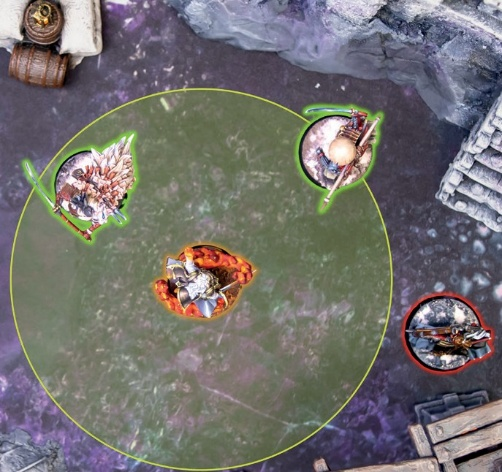A model can find itself in **more than one State** at the same time.
>
> States of the **same name cannot be applied more than once** to the same model.
>
> *List of States can be found on page 59.*

########  STATES 

> A State represents a condition affecting a model.
>
> When a model enters a State, a token or marker representing that State may be placed next to the model or on its profile card for convenience.
>
> Note: In competitive play, it is recommended that all players use tokens to keep track of all active States at all times.

######## \
ACTIONS 

> Models can perform different Actions with different intents. There are two kinds of Actions any model may declare: **Normal Actions** and **Special Actions**. *(See list of Normal and Special Actions, on pages 51-57.)*
>
> Normal Actions can be declared both during the model’s Active Role and the Reactive Role *(see page 24)*.
>
> Unless specified otherwise, all Normal Actions can be declared as a Reaction.

######### 22

> In order to declare a **Special Action**, a model must first declare “**Idle**” during its Movement Phase.
>
> Special Actions **cannot be declared**
>
> during the **Reactive Role**.

<table style="width:42%;">
<colgroup>
<col style="width: 41%" />
</colgroup>
<thead>
<tr>
<th style="text-align: center;"><blockquote>

<strong>Active Role</strong>

</blockquote></th>
</tr>
</thead>
<tbody>
<tr>
<td style="text-align: center;"><blockquote>

Normal Movement + Normal Action

</blockquote></td>
</tr>
<tr>
<td style="text-align: center;"><blockquote>

Idle + Special Action

</blockquote></td>
</tr>
<tr>
<td style="text-align: center;"><blockquote>

Special Movement + Nothing

</blockquote></td>
</tr>
</tbody>
</table>

######## \
ACTIVATION POINTS 

> **CORE GAME ELEMENTS**

Activation Points (AP) are a resource generated from the model’s **Stamina** value.

> The player will have to spend these points when activating the model or reacting with it.
>
> *See more detailed explanation in “Playing the Game” section, page 33.*

23

23

> **ACTIVE & REACTIVE ROLE**
>
> **CORE GAME ELEMENTS**

interval becomes modified (See Example 2).

> The Reactive Player’s models perform the Reactive Role while the Active Player’s models perform the Active Role.
>
> When the Active Player concludes their turn, the Roles of players and their models exchange: the former Active Player becomes the Reactive Player and vice versa.

Note: A model can hit targets at different elevations, provided it has sufficient Reach.

> **CASTING AURA**
>
> Note: The Active Player is the player currently conducting their turn.
>
> The Active Player’s models conduct **Activations**, through which they carry out their Active Role, whereas the Reactive Player’s models carry out **Reactions**, through which they react to the Activations .
>
> *This will be explained in detail in “Playing the Game” section, page 33.*
>
> **REACH (RCH)**
>
> Reach represents the distance (measured in inches) at which an Item, Ability or a Spell can be used. Reach is measured from anywhere on the model’s Hitbox. Items, Spells or Skills with Reach **0’’** can only be used in **Base Contact** with the target. If the target of an Action, performed with a certain Item, is outside of the Item’s Reach, the Action fails.
>
> **Ranged Weapons** are special in this regard, as their Reach value displays a single or multiple **intervals** (see Example 1). These intervals indicate the distances at which that ranged weapon has a certain modifier applied to the user’s Accuracy attribute.
>
> If the Reach distance of such
>
> Weapons would be modified, every
>
> Some Spells can only be cast in the proximity of their caster.
>
> Casting Aura is an area where some Spells can be cast and is in size equal to the caster’s **Awareness**.
>
> Spells with Casting Aura Reach can only target models within the Casting Aura.
>
> In the Active Role, the caster of a Spell can target models within the Casting Aura, even if it has no Line of Sight towards them. In such cases, the caster’s casting attribute suffers a halving modifier.
>
> Targets of an Attack with this Reach
>
> cannot benefit from Cover.

<table style="width:42%;">
<colgroup>
<col style="width: 42%" />
</colgroup>
<thead>
<tr>
<th><blockquote>

Example 1: 0-20’’: 0; 21-40’’: -3. The first interval indicates that the user’s Accuracy is unmodified when targeting within 20 inches. The second interval applies a −3 modifier to Accuracy when the target is between 21 and 40 inches away. If the target is beyond 40 inches, the Attack fails automatically.

Example 2: A model using a Short Bow (Reach 0–20”: 0; 21–40”: −6) uses an ability that extends its Weapon’s Reach by 2 inches on each interval. The modified Reach of the Short Bow becomes: 0–22”: 0; 23–42”: −6.

</blockquote></th>
</tr>
</thead>
<tbody>
</tbody>
</table>

> 24

########  TEMPLATES & Aoe 

> Some Abilities, Spells or Items have an Area of Effect, or AoE for short. It is an area where the Ability/ Item/Spell in question affects the surroundings, models etc.
>
> In order to determine the number of models affected by such abilities, a player places a **template** over the affected area. The template will affect all models whose Hitboxes are at least partially covered or in contact with the template. Note that the **main target** must be fully **covered** by the template.
>
> If a model is covered with multiple templates at the sam**e** time, it will suffer the effect of each successfully placed template separately.
>
> A model affected by an Attack with a template may avoid receiving Hits with a successful **Dodge** Action, even if the template was placed successfully and even if the model is still within the area of the template effect.
>
> If a model targeted by an Attack with a template declares an Attack (as its Action or Reaction) and wins the Confrontation, the Attack with the template is **fully nullified**, and the template is not placed.
>
> Note: The caster or user of the template does not suffer its own Attack.
>
> **TEMPLATE KINDS & PLACEMENT**
>
> **CORE GAME ELEMENTS**

**CirCulAr (SMAll -S, lArge -l)** The target of the Attack must be fully covered by the template. The AoE also affects models **3”** above and below the surface on which the target is located.

> A model cannot be affected by a Circular AoE if there is **no LoS** between the center of the AoE and the model.
>
> If there is obstructing terrain between the center of the AoE and the target, the target may benefit from **Cover**.
>
> If the target’s base is too large to be fully covered by the AoE, the model can still be targeted; place the entire AoE template over the target’s base. Note: You may also hit one additional model in Base Contact with the large-base target.
>
> 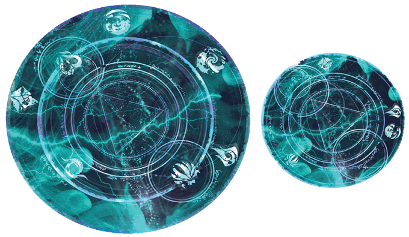Large circular template: d=120 mm Small circular template: d=70 mm

######### 25

> **CORE GAME ELEMENTS**

**SPrAy (SMAll -S, lArge -l)** Spray templates are placed with the narrow end in Base Contact with the attacking model. The target of the Attack must be fully covered by the template.

> The AoE may also affect models up to **5”** above or below the surface
>
> on which the attacker is located
>
> (attacker’s choice).
>
> A model cannot be affected by a Spray AoE if there is **no LoS**
>
> between the attacker and the affected model. If there is obstructing terrain between the attacker and the target, the target may benefit from **Cover**.
>
> If a model is too close to the attacker to be fully covered by the Spray template, it may still be targeted. In this case, both edges of the template must cover the target.
>
> Large Spray template length: 260 mm Small Spray template length: 213 mm
>
> 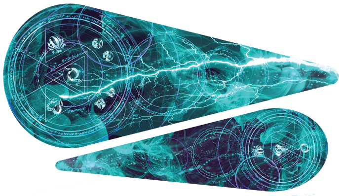
>
> Figure 1&2: Template placements and where Hits are possible. The blue model is the user of the template.
>
> 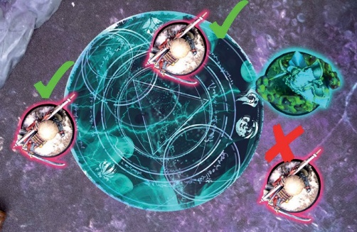
>
> 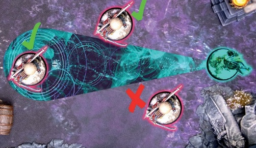

########  STRIKES & HITS 

> Strike value (STK) specifies the number of **dice rolled** when performing an Action with
>
> a certain Item (e.g. Weapon), Spell, Ability etc. Strike value is specified in the Item table, Spell table, or in the description of the Ability.
>
> Oftentimes, when performing an Attack roll, the roll itself can also be called a Strike.
>
> In the Reactive Role, a model’s default Strike value becomes 1 (unless Stated otherwise).
>
> **Strike value cannot be**
>
> **modified below 1.**
>
> In the Active Role, when performing an Attack, if the Active model has a **Strike value greater than 1**, it may Attack a number of different targets up to its Strike value.
>
> *(See example 1 below.)*
>
> Hint: Be mindful that certain Abilities, such as Traits, Skills, Class Abilities, Combat Arts, etc., can modify a model’s Strike value. Having a higher Strike value is often advantageous in combat.
>
> Note: A player may choose to roll less dice than the number displayed in the Strike value.

<table style="width:42%;">
<colgroup>
<col style="width: 41%" />
</colgroup>
<thead>
<tr>
<th><blockquote>

Example 1: Distributing a Strike Value Greater Than 1 Among Two Enemy Models.

Model A activates and moves toward enemy Models B and C. Model B reacts with an Attack, while Model C reacts with a Dodge. Model A declares an Attack,

and its Strike value is 2. Therefore, it may

</blockquote></th>
</tr>
</thead>
<tbody>
</tbody>
</table>

######### 26

> A **successful Attack roll** is considered as delivering a **Hit** to the attacked model. When performing an Attack, the attacking model delivers a Hit with each successful Attack roll.
>
> Some Actions, Skills, Items, etc., namely the Attack Action, may cause a model to suffer one or more Hits.
>
> If a **Damage roll is successful**, it commonly inflicts a **Wound** to the model (causing it to lose 1 HP unless Stated otherwise).
>
> ¸
>
> Suffering a Hit allows the hit model to **rotate** and adjust its Line of Sight.
>
> **STRIKES & TEMPLATES**
>
> When a model uses an Ability that places templates and its Strike value is greater than 1, the player may place a number of templates equal to the model’s Strike value and distribute them among one or more targets.
>
> **CRITICAL HIT**

<table style="width:42%;">
<caption><blockquote>

<strong>CORE GAME ELEMENTS</strong>

</blockquote></caption>
<colgroup>
<col style="width: 41%" />
</colgroup>
<thead>
<tr>
<th><blockquote>

strike one of the enemy models twice or strike each of the two enemy models once. Model A decides to target both enemies, distributing 1 Strike to Model B and 1 Strike to Model C.

Models A and B resolve their Confrontation rolls, while Model C rolls for Dodge against Model A’s Attack separately. (If Model C fails the roll, it receives all successful Attack rolls directed at it.)

</blockquote></th>
</tr>
</thead>
<tbody>
</tbody>
</table>

During an Attack, when the **result of a dice roll is 1**, it is considered a Critical Hit.

> A Critical Hit reduces the target model’s **armor to 0** (but only for that particular Hit).
>
> A Critical Hit **beats** all opponent’s **Confrontation**
>
> roll results. *(See Confrontation on page 28.)*
>
> When both (or more) players declare Attack and score a Critical Hit,
>
> both (or all) models suffer the Hit, applying all additional effects.
>
> 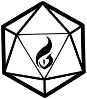Hint: If you own the official Eldfall Chronicles dice, you will notice that number 1 is marked with the iconic ember fox logo.
>
> Note: Some Items, Spells, etc. have effects that are triggered with a scored Critical Hit.
>
> Some Skills can increase or decrease the likelihood of a Critical Hit.
>
> 27

<table style="width:42%;">
<caption><blockquote>

<strong>CORE GAME ELEMENTS</strong>

</blockquote></caption>
<colgroup>
<col style="width: 41%" />
</colgroup>
<thead>
<tr>
<th><blockquote>

Example:

Model A moves into Line of Sight of model B. B reacts with an Attack,

targeting A. A also declares an Attack, targeting B. Both models perform their Attack rolls. As the reacting model, B has Strike 1, while the activated model A has Strike 2.

B’s used modified attribute value is 12, and the result of its roll is 8. A’s used modified attribute value is 13, and the results of its rolls are 6 and 11. B’s roll of 8 is higher than A’s roll of 6; therefore, it negates A’s roll of 6. However, A’s roll of 11 is higher than B’s roll of 8 and is still within its used attribute value (13). Therefore, it negates B’s roll and is considered a successful Confrontation roll. As a result, B receives 1 Hit from A, and B’s Attack is negated.

Further example: If A had a Strike value of 3 and rolled an additional 13, A would instead win the Confrontation with two successful Confrontation rolls, delivering two Hits with the rolls of 13 and 11.

</blockquote></th>
</tr>
</thead>
<tbody>
</tbody>
</table>

CONFRONTATION

> Confrontation occurs when two (or more) opposing models declare the **Attack Action against one another**. (This is the only instance when a Confrontation occurs!)
>
> When this happens, the two models will fight, each attempting to block incoming Strikes and hit their adversary in return.
>
> Only the model that performs one or more successful Confrontation rolls wins the Confrontation.
>
> **CONFRONTATION ROLL**
>
> *Confrontation rolls symbolize parrying, blocking, counter-attacking and the quickness of strikes. They are performed simultaneously among the models that are attacking one another.*
>
> **The model with one or more successful Confrontation rolls wins the Confrontation**. It is the only model between the two that deals damage to the other and successfully performs the Attack.
>
> Confrontation rolls are considered successful if each roll’s result is equal or lower than the model’s used modified attribute and higher than the enemy model’s successful rolls. **Each successful Confrontation roll negates all enemy model rolls with equal or lower results.**
>
> Note: ven if a model’s Attack rolls are within the parameters of success, they are considered unsuccessful if the opponent’s rolls are also within the parameters of success and have a higher result.
>
> After all Confrontation rolls have been made, the Reactive Player first performs any available rerolls. The Active Player then does the same.

######### 28

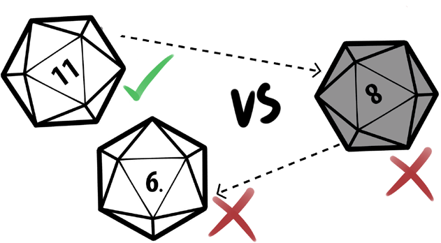

########  DAMAGE & WOUNDS 

When a model hits another model, it must perform a **Damage roll** for **every Hit** it dealt to that model in order to damage and wound it. In the occasion of a successful Damage roll, the hit model suffers a **Wound** for every **successful Damage roll**. It loses 1 HP for every suffered

Wound. A model cannot suffer more Wounds than it has HP.

Note: Unless specified otherwise, the hit model suffers a number of Wounds equal to the amount of Hits not prevented.

However, some abilities may modify

the number of Wounds a model suffers when receiving damage.

> A model whose HP value is reduced to 0 becomes **Incapacitated** (State). The model enters the Incapacitated State at the end of the Activation Sequence *(later explained from page 39)*.
>
> If an Incapacitated model suffers another Wound, it becomes **Dead** (State) instead.

> **FALL DAMAGE**
>
> If a Sequence somehow resolves with a model being moved from a higher to a lower surface, that model might suffer damage from the fall.
>
> Figure 1: A model falls from a higher to a lower position, suffering fall damage.
>
> A model falls, when it is somehow moved from a higher surface onto a lower surface (if Climb was
>
> **CORE GAME ELEMENTS**

not used).

> If a model **falls** for a distance that is **greater than its halved Speed value** (measured vertically from the point of falling to the point of landing),
>
> it must perform an **Agility roll for each interval** of the fall equal to the model’s halved Speed value. The model suffers a **Wound** for every failed Agility roll.

<table style="width:42%;">
<colgroup>
<col style="width: 41%" />
</colgroup>
<thead>
<tr>
<th><blockquote>

Example: If a model that has a Speed of 6 falls, it must perform an

Agility roll for every 3 inches of its fall from the point of falling to the surface it falls onto. If it, for example, falls 5’’, it only has to roll once, but if it fell for an extra 1’’, it would have to roll twice.

</blockquote></th>
</tr>
</thead>
<tbody>
</tbody>
</table>

######### 29

> **SPELLS & MAGIC**
>
> **CORE GAME ELEMENTS**

*Spells are a focused representation of magic. Wielders of magic channel*

> *raw mana from the elements or Items and shape it into unique forms known as Spells.*
>
> The process of using Spells is often referred to as Casting.The model who uses the Spell in question is often referred to as the Caster.
>
> Unless Stated otherwise, the model uses the Intellect attribute when casting Spells.
>
> In order to cast Spells of a certain Element, the caster must have
>
> an Affinity (Element) of the
>
> specified Element.

<table style="width:42%;">
<colgroup>
<col style="width: 41%" />
</colgroup>
<thead>
<tr>
<th><blockquote>

Example: Affinity (Fire) is needed to cast Spells of the fire Element.

</blockquote></th>
</tr>
</thead>
<tbody>
</tbody>
</table>

> In the Active Role, if a Spell has a **Strike value greater than 1**, the Caster may choose a number of targets up to the specified Strike value.
>
> Note: This cannot be applied to the casting of Conjuration Spells.
>
> A model can cast only one Spell at a time.
>
> A model cannot cast Spells if it has “both hands full”.

<table style="width:42%;">
<colgroup>
<col style="width: 41%" />
</colgroup>
<thead>
<tr>
<th style="text-align: left;"><blockquote>

Example: a model with both Shield and a Weapon/two Weapons/Two-Handed Weapon equipped, cannot cast Spells.

</blockquote></th>
</tr>
</thead>
<tbody>
</tbody>
</table>

> Note: Spell Attacks are affected by effects that interact with either the Melee or Ranged Trait. If a Spell has both Traits, the caster chooses which Trait is used when declaring the Attack, if both are valid.
>
> Some Spells have Traits listed under their effects. Depending on a particular Trait, some might dictate the Spell’s usage, while others affect targets when the Spell is used.

<table style="width:42%;">
<colgroup>
<col style="width: 41%" />
</colgroup>
<thead>
<tr>
<th><blockquote>

Example: The Targetless Trait on a Spell means that the caster of such a Spell can select any surface as its target, while the Weakening Trait forces a wounded target into the Weakened State, etc.

</blockquote></th>
</tr>
</thead>
<tbody>
</tbody>
</table>

**MANA COUNTERS**

> Mana Counters are a resource that represents mana - the energy required for casting Spells. Mana
>
> counters can be spent for covering the price of Conjuration-type Spells or some other powerful Spells.
>
> In the Active Role, a **Mage** *(Mage Class on page 63)* can convert any number
>
> of its Activation Points into the corresponding amount of Mana Counters (replace Activation Points with Mana Counters) and place them in its personal pool.
>
> Mana counters are **cumulative** and do not disappear at the end of the turn!
>
> 
>
> **THE 5 TYPES OF SPELLS**
>
> Spells are divided depending on their application and purpose.
>
> **SorCery**
>
> Sorceries are Spells, mainly with short-lasting, destructive effects. Unless specified otherwise, the effect of a Sorcery-Type Spell lasts until the end of the Activation Sequence.
>
> Its effect is dealt to the target or affected models.
>
> **HeAling**
>
> Healing Spells have short-lasting, restorative effects.
>
> Unless specified otherwise, the effect
>
> of a Healing Spell lasts until the end

######### 30

> of the Activation Sequence.
>
> They can be cast only in the caster’s Active Role.
>
> **enCHAntMent**
>
> Enchantments are Spells that last for an extended period of time and bolster or weaken the target.
>
> Unless specified otherwise, the effect of an Enchantment lasts until the caster’s next Strategic Phase.
>
> They can only be cast in the caster’s Active Role.
>
> If the Enchantment Spell is cast successfully, its target receives the Enchantment Spell’s effect.
>
> If the Enchantment Spell would have the ✯ **symbol** for its Power, the enchanted model’s Attacks are considered to have the “Spell” type (for the duration of the Enchantment).
>
> A model can be enchanted by only up to 1 Enchantment of the same name.
>
> **CORE GAME ELEMENTS**

Effects of Enchantment Spells cannot be prevented with a successful Dodge.

> **trAnSMutAtion**
>
> Transmutations are Spells that are permanent and affect the environment.
>
> Transmutation Spells remain present on the field until removed or destroyed.
>
> Transmutation Spells with an Armor value in its effect can be targeted with Attacks and destroyed with a successful Damage Roll.

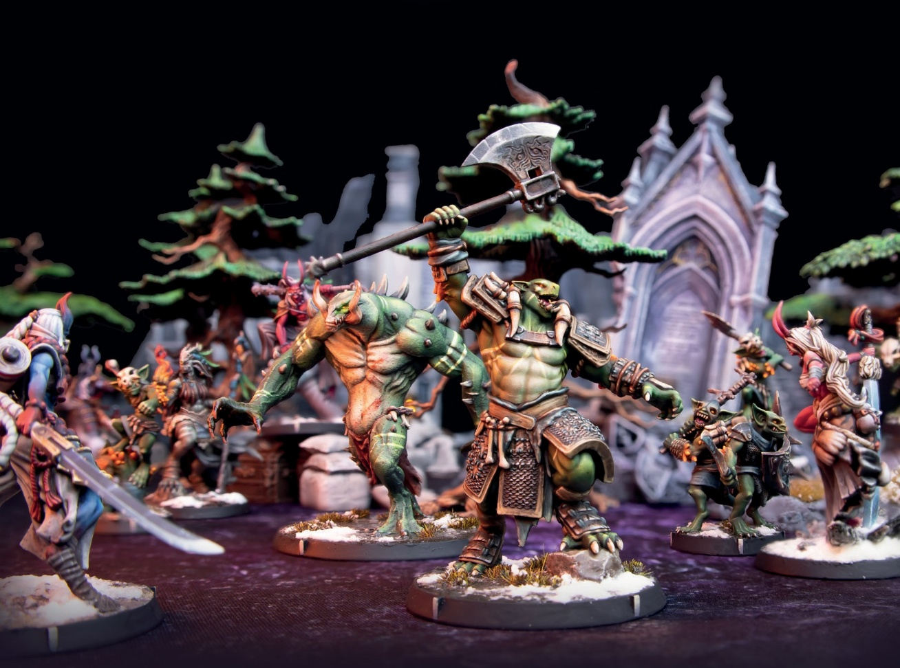

31

> Goblin Wartribes Faction Starter

31

> **CORE GAME ELEMENTS**

**ConjurAtion**

> They allow the caster to summon a creature to the field, and bind it under their command.
>
> Conjuration Spells can only be cast in the caster’s Active Role by declaring a **Ritual** (Special Action, *See page 57*).
>
> A cast Conjuration Spell allows the caster to summon a corresponding creature to the field, and it may be used as one of the models under the player’s command. The creature immediately receives **Activation Points** equal to
>
> its Stamina.
>
> Creatures summoned to the field by a Conjuration Spell are at the same time considered as **models** and as Conjuration-Type **Spells**.
>
> Conjuration Spells have a Mana Cost of 1 or more.
>
> **Mana Cost (X)**: In order to cast a Spell with this Trait, the caster must spend an amount of Mana Counters equal to the X value.
>
> Creatures summoned to the field by Conjuration Spells have **Summoning Limit**, which is equal to the creature’s Tier (listed on the creature’s profile).
>
> A caster cannot cast any more Conjuration Spells if the combined Summoning Limit of the creatures that had been summoned by that caster and are now present on the field equals or exceeds that caster’s modified **Stamina**. A caster may cast a Conjuration
>
> Spell that would cause the combined Summoning Limit to exceed its modified Stamina, provided the Summoning Limit was below that value at the time the Spell was cast.
>
> During the Strategic Phase, a caster can voluntarily dismiss one of its summoned creatures. When done so, the summoned creature is instantly removed from the field.
>
> Hint: Keep an eye out for abilities etc. that would reduce the Summoning Limit on Summons. These can help you summon more creatures than you normally could.
>
> Note: A caster with summoned creatures, whose combined Summoning Limit is below their Stamina value, can summon more creatures even if it surpasses the Stamina value initially. However, once the total Summoning Limit of their creatures on the field exceeds their Stamina value, the caster can no longer summon additional creatures.
>
> Any creature a model starts the game with due to the Summoner Class, counts toward that model’s Summoning Limit.

<table style="width:42%;">
<colgroup>
<col style="width: 41%" />
</colgroup>
<thead>
<tr>
<th><blockquote>

Example 1: If the caster has a Stamina value of 2, and they have already summoned 2 creatures, each with a Summoning Limit

of 1, the caster cannot summon any more creatures. The caster can summon new creatures once the combined Summoning Limit of the creatures on the field is lower than the caster’s modified Stamina.

</blockquote></th>
</tr>
</thead>
<tbody>
</tbody>
</table>

> When the caster of a Conjuration Spell becomes Incapacitated or Dead (States), the creatures it summoned to the field are removed from the field at the end of the Activation Sequence.

32

###  PLAYING THE GAME 

##### GAME SETUP

> **PLAYING THE GAME**

After you familiarize yourself with the core game elements, you can start setting up the game. Follow the instructions in each section and refer to previous parts of the core rules if the need arises.

########  QUEST SELECTION 

> First, select a Quest with the other players. The Quest will impact the gameplay in different ways as it sets the circumstances, goal, end conditions, and other variables.
>
> There is a variety of Quests that you can choose from.
>
> You can find the full collection of Quests on the webpage, eldfall-chronicles.com under “Resources”.
>
> **DETERMINE THE GAME SIZE**
>
> The Game Size defines the
>
> amount of Recruitment Points each player has for assembling and outfitting their Party. Players must
>
> determine the point size of the game before they start playing. Select
>
> how many **Recruitment Points** each player will have at their disposal for the creation of their Parties.
>
> Each model that a player may enlist into the Party has its own **Recruitment Cost**. This indicates the amount of Recruitment Points a player needs to spend for enlisting the model into their party.
>
> Hint: The recommended Game Size for starting players is 60 pts (this normally allows recruiting 3 models with some spare pts for Upgrades per player), while we encourage players to try out larger games as well (60-90 pts or more).

######## \
CREATING A PARTY 

> A party consists of a group of models that belong to a single player.
>
> In order to depart on a Quest, the players must assemble their parties which will represent their interests in the game.
>
> First, choose a Faction, then choose the models you would like to employ for that game.
>
> Each model belongs to a specific Faction, displayed on their Model Profile.
>
> When enlisting models, a player may only enlist models from the chosen **Faction** along with **Neutral models**.
>
> When players select a Faction, at least 1 enlisted model must be affiliated with the selected Faction. A player may choose the Neutral Faction, in which case they may only enlist models with the Neutral
>
> affiliation and purchase only Neutral
>
> Upgrades.
>
> The number of enlisted models of the same name must not exceed their **Limit**.
>
> A single party may contain up to
>
> **10 models**.
>
> Players create their parties in private.
>
> 33

########  LEADER 

> **PLAYING THE GAME**

A Leader is the model that represents the player on the field. After you have finished assembling your party, you must assign the status of a party Leader to a model in the party.

> As long as the Leader is not Incapacitated or Dead, the player controlling it may use **Stratagems** during their Strategic Phase *(see Game Sequence on page 37)*.
>
> Hint: Because only the Leader may use Stratagems, choosing a model with Stratagems on its profile is beneficial.
>
> **UPGRADES**
>
> When creating a party, you may purchase **Upgrades** and assign them to their models during their Deployment. You can **purchases Upgrades with any remaining Recruitment Points**. In order to create a valid party, the combined point Value of the party members and their Upgrades must not exceed the decided Game Size.
>
> A player may purchase only Neutral Upgrades and Upgrades belonging to the Faction they are currently playing.
>
> When creating a party, a player may purchase Upgrades with the same name up to their specified **Limit**.
>
> A player may assign **up to 1 Upgrade per model**.
>
> A model cannot be assigned more than one Upgrade with the same name.

######## \
FIELD SETUP 

> After you and the other players finish setting up the Quest, Game Size, and create your parties, you can begin setting up the playing field.
>
> The table, or rather, the field may be set up according to the players’ preferences. Any (wargaming) terrain can be used.
>
> Hint: For standard play, we recommend using 3D scenery (obstacles of different heights) and a field size of 36 × 36 inches. We recommend this size because it provides the best balance between ranged and melee combat when playing with a party of 3 to 5 models.
>
> Note: Different field setups affect gameplay in different ways. The game can be played on other field sizes; however, gameplay and tactics may change depending on the size you choose.
>
> It may be beneficial to change the field size if there are many models on the field or if
>
> there are multiple players. Keep in mind that the larger the field, the farther models will need to travel to engage in melee combat, while ranged models may gain an advantage. Likewise, on a smaller field, melee models will be able to close the distance more quickly and may therefore have the advantage.

######### 34

> **PLAYER COUNT (OPTIONAL)**
>
> **FORMAT OF PLAY (OPTIONAL)**
>
> The core rules are written mainly with two players in mind; however, they are generally applicable to **solo** and **multiplayer** play.
>
> If you are playing alone (solo) or if you are playing with more than two players (multiplayer), please refer to the Solo and Multiplayer
>
> supplementary rules, which can be found online at eldfall-chronicles. com under “Resources”.
>
> These supplementary rules are mandatory for participation in tournaments, competitions, and other organized play.
>
> Before starting the game, players decide which one of the following formats they will implement:
>
> **PLAYING THE GAME**

**rivAlry**

> Party creation is as per the core rules.
>
> **guilDSWorn**
>
> In this format, you assume the role of a member of the **Adventurers’ Guild**. Affiliation is not important. The player may form a party that consists of models from any Faction, regardless of Affiliation. In this case, all models have a **Limit 1**. Authority Stratagems affect all of your partied
>
> models regardless of their Affiliation, but this **does not extend to the allied player’s party**.

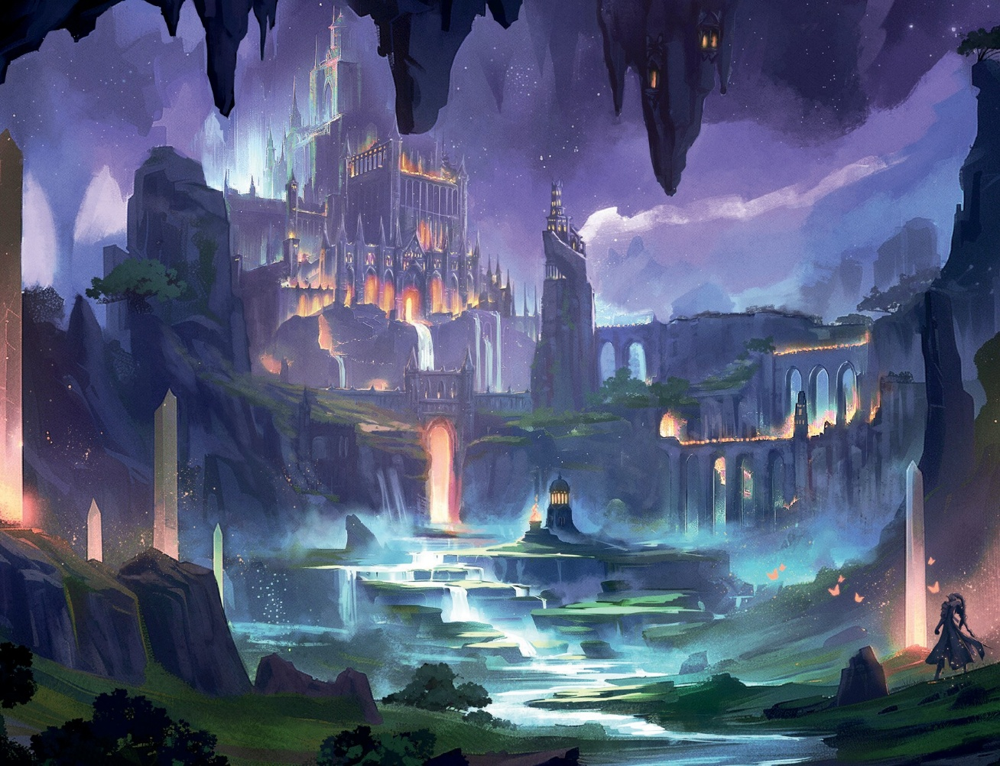

35

35

########  INITIATIVE CHECK 

> After the field is set up, all players
>
> perform an **Initiative Check**.
>
> **PLAYING THE GAME**

Players roll a single die. They add the Party Leaders’ **Morale** value to the roll’s result.

> The player with the higher sum wins the initiative and may choose one of the following (the other decision is left to the other player):
>
> **turn orDer**
>
> The player chooses who will be the Active Player first in a round—the so-called 1st Player. The other player goes second and is considered the 2nd Player. Players deploy models in the same order. (If there are multiple players, they may determine their order according to their Initiative Check results.)
>
> **DePloyMent PoSition**
>
> The player chooses the Deployment zone to place (deploy) their models (Figure 1).
>
> The other player will
>
> deploy within the other available Deployment zone.
>
> Furthermore, they may decide whether the players will deploy their entire parties at once or interchangeably deploy one model after the other.
>
> After all players have deployed their models, they reveal their party list to each other.
>
> (If there are multiple players, they can choose their position according to their Initiative Check results.)

######## \
DEPLOYMENT 

> After the players have performed an Initiative Check, they deploy their models in the determined turn order and at their chosen positions.
>
> Players must deploy their models fully within their Deployment Zones unless specified otherwise.
>
> **DePloyMent zoneS**
>
> Deployment Zones are imaginary belts on the field measured from the opposing edges (of the table) and are commonly **8 inches** wide (however this is largely dependent upon the Quest and may vary according to its description).
>
> A model can only be deployed on a surface where at least half of its base fully fits.
>
> A model may be deployed in the **Crouched** State, **Flying** State or **Mounted**.
>
> After all the players deploy their models, the game can begin.
>
> Figure 1: Deployment Zone, commonly
>
> **8’’** deep.

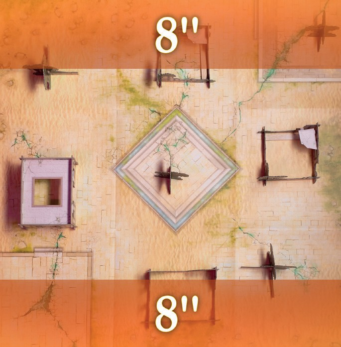

36

###  GAME SEQUENCE 

> In the first turn of a round, the
>
> 1st Player will assume the Role of the **Active Player** and the 2nd Player (or all other players) will assume the Role of the **Reactive Player**.
>
> During the turn, the Active Player will spend Activation Points to activate their models. The Active Player‘s models carry out their **Activations**, performing their **Active Role**. At the same time, the **Reactive Player(**s) will spend Activation Points to react with their own models in response; the models carry out their **Reactions**, performing their **Reactive Roles**.
>
> Once all of the Active Player›s models have been activated, the Roles are reversed, and the next turn begins.
>
> The 1st Player now becomes the Reactive Player, whilst the 2nd Player becomes the Active Player. In a multiplayer game, the players assume their Active turns according to the turn order they decided.
>
> A game consists of a number of rounds, each divided into a number of turns (one for each player).

After both(all) turns are complete, the round ends and a new

> **GAME SEQUENCE**

one begins.

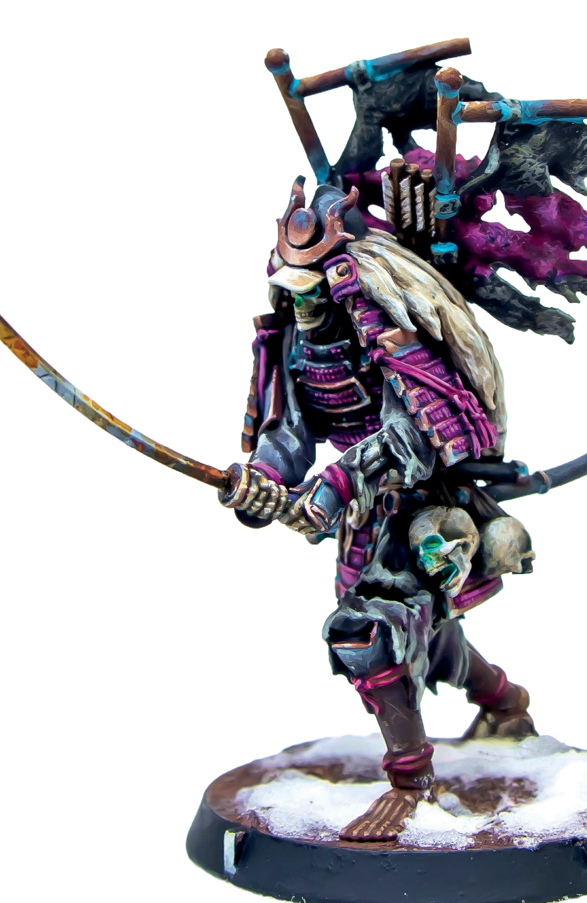

> **exAMPle rounD**

<table style="width:87%;">
<colgroup>
<col style="width: 19%" />
<col style="width: 21%" />
<col style="width: 23%" />
<col style="width: 23%" />
</colgroup>
<thead>
<tr>
<th></th>
<th style="text-align: center;"><blockquote>

1st PlAyEr

</blockquote></th>
<th style="text-align: center;"><blockquote>

2nd PlAyEr

</blockquote></th>
<th style="text-align: center;"><blockquote>

3rd PlAyEr

</blockquote></th>
</tr>
</thead>
<tbody>
<tr>
<td><blockquote>

TURN 1

</blockquote></td>
<td style="text-align: center;"><blockquote>

Active

</blockquote></td>
<td style="text-align: center;"><blockquote>

Reactive

</blockquote></td>
<td style="text-align: center;"><blockquote>

Reactive

</blockquote></td>
</tr>
<tr>
<td><blockquote>

TURN 2

</blockquote></td>
<td style="text-align: center;"><blockquote>

Reactive

</blockquote></td>
<td style="text-align: center;"><blockquote>

Active

</blockquote></td>
<td style="text-align: center;"><blockquote>

Reactive

</blockquote></td>
</tr>
<tr>
<td><blockquote>

TURN 3

</blockquote></td>
<td style="text-align: center;"><blockquote>

Reactive

</blockquote></td>
<td style="text-align: center;"><blockquote>

Reactive

</blockquote></td>
<td style="text-align: center;"><blockquote>

Active

</blockquote></td>
</tr>
</tbody>
</table>

> 37

#######  TURN PHASE 

> Each round consists of a turn for each player. In the case of two players, in the first turn, the
>
> 1st Player is Active and the 2nd Player the Reactive Player. In the second turn, the Roles of the players
>
> are reversed. Now the 2nd Player assumes their Active Role, while the 1st Player assumes their Reactive Role. If there are more players, the players take turns being the Active Player in the decided order.
>
> **ACTIVE PLAYER**
>
> **GAME SEQUENCE**

The Active Player carries out 4 Phases in their turn.

> While all of them are important, pay special attention to the **Tactical Phase**, which is further explained on page 39.

1)  **tHe StrAtegiC PHASe:**

> During the Strategic Phase, models of the Active Player may declare the use of any applicable Abilities, Items, or Stratagems in an order of their choosing.
>
> A Leader’s **Stratagems** can only be declared during this Phase.
>
> Some other abilities need to be declared during this Phase.

2)  **tHe uPKeeP PHASe:**

> During the Upkeep Phase, all players allocate **Activation Points** to all of their models that can receive them. They allocate a number
>
> that is equal to their models’ Stamina values.

3)  **tHe tACtiCAl PHASe:** The Tactical Phase consists of **multiple ACtivAtion SequenCeS**.

> During this Phase, the Active Player may **activate** each of their models by spending their available Activation Points in the **Activation Step**.
>
> Likewise, the Reactive Player may
>
> spend Activation Points to **react** with their own models during the **Reaction Step** of each Activation Sequence.
>
> A model with no Activation Points cannot be chosen to activate or react. The Tactical Phase ends when the Active Player no longer has any eligible models left to activate or decides they do not wish to activate any more models.
>
> Note: You do not have to activate every model, and you may activate them in any order or use any number of their available Activation Points. A model’s Activation Points do not have to be spent in succession— you may activate a different model before spending all of the Activation Points available to the first model during the same turn.

4)  **tHe enD PHASe:**

> During the End Phase, any applicable effects are resolved and both players **discard** any unspent Activation Points.
>
> After the Active Player ends their turn, the players exchange their Roles – the Active Player becomes the Reactive Player, and the opponent now assumes the role of an Active Player (this is in the case of two players).
>
> **REACTIVE PLAYER**
>
> Following the rules of Reaction and the Activation Sequence, the Reactive Player’s models (in their Reactive Role) may
>
> react against each Activation of the Active Player’s models during the **Reaction Step** of each Activation Sequence.

######### 38

> **TACTICAL PHASE**
>
> **- ACTIVATION SEQUENCE -**
>
> An Activation Sequence occurs with every **Activation** during the Tactical Phase.
>
> Figure 1: The Tactical Phase with two models on each side begins.

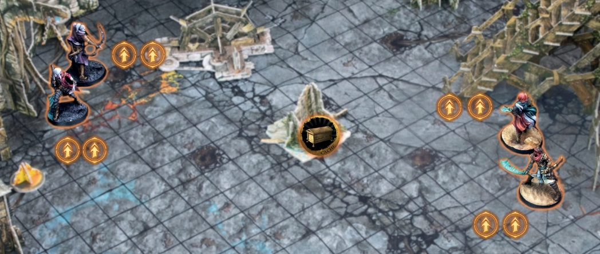

######## ACTIVATION STEP 

> The Active Player activates a model by spending one of its available Activation Points (represented by the token on the right).
>
> Note: An activated model suffers any relevant effects it might be affected by when the model activates.
>
> 

######## MOVEMENT STEP 

> An activated model may declare **Normal** Movement or **Special** Movement.
>
> The Active Player must declare all Skills relevant to its Movement,
>
> if any (e.g. Dash, Climbing, Leap, Flight, Flicker etc.).
>
> During this Step, the activated model may either enter or cancel the **Crouched** State (at the start or at the end of the Movement).
>
> **GAME SEQUENCE**

After the Movement is declared, the model is moved.

> Figure 2: The Ranger’s Guild-Hunter activates by spending AP in the Activation Step. In
>
> the Movement Step, it performs a Walk Movement.

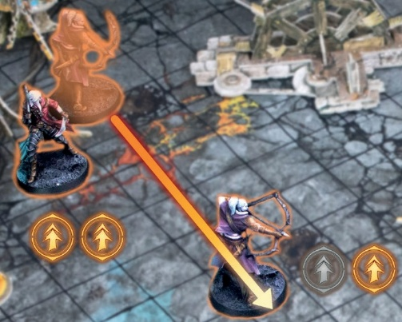

> 39

######## REACTION STEP 

> Following the rules of Reaction, the Reactive Player must now declare which of their models will **react** to the **activated model**, if any.
>
> After declaring these Reactions, the Reactive Player must now declare which **Normal Actions** the reacting models will perform. More than one model can react against an activated model, however, the Reactive Player must specify each reacting model’s Action).
>
> **GAME SEQUENCE**

If the declared Reaction is Attack, the Reactive Player must also declare the type/means of the Attack (e.g. Ranged or Melee, Skills, Items, Combat Arts, etc. used with the Attack).

> A model may target only an activated model with an Attack in Reaction!
>
> **REACTION**
>
> Reaction is performed by the Reactive Player (or rather, by a model in its Reactive Role).
>
> In the Reactive Role, a reactive model may declare Reaction and react to an activated model by spending an Activation Point.
>
> Reaction can only be a Normal Action.
>
> Reaction requires Line of Sight towards the activated model at any point during its Movement.
>
> If the activated model moves within the reactive model’s Awareness, the reacting model may declare Reaction and perform a Dodge even without Line of Sight.
>
> Figure 3: Faris Outrider spends an Activation Point to declare Dodge in anticipation of the Ranger performing an Attack in the next Step.

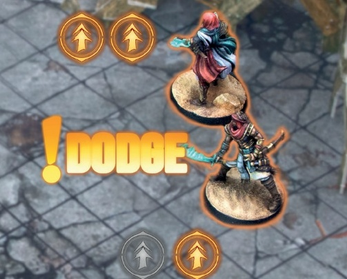

> **ATTACK OF OPPORTUNITY (REACTION)**
>
> If you see an opportunity or opening while the activated enemy model
>
> is moving, you can react before its Movement ends. This way, you can also prevent the enemy model escaping your Reach.
>
> If an activated enemy model performs a Movement that the reactive Player suspects might have come **within Reach** of their reactive model’s Weapon, the reactive model may declare Reaction at
>
> that point of the activated model’s Movement and declare an Attack of Opportunity against it.
>
> After the Reaction (Attack) has been declared, the reacting model must measure its Reach, to check whether the enemy model is indeed within the Reach of its Weapon.

######### 40

> Note 1: If you are playing on Assisted/ Standard mode of Measuring, the Reactive Player can measure whether the activated model comes within Reach before declaring Attack of Opportunity. However, if you are playing on Realism mode, the Reactive Player must declare Attack of Opportunity before measuring the activated model’s Movement and Reach.
>
> If the activated model is not within the Weapon’s Reach, it is not affected by the Attack.
>
> If the activated model is within the Weapon’s Reach, the reacting model may attempt an Attack against it.
>
> 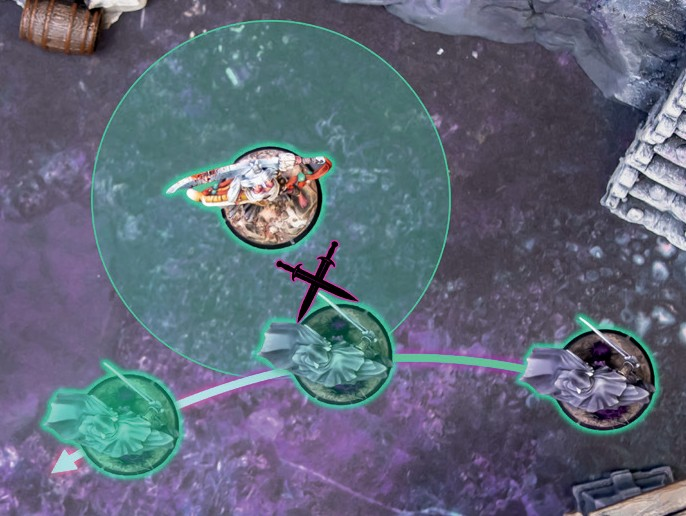When the reactive model performs an Attack of Opportunity, even if it fails, it cannot declare a different Reaction in this Sequence.

<table style="width:42%;">
<colgroup>
<col style="width: 41%" />
</colgroup>
<thead>
<tr>
<th><blockquote>

Example: The Hired Blade model in its Active Role moves into the Reach of Red Rasetsu. Red Rasetsu performs an Attack of Opportunity at the point along the Hired Blade’s Movement path where it enters Reach.

</blockquote></th>
</tr>
</thead>
<tbody>
<tr>
<td></td>
</tr>
<tr>
<td></td>
</tr>
</tbody>
</table>

> Note 2: A reactive model may perform a Ranged Attack of Opportunity while the activated enemy model is moving toward it. If the activated model then declares a Melee Attack, this triggers a Confrontation.
>
> Note 3: All modifiers are still applied to the reacting model’s Attack.
>
> **REACTION AGAINST SHROUDED OR FLYING MODELS (ATTACK OF OPPORTUNITY)**
>
> If a reacting model has declared Dodge or Perceive and has Line of Sight towards an activated enemy model that has declared an Attack while in the Shrouded or Flying State, the reacting model may change its Dodge or Perceive declaration into an Attack declaration immediately after the activated enemy model’s Action Step.

######## ACTION STEP 

> **GAME SEQUENCE**

The activated model may declare a **Normal** Action or a **Special** Action in the Action Step.

> If the declared Action is Attack, the Active Player must declare its **targets and means** (Skills, Items, Combat Arts, etc.).
>
> Figure 4: The Ranger performs an Attack Action targeting Faris Outrider.

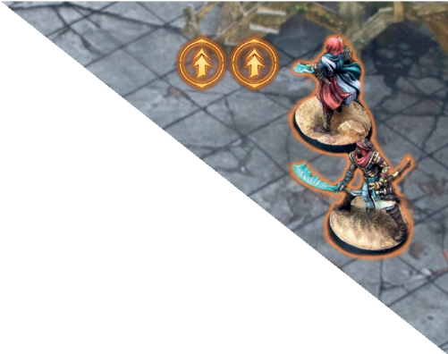

> 41

<table style="width:42%;">
<colgroup>
<col style="width: 41%" />
</colgroup>
<thead>
<tr>
<th><blockquote>

In the Action Step, the Active model— the Ranger Guild Hunter—declares its Action. If the Ranger Guild Hunter had chosen Run during the

Movement Step, it would only be able to declare Nothing. However, since it chose Walk, it may now declare an Action. Mark declares an Attack with the Ranger’s

Bow, targeting the Faris Outrider. With both the Action and Reaction declared, the Activation Sequence proceeds to the final Step.

During the Resolution Step, all necessary rolls are made to determine the outcome. Anna rolls one die for the Faris Outrider’s Dodge and rolls a 14. This result is

higher than the model’s AG value, so the Dodge fails.

Mark now checks the STK value of the Ranger’s Bow, which is 2, allowing him to roll two dice. He rolls an 8 and a 17. Comparing these results to the Ranger’s ACC, Mark determines that one roll is successful, scoring 1 Hit.

Next, Mark determines whether the Hit causes damage.

He takes the PW value of the bow and subtracts the target’s ARM (applying any relevant Combat Arts). He then rolls one die and must roll a value equal to

or lower than PW minus ARM to cause a Wound. Mark rolls a 3, successfully causing a Wound.

Even though the Faris failed its Dodge roll it may still move up to half of

its SPD now.

Mark places a Wound token next to the Faris Outrider.

With this, the Activation Sequence is concluded. Mark may now choose another of his models that still has Activation Points and repeat the Activation Sequence.

</blockquote></th>
</tr>
</thead>
<tbody>
</tbody>
</table>

RESOLUTION STEP

> Players apply **modifiers**.
>
> All necessary **rolls** are performed. When necessary, players must carry out **Confrontation rolls** *(page 28)*.
>
> Models that scored **Hit**(s) must perform **Damage rolls**, while certain models that suffered a Hit during the Sequence may perform corresponding rolls (T, AG, etc.) in order to prevent taking damage and some effects.
>
> **GAME SEQUENCE**

Damage, effects, and abilities that happened during this Activation sequence are **applied and carried out simultaneously**. Models that suffered damage from an opponent’s successful Damage rolls suffer the corresponding number of **Wounds**. Wounds and the resulting effects and States are applied last. If two effects cannot be resolved simultaneously because they affect the game state (e.g., both models Interact or both models Dodge), the Active player chooses the order in which they are resolved.

> **exAMPle oF ACtivAtion SequenCe**

<table style="width:42%;">
<colgroup>
<col style="width: 41%" />
</colgroup>
<thead>
<tr>
<th><blockquote>

Mark and Anna are our players. During the Movement Step, Mark activates his Ranger Guild Hunter and chooses a Movement option. He selects Walk, allowing the model to move up to its SPD. Mark moves the Ranger Guild Hunter into position so that it has an unobstructed LoS to Anna’s Faris Outrider. Once the Movement

is complete, the Activation Sequence proceeds to the next Step.

The next Step is the Reaction Step. During the Movement Step, Anna’s Faris Outrider had LoS to the Ranger Guild Hunter at least once. This allows Faris to spend an Action Point to declare a Reaction. With no effective Ranged options available and anticipating a bow Attack, Anna declares Dodge. After the Reaction is declared, the Sequence moves on.

</blockquote></th>
</tr>
</thead>
<tbody>
</tbody>
</table>

> 42

###  HOSTILES 

> Hostiles are models that are controlled by the game, similarly to an AI. They function like any other model; they have their own Profile Cards that indicate their in-game capabilities, stats, abilities etc. The **Hostile Behavior** shows patterns/ hierarchy of how the Hostile behaves itself if controlled by the game. The patterns are displayed on Hostile Behavior cards.
>
> **TURN ORDER OF HOSTILES**

*(See examples on pages 45, 46.)*

> Hostiles perform their Active Role called the **Hostiles turn** after all of the players finished their turns.
>
> Hostiles regain their Activation Points during every player’s Upkeep Phase.
>
> Players regain Activation Points at the beginning
>
> of every Hostiles turn.
>
> Hostiles perform their Reaction Step after the Active Player’s Action Step and before the
>
> Resolution Step of the Activation Sequence.
>
> When a Hostile declares an Action targeting a model, it must **rotate**
>
> so that it is facing the target directly.
>
> If a Hostile suffers a **Hit**, it must turn
>
> directly towards the attacker.
>
> The exception are Hostiles with the Construct or Undead I Trait do not turn their facing on Hit, but on Wound instead.
>
> Unless clearly specified otherwise, the Hostile will move via the **shortest route**.
>
> Hostiles ignore tokens unless
>
> specified otherwise.

<table style="width:42%;">
<colgroup>
<col style="width: 41%" />
</colgroup>
<thead>
<tr>
<th><blockquote>

Example: Hostiles would not target the Shrouded token and would not consider it as a possible target.

</blockquote></th>
</tr>
</thead>
<tbody>
</tbody>
</table>

> **GAME SEQUENCE**

Hostiles, or rather the players carrying out their behavior according to the cards, can pre- measure distances even on Realism mode of measuring.

> If the Hostile becomes **Crouched**, it will try to cancel the State in
>
> the Movement Step of its next Activation. If it declares Dodge, it also cancels the Crouched State. If the Hostile becomes
>
> **Immobilized**, it will try to cancel the State by
>
> declaring Dodge in its Action Step if no other Behavior
>
> listed on its card can be applied.
>
> 43

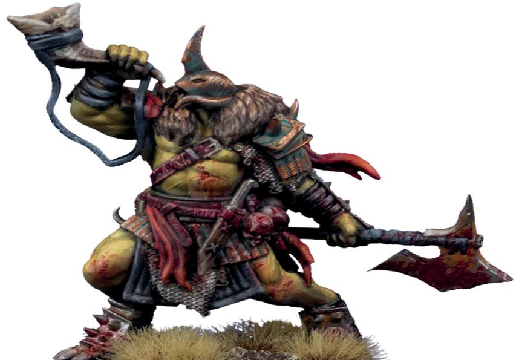

########  HOSTILE TURN 

1.  **eStAbliSH orDer oF**

> **ACtivAtionS**
>
> Hostiles perform their Activations according to their **Tiers** marked on the bottom of the Hostile card, beginning with the lowest Tier.
>
> Note: Tier I is the lowest Tier in the game.
>
> If there were multiple Hostiles with the same Tier, the one with the highest Morale performs their Activations first. If there were more with the same Morale and Tier, the players decide their turn orders.
>
> **GAME SEQUENCE**

Hostiles with the same Tier and Morale can activate interchangeably; one Hostile can spend one of its Activation Points, then a different Hostile can activate before the first one activates again. Hostiles of the same Tier must exhaust all of their Activation Points if possible before a higher-Tiered Hostile can activate.

2.  **ACtivAte HoStileS**

> The Activation Sequence of Hostiles is the same as with any other regular models. However, keep in mind that some Hostiles may have **Special Behaviors**, special abilities and may have particular **Target Priorities** that should be applied when possible
>
> or according to the rules. When a Hostile is in its Active Role, see
>
> section “**ACTIVE**” of the Hostile. When a Hostile is in its Reactive Role, see section “**REACTIVE**” of the Hostile.

3.  **FolloW tHe HierArCHy oF**

> **beHAviorS**
>
> Within the numbered hierarchy of Behaviors, under the Movement Step, Action Step, and Reaction Step, the highlighted text (before the “:”) states a specific **condition** of the Behavior in relation to possible enemy targets. The non-highlighted
>
> text (after the “:”) explains what the Hostile will do—its behavior—if the aforementioned condition is met.
>
> This means that when a Hostile would activate or react, the players carrying out their behavior must first check the condition of behavior ‘1.’ listed under its hierarchy of Hostile Behaviors. If the condition is met, the Hostile carries it out. However,
>
> if the conditions of ‘1.’ aren’t met, check ‘2.’ Continue this until the conditions are met.
>
> If none of the consecutive behavior conditions are met, the Hostile does not activate or react.
>
> In the Hostile’s Active Role, if one of the behaviors’ conditions are met according to the hierarchy, but there is more than one possible target
>
> that would match the condition, the model matching the Hostile’s **Target Priority** the most will become the target. In case this is hard to discern, the Hostile moves towards the nearest enemy.
>
> In the Reactive Role, however, the target can only be the **activated model**.
>
> Some conditions may refer to the Hostiles’ allied models. In such cases, the condition will clearly state this.
>
> Technically speaking, if the Hostile is already activated, but cannot move, it declares “Idle” and “Nothing” if it cannot perform an action.

44

######## 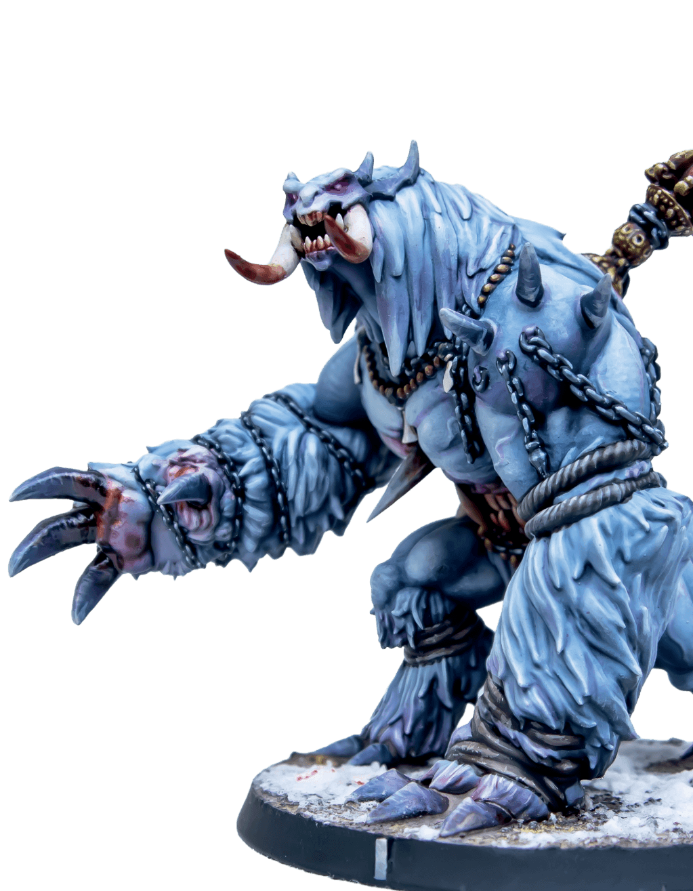EXAMPLE OF HOSTILE BEHAVIOR CARD

<table style="width:42%;">
<colgroup>
<col style="width: 41%" />
</colgroup>
<thead>
<tr>
<th><blockquote>

Taunt, then it walks towards the enemy model, stopping 1 inch away form the enemy model.

</blockquote>
<ol start="3" type="1">
<li>
If there is an enemy model in the Hostile’s LoS and is outside of 6 inches of the Hostile’s reach: the Hostile uses Taunt, then it runs towards the target model, favoring the path where the Hostile will trample as many of the enemy players’ models as possible. If possible, the Hostile will end its Movement in Base Contact with the target model. (In this case, the Hostile skips the Action Step.)
</li>
<li>
If there are no enemy models in the Hostile’s LoS: the Hostile rotates for 180°.
</li>
</ol>
<blockquote>

When the Hostile is in its Active Role, the Action Step goes as follows.

1. If there is an enemy model within 1 inch of the Hostile: the Hostile uses Melee Attack with “Hack &amp; Thrash” (if there is more than 1 enemy model within 1 inch of

the Hostile, the Hostile favors the one with lower AG).

</blockquote></th>
</tr>
</thead>
<tbody>
</tbody>
</table>

> **GAME SEQUENCE**

**ACtive (Front oF tHe CArD)**

######### 45

> **GAME SEQUENCE**

**reACtive ( bACK oF tHe CArD)**

<table style="width:42%;">
<colgroup>
<col style="width: 41%" />
</colgroup>
<thead>
<tr>
<th><blockquote>

Target Priority: According to the general rules of Reaction, Hostiles in their Reactive Role can react only against the activated model.

When the Hostile is in its Reactive Role, the Hostile does as follows.

</blockquote>
<ol type="1">
<li>
If the Hostile is a target of enemy Ranged Attack with the Spell Trait: the Hostile uses Dodge and uses Movement generated by the Dodge to move towards the attacker.
</li>
<li>
If the Hostile is a target of an enemy Melee Attack, but the Hostile has no LoS to the attacker or if the attacker is more than 1 inch away: the Hostile uses Dodge; and moves towards the attacker.
</li>
<li>
If the Hostile is a target of an Attack and has LoS and Reach to the Attacker: the Hostile uses Melee Attack with “Hack &amp; Thrash”.
</li>
</ol></th>
</tr>
</thead>
<tbody>
</tbody>
</table>

> If you do not own Hostile Behavior cards, please check online at eldfall- chronicles.com, under “Resources” to find free resources or the latest versions.
>
> Reinforcements Pack: Queen’s Blade

46

> **<u>RULES IN GENERAL EFFECT</u>**
>
> **ADVANCED RULES**
>
> **END OF THE GAME**
>
> You can find advanced rules on the webpage: eldfall- chronicles.com. Look under the “Resources” subpage.
>
> They add variety, tactical depth, and immersion to the gameplay for more advanced players.
>
> New advanced rules will be added with future expansions of the game.
>
> **BROKEN MORALE**
>
> If at any time the number of Alive models in a party would fall **below half** of their original number, **Broken Morale** is triggered. The models of that party become affected by the **Panicked State** until the
>
> end of the game. (If the number of models would again rise above half or more, this rule stops being in effect.)

<table style="width:42%;">
<colgroup>
<col style="width: 41%" />
</colgroup>
<thead>
<tr>
<th><blockquote>

Example: In a party of three, when two members fall, the one remaining becomes Panicked. In a party of four, when three fall, the remaining one becomes panicked. In a party of five, when three fall, the remaining two become panicked, etc.

</blockquote></th>
</tr>
</thead>
<tbody>
</tbody>
</table>

> **CHARACTERS**
>
> Models with a specific name are Characters. Characters cannot be assigned Upgrades when
>
> creating your party. For a list of all Characters, see the FAQ.
>
> Different Quests have different endgame conditions, however, below are some universal rules:
>
> Depending on the Quest, a
>
> game may end when specific endgame conditions stated in the Quest are met.
>
> The Quest automatically ends if at the beginning of their turn a player has all models in either the **Incapacitated or Dead State**.
>
> Unless specified otherwise, the game ends after the last player concluded their **5th turn**.
>
> **RULES IN GENERAL EFFECT**

The victorious player is the player who scored the greater amount of **Victory Points** (VP). The defeated players are the players with the fewer amount of VP. If (all) players have the same amount of VP, the game ends in a draw. Unless stated otherwise, the maximum number of VP a player can obtain in a single Quest is 10.

> **FRIENDLY FIRE**
>
> If a model delivers a Hit that c**ould deal damage to an allied model**, that allied model must perform a **Morale roll**. If the roll results in a failure, that allied model becomes **Panicked** (State) until its next Strategic Phase.

<table style="width:42%;">
<colgroup>
<col style="width: 41%" />
</colgroup>
<thead>
<tr>
<th><blockquote>

Example 1: A model declares an Attack, that can cause Wounds and has an Area of Effect (AoE). Incidentally, one of its allied models gets caught in the AoE and suffers a Hit from the Attack. To avoid becoming Panicked, that allied model must perform a successful Morale roll.

Example 2: A model declares a Ranged Attack targeting an enemy model in Base Contact with an allied model. On rolls

of 17, 18, 19, 20 the ally is Hit. To avoid becoming Panicked, that allied model must perform a successful Morale roll.

</blockquote></th>
</tr>
</thead>
<tbody>
</tbody>
</table>

47

> **MONSTER FACTIONS**
>
> Certain Factions are separate from the civilized ones and do not coexist with them. Monster Factions **cannot** hire Neutral models when creating a party and may only use Neutral Upgrades and Neutral Schemes.
>
> **NEWER EDITIONS OF THE GAME’S RULES**

Currently, the Oni Clans and Goblin Wartribes are Monster Factions.

> Any changes to the rules, profiles of models, or important documents will appear on our webpage, **eldfall-chronicles.com** under “Resources”, and will be featured in newer editions of the game.
>
> These documents take priority over any past editions and their use is mandatory for participation in tournaments, competitions and
>
> **RULES IN GENERAL EFFECT**

organized play. The use of out-dated documents is, however, allowed in casual play.

> **PRIORITY OVER THE CORE RULES**

Abilities (Skills, Traits, Combat Arts, Spellcrafts), Spells, Items, Upgrades, Class-specific abilities, Stratagems, and certain effects take priority over the core rules and may override their restrictions. Rules stated on cards or within Spells take precedence.

> **RECOVERY CHECK**
>
> During its own **Strategic Phase**, an Incapacitated model may perform a **Toughness roll**:

- On success: The model regains

> 1 HP and gains the Weakened State.

- On a failure: The model remains Incapacitated.

> An Incapacitated model that has an allied model in Base Contact with it, and where neither model is Engaged, may reroll the Recovery Check once.
>
> Undead Expansion I

48

##  LIST OF MOVEMENT

> **NORMAL MOVEMENT**
>
> **IDLE**
>
> The model does not move and remains stationary.
>
> The player may rotate the miniature and change its Line of Sight.
>
> **WALK**
>
> This is the most common type of Movement. The model may move up to its **Speed** value.
>
> **SPECIAL MOVEMENT**
>
> Note: If a model declares a Special Movement, it may only declare “Nothing” during its Action Step!
>
> **CLIMB**
>
> When a model declares Climb, its
>
> **Speed is halved** (rounded up). Climb allows a model to move over an obstacle, vertical surface, or piece of scenery that is higher than its Hitbox.
>
> A model cannot perform any other
>
> Action while on a vertical surface; if a model would perform any Action other than Nothing while on the vertical surface, the model falls and has to apply any possible **Fall Damage**.
>
> A model may end its Movement on a vertical surface.
>
> **LIST OF MOVEMENTS**
>
> **LIST OF MOVEMENTS**

**JUMP**

> In order to reach a higher or lower ground, to reach the surface across the gap, to reach ground
>
> behind an obstacle higher than the model’s Hitbox etc. a model may perform a Jump.
>
> The model can move through the air horizontally, vertically, diagonally or in a parabolic line. The distance a model can jump over is equal to **half** of its **Speed** value.
>
> Jumping distance is measured horizontally, vertically, diagonally or parabolically between the model’s starting point and the desired destination of the jump.
>
> The distance of a jump is measured after the declaration was made (if you are playing the Assisted or Standard mode, this can be ignored).
>
> If the distance between the starting point and jump destination is larger than the model’s halved Speed
>
> value, but the top of the model’s Hitbox would come in contact and reach the same (or higher) level as the surface it wants to jump onto, the model is placed on the edge of the surface (the model pulls itself up).
>
> If the distance between the starting point and jump destination is larger than the model’s halved Speed value (and the model’s Hitbox does not come in contact with the surface it wants to jump onto), the model falls vertically at the end of its halved Speed value, to the lower surface.
>
> If a model falls, its player must measure the distance of the fall and if necessary, apply **Fall Damage**.
>
> **RUN**
>
> The model may move a distance of up to its **doubled Speed** value.
>
> **NORMAL ACTIONS**

LIST OF ACTIONS

> **ASSIST**
>
> Some models can assist their allies with their own set of Items or abilities. Most commonly, Assist is used to cast support Spells (e.g. Enchantments, Heal, Ward etc.) among allies.
>
> Assist is an Action which an activated model can declare by targeting **itself** or one or more **allied** models.
>
> When declaring Assist as a **Reaction**, a model may target other allied models or itself.
>
> During the declaration of the Assist Action, the player must choose and state with which Skills or Items the assisting model will perform the Action or which Spells it will cast.
>
> Unless specified otherwise, when targeting allied models with an activated model, **Line of Sight** is required to perform the Assist Action.
>
> If an assisting model would have Strike greater than 1, it may target a number of models up to its Strike value.
>
> In order to perform Assist, the requirements of the used Skills, Spells or Items (RCH, additional effects, etc.) must be fulfilled.
>
> If a model uses a Spell to Assist, it must make INT Attribute rolls equal to the spell’s Strike value. Only successful rolls grant the Spell’s effects.
>
> **ATTACK**
>
> Attack is an Action which an activated or reacting model may declare by targeting **one or more enemy** models.
>
> Unless specified otherwise, **Line of Sight** is required in order for the attacking model to perform the Attack.
>
> During the declaration of the Attack, the player must **choose and declare** which Skill(s) and which Combat Art listed on the model’s profile the model will use with the Attack. The player must also select an Item or
>
> a Spell available to that model that the model will use to perform the Attack. Unless Stated otherwise,
>
> a model may select only **1 Item**
>
> or **1 Spell**.
>
> The Attack can be **Ranged** or **Melee**
>
> depending on the Item, Spell or Skill.
>
> The modified Strike value, found in the Skill, Spell or Item profile, specifies the number of dice used
>
> during the Attack in the Active Role.
>
> In the Reactive Role, when a reacting model declares an Attack, its default Strike value becomes 1.
>
> **LIST OF ACTIONS**

In order to perform an Attack with a certain Skill, Spell or Item, their requirements (Reach, additional effects, etc.) must be fulfilled.

> In order to perform a successful Attack, the result of a die roll must be equal to, or lower than the used modified attribute (Offence, Defense, Accuracy, Intellect, etc.).

######### 51

> If **Confrontation rolls** are performed, the Attack is successful if the roll is within the above- mentioned conditions and higher than the enemy model’s rolls.
>
> In the Active Role, during the Attack declaration, if the Active model’s Attack would have a Strike value greater than 1, its Attack may have
>
> a number of targets up to its Strike value. In other words, if the active attacker’s Strike value is greater than 1, it can distribute its strikes among different targets.
>
> **MELEE ATTACK**
>
> A Melee Attack is an Attack Action performed with an Item or a Spell of the Melee Type.
>
> A model may always choose to perform a Melee Attack
>
> When performing a Melee Attack with a Melee Item, a model uses the Offense attribute in its Active Role and the Defense attribute in its Reactive Role.
>
> Whenever a Melee Attack is performed with a Spell, the Intellect attribute is used (unless Stated otherwise).

unarmed, instead of using other Melee Weapons.

> If the Strikes are distributed among more than one enemy model,
>
> Confrontation rolls are resolved separately with every targeted enemy model, for each distributed Strike.
>
> Unarmed Melee Attack is performed according to the following table:

<table style="width:87%;">
<colgroup>
<col style="width: 12%" />
<col style="width: 12%" />
<col style="width: 14%" />
<col style="width: 9%" />
<col style="width: 9%" />
<col style="width: 10%" />
<col style="width: 9%" />
<col style="width: 9%" />
</colgroup>
<thead>
<tr>
<th style="text-align: center;"><blockquote>

NAME

</blockquote></th>
<th style="text-align: center;"><blockquote>

EFFECTS

</blockquote></th>
<th style="text-align: center;"><blockquote>

PW

</blockquote></th>
<th style="text-align: center;"><blockquote>

RCH

</blockquote></th>
<th style="text-align: center;"><blockquote>

STK

</blockquote></th>
<th style="text-align: right;">TYPE</th>
<th style="text-align: center;"><blockquote>

QTY

</blockquote></th>
<th style="text-align: center;"><blockquote>

WGT

</blockquote></th>
</tr>
</thead>
<tbody>
<tr>
<td style="text-align: center;"><blockquote>

Unarmed

</blockquote></td>
<td style="text-align: center;"><blockquote>

Unkeen

</blockquote></td>
<td style="text-align: center;"><blockquote>

T or AG -3

</blockquote></td>
<td style="text-align: center;">0</td>
<td style="text-align: center;"><blockquote>

1

</blockquote></td>
<td style="text-align: right;">Melee</td>
<td style="text-align: center;">-</td>
<td style="text-align: center;"><blockquote>

-

</blockquote></td>
</tr>
</tbody>
</table>

> If a model has a Shield equipped, it may choose to perform a Melee Attack with Shield Bash, instead of using other Melee Weapons. Shield Bash is performed according to the following table:

<table style="width:88%;">
<colgroup>
<col style="width: 12%" />
<col style="width: 18%" />
<col style="width: 7%" />
<col style="width: 9%" />
<col style="width: 9%" />
<col style="width: 12%" />
<col style="width: 9%" />
<col style="width: 8%" />
</colgroup>
<thead>
<tr>
<th><blockquote>

NAME

</blockquote></th>
<th><blockquote>

EFFECTS

</blockquote></th>
<th style="text-align: center;"><blockquote>

PW

</blockquote></th>
<th style="text-align: center;"><blockquote>

RCH

</blockquote></th>
<th style="text-align: center;"><blockquote>

STK

</blockquote></th>
<th><blockquote>

TYPE

</blockquote></th>
<th style="text-align: center;"><blockquote>

QTY

</blockquote></th>
<th style="text-align: center;"><blockquote>

WGT

</blockquote></th>
</tr>
</thead>
<tbody>
<tr>
<td><blockquote>

Shield Bash

</blockquote></td>
<td><blockquote>

Knockback(1), Unkeen

</blockquote></td>
<td style="text-align: center;">T</td>
<td style="text-align: center;">0</td>
<td style="text-align: center;">1</td>
<td><blockquote>

Melee

</blockquote></td>
<td style="text-align: center;"><blockquote>

-

</blockquote></td>
<td style="text-align: center;"><blockquote>

-

</blockquote></td>
</tr>
</tbody>
</table>

> **LIST OF ACTIONS**

**engAgeD in Melee**

> If a model ends within an enemy model’s Melee Weapon Reach and LoS at the end of the Resolution Step or at the end of a Phase, that model is considered Engaged (State).
>
> **engAgeD (StAte)**
>
> During the Movement Step (when in the Active Role), an Engaged activated model may only declare Idle or Walk as its Movement.
>
> However, if it declares Walk, it can only move **directly towards** the

######### 52

> enemy model that is causing the Engaged State.
>
> Note: If a model is Engaged by more than one model, it must choose one of the enemy models causing the Engaged State, when declaring the Walk Action, and move directly towards that enemy model.
>
> While Engaged, a model may declare only **Melee Attack, Assist** (targeting itself) or **Dodge** as its Action.
>
> A model **ceases to be Engaged** when it leaves the Melee Weapon reach
>
> of the enemy model, disengages with a Dodge, or by rendering the enemy model into the Incapacitated, Petrified, Crouched or Dead State.
>
> While a model is Engaged, it automatically has Line of Sight to all enemy models that are causing it to be Engaged, but **cannot react** against models **outside** of its **Awareness**.

<table style="width:42%;">
<colgroup>
<col style="width: 41%" />
</colgroup>
<thead>
<tr>
<th><blockquote>

Example: Clan Champion activates and declares Walk and approaches the Ranger- Guild Hunter. Hunter reacts by declaring a Ranged Attack. Champion then declares a Melee Attack as its Action. Confrontation rolls are made and the combat resolves

with both models alive. Champion activates again, and declares a Melee Attack. Hunter, now Engaged, can react only by declaring Dodge or Melee Attack.

</blockquote></th>
</tr>
</thead>
<tbody>
</tbody>
</table>

> Figure 1: The Red Rasetsu has Reach 2’’ and is not Engaged, because the Hired Blade has Reach 0’’. The Hired Blade is Engaged.
>
> 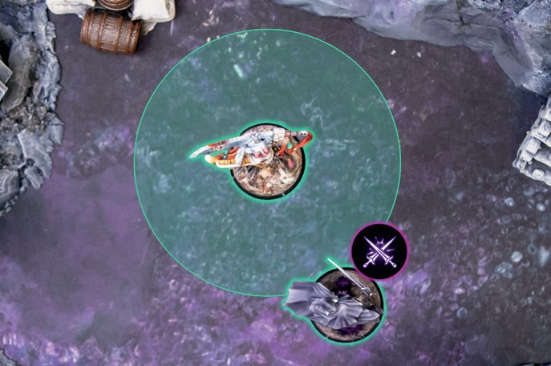
>
> **RANGED ATTACK**
>
> Ranged Attack is an Attack Action, performed with an Item or a Spell of the Ranged Type.
>
> When performing a Ranged Attack, a model uses:

- **Accuracy** when attacking with a Ranged Item.

- **Intellect** when casting Spells (unless Stated otherwise).

> During Reaction, when the Reacting model declares a Ranged Attack, it must also specify the exact location on the activated model’s Movement path (which the reacting model is able to see), where the activated model will be shot upon.
>
> Figure 2: An activated model (purple) moves while a reacting model (blue) declares a Ranged Attack, targeting it at any point along the path where it has Line of Sight.

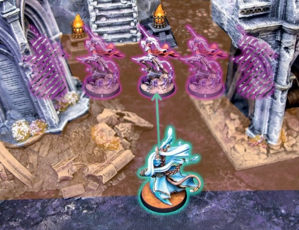

######### 

> **LIST OF ACTIONS**

53

> **Cover (rAngeD AttACK)**
>
> A piece of scenery or terrain on the field can provide cover to a model from Ranged Attacks.
>
> A Size Small, Medium or Large model has Cover against Ranged Attacks, if it is within 1 inch of
>
> a piece of scenery that is higher than the model’s base and at least partially obscures the model’s Hitbox from the attacker’s
>
> Line of Sight.
>
> Figure 1:
>
> The model within 1” of the terrain marked with a green check has Cover. The model marked with a red check is too far from the terrain to have Cover.
>
> contact with the cover (provided that the attacker has a visual of that exact moment).
>
> A model has Light Cover if it is in the Crouched State.
>
> **HigHer grounD**
>
> If a model is on elevated ground and the model’s Hitbox is at least partially obscured from the attacker
>
> because of the perspective, the model receives Light Cover. If the model on the elevated ground stands behind

<table style="width:42%;">
<colgroup>
<col style="width: 41%" />
</colgroup>
<thead>
<tr>
<th><blockquote>

Example: Clan Champion is standing behind a rock that provides Heavy Cover, partially obscuring the Flameweaver’s Line of Sight (LoS). If the Flameweaver casts a Fireball Spell directly targeting the Champion, the Flameweaver suffers a -4 modifier to their Intellect attribute. This

is because Fireball is a Spell, and Intellect is the attacking attribute used to resolve the Attack.

</blockquote></th>
</tr>
</thead>
<tbody>
</tbody>
</table>

a solid wall or similar, the model receives Heavy Cover instead.

> **tHere Are tWo tyPeS oF Cover:**
>
> **HeAvy**
>
> is when the object is both taller and wider than the model’s size.
>
> It causes -4 modifier to the Attacker’s
>
> Ranged Attack.
>
> **ligHt**
>
> **LIST OF ACTIONS**

is when the object is smaller or thinner than the model’s size. It causes -2 modifier to the Attacker’s Ranged Attack.

> Note: When in doubt, we suggest that you beforehand decide whether a scenery piece is heavy or light cover.
>
> If the model is not within 1 inch of the cover at any point of its
>
> movement, it can still be shot upon at the moment when it is not in
>
> Note: In this particular case, however, the Fireball Spell has the Targetless Trait. It allows the Flamweaver to target the ground near the Champion as the target of the Ranged Attack (in the Active Role). Consequentially, the Flameweaver would not suffer the -4 modifier from Cover, while the Champion is still engulfed by the Spell blast!
>
> 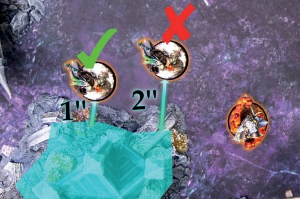**rAngeD FrienDly Fire**
>
> Shooting into melee combat where models are close together can be risky, as the shooters can hit their own allies in the process.
>
> This rule applies when performing a Ranged Attack without AoE **targeting an enemy** model that is in **Base Contact with an allied model** (of the shooter).
>
> When performing such a Ranged Attack, the model that is performing the Ranged Attack will suffer a
>
> **-4 stackable modifier** for every allied model in Base Contact with the

######### 54

> target. A roll result of **17, 18, 19 or 20** hits one of the allied models in Base Contact with the target (if more than 1, the opponent chooses which one gets hit). A hit model suffers from **Friendly Fire** (see page 47).
>
> **DEATH BLOW**
>
> Deathblow or “Coup de ’Grace” is an Action that renders an
>
> incapacitated enemy model into the Dead State.
>
> In order to declare this Action, the model must be in **Base Contact** with the target Incapacitated model.
>
> Upon the declaration of this Action, the target incapacitated model is automatically rendered into the Dead State.
>
> No roll is required.
>
> **DODGE**
>
> To avoid a potential or an incoming Attack, a model may attempt to perform a Dodge.
>
> To Dodge, the model must perform a successful **Agility** roll, using 1 die.
>
> If the Dodge roll is **successful**, all **non-critical Hits** from the enemy’s Attack are negated.
>
> In order to declare Dodge in the **Reactive** Role, a model must either have Line of Sight towards the activated model, or the currently activated enemy model must be within its Awareness, or both.
>
> If a model declares Dodge and did not have LoS at any point during the activated model’s Movement, the Dodge must be performed with a **halved Agility** attribute.
>
> When a model declares Dodge, it can do these things at the end of the
>
> Resolution Step, **even if the roll was unsuccessful**:

- **move for a distance of its halved Speed** value in any direction (rounded up),

<!-- -->

- enter or cancel the

> **Crouched** State.
>
> Note : A successful Dodge roll may also cancel all States that require a successful Dodge for their cancellation.
>
> A model can fall off the edge of a surface while dodging. In this case, any possible Fall Damage has to be applied.
>
> Declaration of Dodge requires no target, or rather, the target is the model itself.
>
> **DiSengAge**
>
> During the Active and/or Reactive turn, when an engaged model declares a Dodge, it may move out of the enemy model’s melee Reach, canceling the Engaged State (even if the roll was unsuccessful).
>
> **DoDge AgAinSt MultiPle eneMy AttACKS**
>
> **LIST OF ACTIONS**

A model declaring Dodge, upon becoming the Attack target of multiple enemy models, must perform **an Agility roll** against **each enemy Attack separately**, in order to prevent receiving Hits.

<table style="width:42%;">
<colgroup>
<col style="width: 41%" />
</colgroup>
<thead>
<tr>
<th><blockquote>

Example: Models B and C react against the activated Model A by declaring an

Attack. A declares a Dodge as its Action (its Agility being 13). B and C will perform an Attack roll, each using 1 die (while reacting, their Strike value is 1). Meanwhile, A will perform 2 Agility rolls, 1 against B and 1 against C separately.

Against B, A rolls 8, and against C, A rolls 14, therefore it dodges the Attack of B, but suffers the Attack of C. C must now

proceed making a Damage roll with hopes that it deals a Wound to A. As A declared Dodge, it may move up to its halved Speed value.

</blockquote></th>
</tr>
</thead>
<tbody>
</tbody>
</table>

######### 55

> **INTERACT**
>
> In order to declare this Action, a model must be in Base Contact with an object described by the Quest.
>
> By declaring this Action, the model may perform a roll against the object (if necessary), using the attribute prescribed by the Quest.
>
> **NOTHING**
>
> The model does nothing.
>
> **PERCEIVE**
>
> Some models or Spells have abilities that prevent other players from clearly seeing what they truly are.
>
> You may use Perceive to reveal their identity. For example, models can hide as tokens in the Shrouded State, but sometimes, you will encounter strange Spells or Items, masked as tokens on the field, that you will first need to uncover.
>
> Perceive allows a model to target and reveal an enemy model, Spell or an Item represented by a token (Intrigue, Shrouded etc.). The model must also have **Line of Sight** towards the token (unless specified otherwise).
>
> By passing an **Intellect roll**, the model may reveal the target token. If the token is revealed, the
>
> corresponding model, Spell or Item token is revealed and placed onto the field.
>
> A model can perform Perceive only against tokens within its **Awareness**.
>
> **TRADE**
>
> A model performing this Action can exchange any number of Items in its Inventory with the allied model, if they are in Base Contact.
>
> A model may exchange only acquired Items. In other words, it
>
> may not exchange the default Items listed
>
> on its profile.

> **LIST OF ACTIONS**

56

> **ISSUE A DUEL** When the duel ends, the game
>
> *A duel is an honorable alternative to a skirmish and unnecessary bloodshed. When both sides agree to a duel, they must both bow to the ancient laws and leave their fates to their singular chosen champions!*
>
> Only a member belonging to the player’s original party can declare this Action. Summoned creatures, familiars, etc. cannot declare
>
> this Action.
>
> If a model issues a duel, the opposing player may decide whether to accept or refuse it.
>
> If the opposing player accepts, they must appoint a model from their party to duel with the model that issued the duel.
>
> If the duel is agreed upon, both dueling models’ **Activation Points are restored** to match their default Stamina value and the duel begins.
>
> While the two models duel, no other model can be activated or react. If a model that is not dueling interferes (with a Skill such as Chain Attack, for example), the side it belongs to automatically loses the duel, and the other side automatically wins.
>
> Models belonging to the involved model, such as already summoned creatures, familiars, etc. can fight alongside the dueling model they belong to. (Note: Summoners are allowed to summon creatures that may help them in the duel.)
>
> The duel ends when one of the two models becomes Incapacitated or Dead (States).
>
> ends as well.
>
> Note: The players should have in mind that issuing and accepting a duel results in the end of the game and any Actions and objectives outside of the duel cannot be continued or completed after the duel starts.
>
> The player of the model that became Incapacitated or Dead loses the duel, while the player of the surviving model wins the duel. The winner of the game, however, is not necessarily the player that won the duel.
>
> If both models become Incapacitated or Dead (States) during the same Activation Sequence, the duel ends in a draw.
>
> The player that won the duel receives **6 Victory Points**.
>
> If the duel ends with a draw, the quest ends and both sides receive
>
> **3 Victory Points**, not exceeding the maximum amount of Victory Points available in the Quest (calculate point sum in “Rewards”, which are defined in each Quest).
>
> Note: The winner of the game is the player that amassed the most Victory Points, including those amassed during the play- through to the point of the Duel.
>
> Hint: Stratagems can be used during a duel.

######### 

> **LIST OF ACTIONS**

57

> **RITUAL**
>
> By declaring Ritual, a model can immediately cast a **Conjuration Spell** (without any roll required) or some Spells that can only be cast with the Ritual Action.
>
> When summoning a creature, after the player pays the **Mana Cost**, they may place
>
> a corresponding miniature and the profile card of the summoned
>
> creature onto the field. The miniature is placed in **Base Contact** with the caster.
>
> **UNCOVER**
>
> By passing a **halved Intellect roll**, the Hidden State of all enemy models or Items within this model’s Awareness is canceled. (When playing with more players, the models and Items are revealed to other players as well.)
>
> Note: Some abilities allow a model to be deployed in the Hidden State, which
>
> prevents the other player from seeing them on the field.
>
> **LIST OF ACTIONS**

58

##  STATES 

> **BLEEDING**
>
> A model in this State must perform a Toughness roll in its every Strategic Phase.
>
> A failed roll causes the model to suffer a Wound.

> **BLINDED**
>
> A model in this State has no LoS (other than to itself) and cannot perform any Actions other than Assist, Dodge or Nothing.

> **CONFUSED**
>
> A model in this State has halved Offense, Defense, Accuracy, Intellect, Agility and Morale.

> **CRIPPLED**
>
> A model in this State has halved Speed and Agility.

> **CROUCHED**
>
> The Hitbox of a Crouched model becomes the size and volume of its base.
>
> While in this State, the model’s Speed and Armor value is halved and its Attack Strike value becomes 1.
>
> Crouched models cannot make other models Engaged.
>
> During the Movement Step, a model in this State may only declare Walk or Idle.
>
> In the Active Role, this State may be voluntarily canceled during the model’s Movement Step. This State may also be canceled with a Dodge.

> **DEAD**
>
> A Dead model’s Hitbox becomes the size and volume of its base.
>
> A Dead model cannot receive Activation Points and cannot perform Activations nor Reactions.
>
> Unless Stated otherwise, it cannot use or benefit from any Skills, Traits, Upgrades, Items etc.
>
> **LIST OF STATES**

Unless stated otherwise, it is ignored for all impacts like scoring in Quests, Ranged Friendly Fire, etc. and does not obstruct Movement, but a model may not end their Movement on top of a Dead model.

> When a model enters Dead State, it retains its other States. Unless specified otherwise, a Dead model cannot regain HP.

######### 59

> **ENGAGED FLYING**
>
> During the Movement Step, when in the Active Role, an Engaged activated model may only declare
>
> **Idle** or **Walk**. However, if it declares Walk, it can only move directly towards the enemy model that is causing the Engaged State.
>
> If a model is Engaged by more than one model, it must choose one of the enemy models causing the Engaged State when declaring the Walk Action and it must move directly towards that enemy model.
>
> While Engaged, a model may declare only **Melee Attack**, **Assist** (targeting itself) or **Dodge**.
>
> A model **ceases to be Engaged** when it leaves the Melee Meapon Reach
>
> of the enemy model, Disengages with a Dodge, or by rendering the enemy model into the Incapacitated, Petrified, Crouched or Dead State.
>
> While a model is Engaged, it automatically has **LoS** to all enemy models that are causing it to be Engaged, but cannot react against models outside of its Awareness.

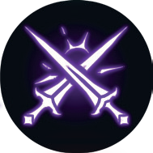

> **FATIGUED**
>
> **LIST OF STATES**

A model in this State cannot regain AP during the Upkeep Phase. This state is canceled at the beginning of this model’s next Strategic Phase.

> While in this State, the model:

- Has doubled Speed.

- Has Melee Attack Strike value of 1.

- May move over scenery, obstacles and models, or end its Movement above them (unless the scenery is of an infinite height).

- Cannot benefit from Cover.

- Always has LoS to all models and all models have LoS to the Flying model.

- Cannot become Engaged or cause Engaged.

- Cannot voluntarily become Crouched.

- Cannot be targeted by Melee Attacks, except by models that are also in the Flying State. However, if a model in this State declares

> a Melee Attack against a model that is not in the Flying State, the attacked model can declare a Melee Attack, targeting the Flying model.
>
> The Flying State is automatically canceled if a model in this State becomes Incapacitated, Dead, Immobilized, Petrified or Crouched.
>
> Attack and Movement distances are measured as if the figure were placed on the field.

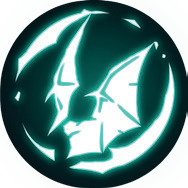

######### 60

> **IMMOBILIZED**
>
> A model in this State cannot perform any Movement, Special Movement or Special Action.
>
> This State can be canceled with a successful Dodge, which may be performed either with Agility or Toughness. When it declares Dodge, it cannot move or enter/cancel the Crouched State, unless it performs a successful Dodge.

> **INCAPACITATED**
>
> When a model’s HP reaches 0, it becomes Incapacitated and
>
> immediately enters the Crouched State. The model retains all
>
> other States.
>
> An Incapacitated model cannot receive Activation Points and cannot perform Activations nor Reactions.
>
> Note: If it had remaining Activation Points at the time when it became Incapacitated, it keeps them until the End Phase of that turn.
>
> This State is canceled if the model regains at least 1 HP. If a model enters the Incapacitated State due to an effect but has more than 0 HP, the State is canceled during the model’s next Strategic Phase. When
>
> canceled, the model may voluntarily cancel Crouched.
>
> An incapacitated Leader cannot use Stratagems.
>
> An already Incapacitated model that would suffer another Wound automatically becomes Dead.
>
> Unless stated otherwise, it cannot use or benefit from any Skills, Traits, Upgrades, Items, etc., and is ignored
>
> for all impacts such as scoring in Quests and Ranged Friendly Fire. They are still hit by Attacks, like AoEs or Sweep Attacks.

> **PANICKED**
>
> A Panicked model must perform a Morale roll at the beginning of its every Activation or Reaction. If it fails the roll when in its Active
>
> Role, it must perform an entire Run Movement towards the nearest open edge of the field. (If the distance from the two or more edges of the field were the same, the player must decide toward which the model
>
> will run to.)
>
> If it starts its turn Engaged it will declare Idle and Dodge.
>
> If the Movement of the model in this State would end past the edge of the field, the model is removed from play and counts as a loss.
>
> If the model fails the roll in its Reactive Role, it can only declare Dodge towards the edge of the field or Nothing as its Reaction.

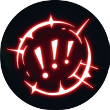

> **LIST OF STATES**

**POISONED**

> A model in this State must perform a Toughness roll with a -6 modifier in its every Strategic Phase. A failed roll causes the model to suffer a Wound.

######### 61

> **SHROUDED**
>
> While a model is in this State, it is represented on the field by a Shrouded token.
>
> A model in this State cannot be the target of Actions other than Perceive.
>
> Dodge does not have a target and is therefore a valid Reaction against Shrouded models.
>
> The Shrouded State is automatically canceled if the model declares a Normal Action (other than Nothing) or a Special Action. Performing an Attack while in this State reveals the model but grants the Surprise Attack Trait to its Attack.
>
> The model and profile concealed by the Shrouded token are considered secret information. The player controlling the model is not obliged to disclose the model’s identity or profile to other players as long as the model remains in this State.
>
> Note: Shrouded models retain all of their Skills, Traits, Size, etc.; however, this information is not publicly disclosed. The model has 360° Line of Sight (LoS).

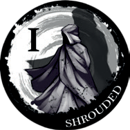

> **SLOWED**
>
> A model in this State has halved SPD.

> **WEAKENED**
>
> A model in this State has halved Toughness, and -1 Stamina.

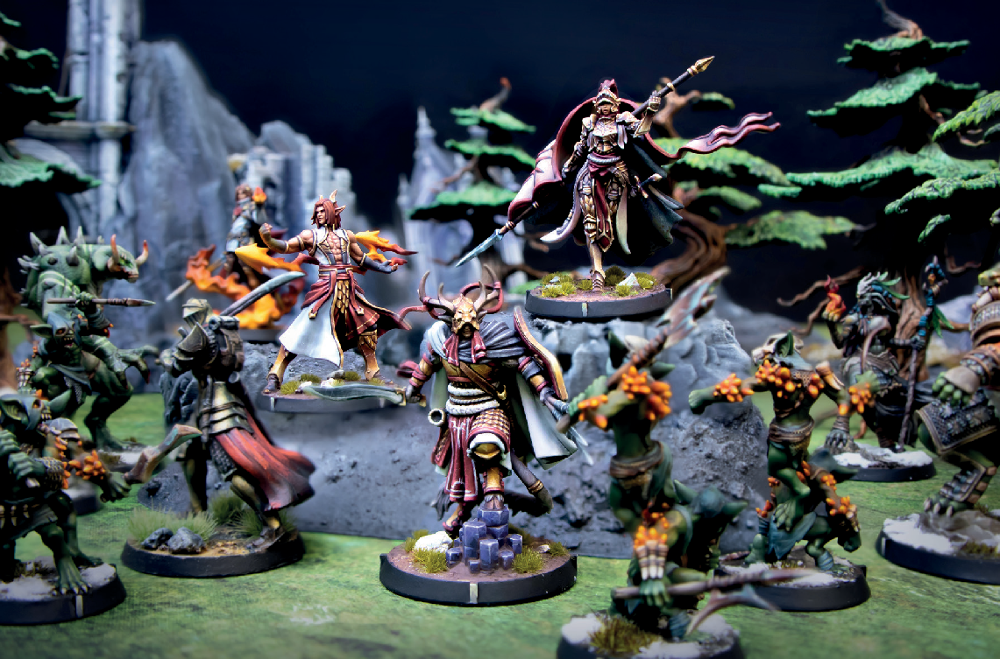

> Reinforcements Pack: Sunspear
>
> **LIST OF STATES**

62

##  CLASSES 

> **ALCHEMIST**
>
> Consumables of Alchemists replenish during their Strategic Phase. When casting a Transmutation-Type Spell, an Alchemist may Reroll up to 1 failed roll.
>
> **ARMSMASTER**
>
> In the Active Role, Armsmasters may gain +1 Strike when performing a Melee Attack.
>
> **ARTIFICER**
>
> During their Strategic Phase, Artificers may select an Enchantment Spell available to them and apply
>
> its effect to themselves without performing a roll until their next Strategic Phase.
>
> **ASSASSIN**
>
> Assassins score a Critical Hit on roll results of 1, 2, 3.
>
> **BERSERKER**
>
> Once per turn, if Berserkers would suffer one or more Wounds as a consequence of Damage roll(s), they may perform a Toughness roll for every Wound they would suffer. If a roll is successful, the corresponding damage is prevented.
>
> **CREATURE**
>
> Creatures have no particular abilities connected to their Class. However, some Quests may have rules that add a specific effect to the Creature Class.
>
> **CIVILIAN**
>
> Civilians have no particular abilities connected to their Class. However, some Quests may have rules that add a specific effect to the Civilian Class.
>
> **DRUID**
>
> Druids gain a +4 modifier when casting Spells of the Earth element. Furthermore, Druids can choose to cast Spells with either their Intellect or Morale value.
>
> **ENCHANTER**
>
> Enchanters may cast Enchantment- Type Spells on allied models without performing a roll.
>
> **MAGE**
>
> When casting a Spell, a Mage may spend an unspent Activation Point to Reroll any number of dice.
>
> Mana Counters are a resource that represents mana - the energy required for casting Spells. Mana Counters
>
> can be spent for covering the price of Conjuration-type Spells or some other powerful Spells.
>
> When in the Active Role, a Mage can convert any number of its Activation Points into the corresponding number of Mana Counters (replace Activation Points with Mana Counters) and place them in their personal pool. Mana counters are cumulative and do not disappear at the end of the turn!
>
> 
>
> **LIST OF CLASSES**

**MARKSMAN**

> If a Marksman declares Idle during their Movement Step, it gains
>
> +4 Accuracy until the end of the Activation Sequence.
>
> **MOUNT**
>
> This Class indicates that the model can be mounted by a Rider.

######### 63

> **MYSTIC**
>
> Mystics must use the Morale value instead of the Intellect value when casting Spells.
>
> **RANGER**
>
> In the End Phase of the Active Role, Rangers may perform a Normal Movement.
>
> Note: this does not provoke Reaction from the Reactive Player.
>
> **RIDER**
>
> A Rider can ride a Mount. When mounted, the profile card of the Mount and the Rider connect and influence each other. See Mounted Rules.
>
> *(See page 77.)*
>
> **ROGUE**
>
> Once per Activation, on at least one successful Hit against the target, a Rogue may perform one AG roll.
>
> If successful, the Rogue’s Hit gains Knockdown.
>
> **SENTINEL**
>
> In their Reactive Role, Sentinels may gain +1 Strike when performing
>
> an Attack.
>
> **SORCERER**
>
> In their Active Role, when casting a Sorcery-Type Spell, a Sorcerer may Reroll up to 1 failed roll.
>
> **SOLDIER**
>
> Soldiers gain +1 Offense, +1
>
> **LIST OF CLASSES**

Defense, +1 Accuracy, +1 Intellect, and +1 Morale for each other Soldier from the same Party within their Awareness that is not in the Incapacitated or Dead State, up to a maximum of +3.

> **SUMMONER**
>
> A Summoner can start the game with a Tier II or lower summoned creature in its Awareness, which could be brought to the field by one of the Conjuration Spells available to them
>
> (with no roll nor spending of an Activation Point required).
>
> A Summoner may share its pool of Mana Counters with other Summoners in the party. (If the Summoner becomes Incapacitated, its accumulated Mana Counters are discarded.)
>
> **VITALIST**
>
> Vitalists can cast Healing-Type Spells on allied models that are not in the Incapacitated or Dead State without having to perform a roll.
>
> **WARRIOR**
>
> During their Strategic Phase, a Warrior may shift to a Defensive Stance; the player indicates this by placing a Defensive Stance token next to the model. A Warrior in Defensive Stance has a Strike of 1 in its Active Role and retains the default Strike
>
> in its Reactive Role (the same as if in Active Role). The Defensive Stance lasts until the Warrior’s next Strategic Phase unless specified otherwise.

> **WIZARD**
>
> When casting a Spell of the Elder Element, a Wizard may Reroll up to 1 failed roll.

<figure>

<figcaption><blockquote>

If you cannot find a Class you are looking for in this rulebook, please check online at <strong>eldfall-chronicles.com</strong>, under “Resources”.

</blockquote></figcaption>
</figure>

64

##  SKILLS 

> **BACKSTAB**
>
> During an Attack Action against a target that lacks LoS to this model, this model’s Hits gain +3 PW for that Attack, and one Strike automatically becomes a Hit (it is not included
>
> in Confrontation rolls). Resolve all other Strikes normally. If this model loses the Confrontation roll, both models may still score successful Hits.
>
> **CHAIN ATTACK**
>
> Once per Activation Sequence, if another allied model scores a Hit against an enemy within this model’s LoS, this model may perform an unmodified STK 1 Attack against that enemy (before DMG rolls). If there are multiple targets, choose one. This Skill is not an Activation or Reaction and does not consume AP. It ignores Ranged Friendly Fire. Hits generated from Chain Attack cannot generate further Chain Attacks.
>
> **CHARM I/II**
>
> I: An enemy declaring Reaction against this model must first perform an INT roll. On a failed roll, it may only declare Nothing (Action) until the end of the Activation Sequence. II: On a failed INT roll, it must also Walk toward this model for its
>
> full SPD (if able) at the end of the Activation Sequence.
>
> **CLAIRVOYANCE**
>
> In the Reactive Role, this model may declare a Reaction using Casting Aura Spells to target enemy models within its Awareness without requiring LoS. It ignores LoS restrictions caused by Environments, as well as the Blinded State and
>
> the Surprise Attack Trait of enemy
>
> models within its Awareness. In the Active Role, it does not suffer halving modifiers when casting Spells without LoS.
>
> **CLIMBING**
>
> This model may perform the Climb Special Movement as Normal Movement, ignoring related Movement penalties. While Climbing, its SPD is not halved.
>
> **DASH**
>
> When performing a Run Special Movement, this model may declare an unmodified STK 1 Melee Attack in its Action Step.
>
> **DUAL WIELD**
>
> A model with this Skill may replace a Shield with a second (Melee) Weapon, as long as both Weapons have RCH 1 or less and lack the Two-Handed Trait. The model may reroll one Melee Attack roll and must choose which Weapon’s PW and STK values apply during an Attack Action. The model may apply effects of both Weapons if applicable.
>
> **FINISHING STRIKE**
>
> When this model causes at least one Wound to a target with this Skill, it may immediately make an
>
> **LIST OF SKILLS**

unmodified STK 1 Attack against the same target, using the same Item or Skill. If there are multiple targets, choose one.

######### 65

> **FLICKER**
>
> When declaring Movement, this model may ignore obstacles and other models, moving in any direction, even vertically. Distance is measured as a straight line between start and end positions. This model cannot end Movement on another model or in scenery. If ending mid- air, place it underneath and test for Fall Damage. Enemies can react if they have LoS to the start or end positions or if this model moves into their Awareness.
>
> **FLIGHT**
>
> The user may enter or cancel the Flying State during its Movement Step. In addition, it cannot be affected by Fall Damage. A model cannot enter Flying (State) if it is Engaged (State).
>
> **FOLLOW-UP**
>
> If an enemy disengages from this model, it may move up to half its SPD toward the disengaged model.
>
> **FORESIGHT**
>
> When this model becomes the target of an Attack in the Reactive Role and did not declare a Reaction during the Reaction Step, it may instead declare a Reaction during the Action Step
>
> of the Activation Sequence, after the Active model has declared its Action.
>
> **HIT AND RETREAT**
>
> **LIST OF SKILLS**

During its Movement Step, this model may cancel (remove) its Engaged (State). If it declares an Attack in its Activation, it may perform (an additional) Walk at the end of the Resolution Step.

> **IMPEDE**
>
> When this model declares an Attack of Opportunity with a Melee Attack against a non-Engaged model, that model’s Movement ends at the point of the Attack and the target becomes Engaged immediately.
>
> **INFILTRATION**
>
> During the Deployment Phase:
>
> I: Deploy this model up to the middle line of your half of the field. II: Deploy this model anywhere outside the opponent’s Deployment Zone.
>
> **LEAP**
>
> This model may perform the Jump Special Movement as Normal Movement. While Jumping, its SPD is not halved.
>
> **PROTECTOR**
>
> When an ally within 1/2 SPD is targeted by an Attack during this model’s Reactive Role, this model may spend 1 AP to move into Base Contact with the the ally and become the new target of the Attack.

######### 66

> **REGENERATION (X)**
>
> During its Strategic Phase, this model may regain 1 HP per Skill level and can cancel Bleeding, Weakened, and Crippled (States).
>
> **SNIPE**
>
> Strike of an Attack using this ability is 1 and cannot be modified. This model ignores Cover and Ranged Friendly Fire.
>
> **STEALTH**
>
> I: If this model activates or enters an enemy’s Awareness, that enemy cannot declare a Reaction unless it has LoS to this model.
>
> II: Deploy this model in Shrouded (State). If no enemy has LoS, it may re-enter Shrouded during its Strategic Phase.
>
> **TAUNT**
>
> This Skill can only be used during Movement. All enemy models with LoS to or with this model in their Awareness must perform an INT roll. On a failed roll, the enemy model must declare a Reaction against this model if possible.
>
> **TRACKING**
>
> If you cannot find a Skill you are looking for in this rulebook, please check online at **eldfall-chronicles.com**, under “Resources”.

This model gains +3 to Perceive and Uncover (Actions). It does not suffer the INT penalty for Uncover and may reroll one die when performing Perceive.

> **LIST OF SKILLS**

##  TRAITS 

> **ACUTE SENSES**
>
> This model may perform Perceive and Uncover Actions using AG instead of INT. Its Awareness increases by 3 inches. When Dodging without LoS, its AG is not halved.
>
> **ADVANTAGE (X)**
>
> Once per Activation Sequence, this model may reroll any number of dice (once) during an Attack
>
> Action against a target with the (X) characteristic (Size, Class, Trait, etc.).
>
> **AFFINITY (ELEMENT)**
>
> This model can cast (Element) Spells. (For example: Element is Fire, Water, Profane, etc.)
>
> **ARMOR-PIERCING**
>
> When making a DMG roll for a Hit with this Trait, subtract only half the target’s ARM value.
>
> **BLEED**
>
> If a model suffers at least one Wound with this Trait, it enters Bleeding (State).
>
> **BRUTE**
>
> This model gains +1 STK when using Items with the Two-Handed (Trait) and ignores Two-Handed restrictions.
>
> **LIST OF TRAITS**

**BURN (X)**

> If a model suffers at least one Wound from an Attack with this Trait, the attacker may make X DMG Rolls using the same PW as the initial Attack and an ARM value of 0. Each successful roll causes a Wound. If this Wound causes the model to become Dead (State), it is removed from the field.
>
> **CLEAVE**
>
> If a model suffers at least one Wound with this Trait, it suffers an additional Wound.
>
> **CONSTRUCT**
>
> This model is unaffected by Surprise Attack, Stagger, Vampirism, Mindgame, and Burn. It is immune to Charm and Toxic Environment. It cannot become Panicked, Bleeding, Poisoned, Weakened, or Confused. Abilities allowing attackers to regain HP after dealing a Wound do not affect it. It cannot regain HP from Spells or Skills without the Earth Element. If its HP reaches 0, it is removed from the field.
>
> **CONTINUOUS**
>
> An effect with this Trait remains in play until the end of the Quest or until removed with a certain other effect, regardless of other imposed time durations (Sorcery, Enchantment, etc.).
>
> **CRIPPLING**
>
> If a model suffers at least one Wound with this Trait, it must perform a T roll. A failed roll causes it to become Crippled (State).
>
> **DEMON**
>
> When this model deals a Wound, the target must perform an M roll. A failed roll causes the target to become Panicked (State) until the end of the turn. On a Critical Hit, the target becomes Panicked (State) automatically. This model’s Attack receives a +4 modifier against a Panicked target. This Trait does not affect models with the Demon Trait.

######### 68

> **DUELIST**
>
> The target of this model’s Attack cannot use Combat Arts of level III or lower.
>
> **ELEMENTAL**
>
> This model is unaffected by the Stagger, Vampirism, and Mindgame Traits, the Charm Skill, and Toxic Environment. It cannot enter Bleeding, Poisoned, or Weakened (States). If its HP reaches 0, it is removed from the field.
>
> **ELEMENTAL ESSENCE (ELEMENT)**
>
> This model is unaffected by effects from (Element) Attacks (it still suffers damage as normal). It deals (Element) Spell damage with Melee Attacks using Natural Weapons.
>
> **FAMILIAR**
>
> When a Creature with this Trait is summoned by a Conjuration Spell, the caster gains additional Abilities and Stat modifiers listed on the creature’s profile. If the caster takes damage and suffers Wounds, the familiar may be removed instead (if multiple, the player chooses which). Creatures with this Trait have no Summoning Limit, but the caster may control only one of each named creature.
>
> Note: Familiars are not considered full models, but their miniatures may be used as visual elements. Some familiars have individual miniatures, while others are attached to the caster’s. The caster gains the familiar’s Abilities and modifiers only if the
>
> familiar is summoned, regardless of attached miniatures.
>
> **FEARLESS**
>
> This model cannot become Panicked (State).
>
> **FOCUS**
>
> Spells or Items with this Trait do not require a target when declaring an Attack or Assist. Instead, the caster or user becomes the center of the effect, and models within the caster’s Casting Aura are affected by the Spell or Item.
>
> **FROSTBITE**
>
> If a model suffers at least one Wound with this Trait, it must perform a single T roll, regardless of the number of Hits. On a
>
> failed roll, the model suffers an additional Wound.
>
> **IGNORE ARMOR**
>
> A Hit with this Trait reduces the target’s ARM to 0 for the DMG roll duration.
>
> **IGNORE SHIELD**
>
> Attacks with this Trait ignore the effects of Shields.
>
> **INCORPOREAL**
>
> The PW of a Hit lacking the Spell Type or Burn (Trait) against this model is halved. This model ignores Environment rules and Movement penalties, allowing it to move through obstacles and vertically. It cannot end within an obstacle and cannot become Engaged (State).
>
> **INSPIRING I**
>
> **LIST OF TRAITS**

Other allied models within this model’s Awareness and with the same Affiliation gain +6 M.

> **INTIMIDATING**
>
> Models in the Panicked (State) with LoS towards this model suffer -6 M.

######### 69

> **KNOCKBACK (X)**
>
> During the Resolution Step, a model Hit with this Trait is moved for X inches away from the attacker. The direction is the attacker’s choice.
>
> This Trait does not affect models two or more Sizes larger than the attacker.
>
> **KNOCKDOWN**
>
> A model that suffers a Hit with this Trait becomes Crouched (State). It does not affect models two or more Sizes larger than the attacker.
>
> **MANA COST (X)**
>
> To cast a Spell with this Trait, the caster must spend Mana Counters equal to the X value.
>
> **MENACING (X)**
>
> Models with LoS to this model suffer a -2 M modifier for every level of this ability.
>
> **MINDGAME**
>
> A Dodge against an Attack with this Trait uses INT instead of AG. If a model suffers a Mindgame Hit with PW, it rolls INT instead of making
>
> a Damage roll. On a failed roll, the model suffers damage.
>
> **POISON I/II**
>
> I: WEAK POISON; If a model suffers a Wound with this Trait, it becomes Weakened until its next Strategic Phase.
>
> **LIST OF TRAITS**

II: STRONG POISON; If a model

> suffers a Wound with this Trait, it becomes Weakened and Poisoned.
>
> **RESISTANCE I/II (X)**
>
> I: The PW of a Hit with (X) Type or Trait against this model is halved. II: Hits and effects from an Attack with (X) Type or Trait are negated.
>
> **RESOURCEFUL I/II**
>
> I: This model may receive 1 additional Upgrade.
>
> II: This model may receive another additional Upgrade.
>
> **RICOCHET (X)**
>
> When a model is hit by an Attack with this Trait, the nearest enemy model within 5” is also hit by
>
> the same Attack. This effect can repeat up to X times per Activation Sequence but cannot target the same model more than once. If multiple enemies are equidistant from the hit model, they all suffer this effect.
>
> **SPELLBOUND (X)**
>
> A model or Item with this Trait is enchanted by the Enchantment Spell listed in brackets. The Spell remains active for the entire game.
>
> **STAGGER**
>
> A model that suffers a Hit with this Trait loses 1 AP (until the end of the turn). This Trait does not affect models two or more Sizes larger than the attacker.
>
> **STRATEGIST**
>
> This model can use two Stratagems of different names in its
>
> Strategic Phase.

######### 70

> **STUN**
>
> A model that suffers at least one Wound with this Trait must perform a T roll. If failed, the model loses all AP (until the end of the turn).
>
> **SURPRISE ATTACK**
>
> An Attack with this Trait halves the target model’s OFF, DEF, ACC, AG, and INT until the end of the Activation Sequence.
>
> **SURVIVAL**
>
> **(X ENVIRONMENT)**
>
> This model is unaffected by the X Environment.
>
> **SWEEP I/II**
>
> I: On a successful Attack roll, all models within this model’s LoS and Melee RCH suffer a Hit.
>
> II: On a successful Attack roll, this model’s Front arc becomes 360° for the remainder of the Activation Sequence. All models within this model’s Melee RCH and LoS suffer a Hit.
>
> **TACTICIAN**
>
> The Deployment Zone of the party in which this model is present is extended for 5 inches (towards the middle of the field).
>
> **TARGETLESS**
>
> In the Active Role, an Attack with this Trait does not require a model as a target. The target can be any field surface. If the Spell has both Casting Aura and AoE Reach, and the target is a flat surface/ground, the template must be placed wholly within the Casting Aura.
>
> **THROWING**
>
> An Item with this Trait enables a Ranged Attack with RCH equal to the user’s T. STK can be up to the Item’s QTY. Upon use, remove QTY of the Item equal to the STK, even
>
> if the Attack is unsuccessful. If the Attack incapacitates or kills the target, the Item can be recovered by moving into Base Contact with the target.
>
> **TRAMPLE**
>
> When this model declares Run, it can move through any model that is a smaller Size. Each model it moves through or touches suffers a Hit with Knockdown (Trait) and PW equal to this model’s T.
>
> Note: The Reacting model can avoid the Hit with a successful Dodge.
>
> **TWO-HANDED**
>
> A Weapon with this Trait cannot be used with an equipped Shield or another Weapon.
>
> **UNDEAD**
>
> I: This model cannot be affected by Poisoned, Weakened, Bleeding, or Panicked (States). Spells with the Mindgame Trait cannot target or affect it. Healing-type Spells of the Divine Element do not restore any HP but instead, deal PW 15 Hit to it. If this model’s HP reaches 0, it becomes Dead (State).

######### 

> **LIST OF TRAITS**

71

> **UNKEEN**
>
> If a model would suffer a Wound with this Trait, it must first perform a T roll. A failed roll causes the Wound, while a successful roll negates it.
>
> **UNSTOPPABLE**
>
> If the target of an Attack with this Trait is of a smaller Size, a Confrontation does not occur.
>
> Successful Attack rolls from either model do not block one another.
>
> **UNWIELDY**
>
> When used by a Size: Medium or a smaller model, STK of this Item can never exceed 1. When performing an Attack with this Item while not Mounted, the model may reroll 1 Attack roll once.
>
> **WATCHFUL**
>
> This model receives double AP in its Reactive Role.
>
> **VIGILANCE**
>
> This model is immune to the Surprise Attack Trait, has a 360° Front arc, and no Back arc.
>
> **WEAKENING**
>
> **LIST OF TRAITS**

If this model suffers a Wound with this Trait, it becomes Weakened (State).

> If you cannot find a Trait you are looking for in this rulebook, please check online at **eldfall-chronicles.com**, under “Resources”.
>
> 72

###  COMBAT ARTS 

> **ARCHERY**
>
> The selected level’s effect applies to this model’s Ranged Attack.

<table style="width:87%;">
<colgroup>
<col style="width: 5%" />
<col style="width: 80%" />
</colgroup>
<thead>
<tr>
<th><blockquote>

<strong>I</strong>

</blockquote></th>
<th><blockquote>

<strong>Overdraw:</strong> When using a weapon with two RCH values, the first value RCH is increased by 6’’.

</blockquote></th>
</tr>
</thead>
<tbody>
<tr>
<td><blockquote>

<strong>II</strong>

</blockquote></td>
<td><blockquote>

<strong>Impeding Momentum:</strong> If hit, the target becomes Slowed (State) until the end of the turn.

</blockquote></td>
</tr>
<tr>
<td><blockquote>

<strong>III</strong>

</blockquote></td>
<td><blockquote>

<strong>Staggering Precision:</strong> User’s Ranged Attack gains Stagger.

</blockquote></td>
</tr>
<tr>
<td><blockquote>

<strong>IV</strong>

</blockquote></td>
<td><blockquote>

<strong>Quickdraw:</strong> User’s Ranged Attack gains +1 STK.

</blockquote></td>
</tr>
</tbody>
</table>

> **ASSASSINATION**
>
> Selected level’s effect is applied to this model’s Attack.

<table style="width:87%;">
<colgroup>
<col style="width: 5%" />
<col style="width: 81%" />
</colgroup>
<thead>
<tr>
<th><blockquote>

<strong>I</strong>

</blockquote></th>
<th><blockquote>

<strong>Aiming for the Vitals:</strong> User’s Attack gains +6 PW.

</blockquote></th>
</tr>
</thead>
<tbody>
<tr>
<td><blockquote>

<strong>II</strong>

</blockquote></td>
<td><blockquote>

<strong>Cunning Precaution:</strong> User’s Attack gains Poison I Trait.

</blockquote></td>
</tr>
<tr>
<td><blockquote>

<strong>III</strong>

</blockquote></td>
<td><blockquote>

<strong>Overwhelming Assault:</strong> User’s Attack gains +1 STK.

</blockquote></td>
</tr>
<tr>
<td><blockquote>

<strong>IV</strong>

</blockquote></td>
<td><blockquote>

<strong>Decisive Blow:</strong> In the Active Role, User’s successful Attack rolls become Critical hits.

</blockquote></td>
</tr>
<tr>
<td><blockquote>

<strong>V</strong>

</blockquote></td>
<td><blockquote>

<strong>Deadly Precision:</strong> if a model suffers a Wound by this ability, it automatically dies.

</blockquote></td>
</tr>
</tbody>
</table>

> **BERSERK**
>
> Selected level’s effect is applied to this model’s Melee Attack.

<table style="width:87%;">
<colgroup>
<col style="width: 5%" />
<col style="width: 80%" />
</colgroup>
<thead>
<tr>
<th><blockquote>

<strong>I</strong>

</blockquote></th>
<th><blockquote>

<strong>Grapple &amp; Thrash:</strong> User’s Melee Attack gains Knockdown.

</blockquote></th>
</tr>
</thead>
<tbody>
<tr>
<td><blockquote>

<strong>II</strong>

</blockquote></td>
<td><blockquote>

<strong>Onslaught:</strong> User’s Melee Attack gains Sweep.

</blockquote></td>
</tr>
<tr>
<td><blockquote>

<strong>III</strong>

</blockquote></td>
<td><blockquote>

<strong>Limb Fracture:</strong> User’s Melee Attack gains Crippling.

</blockquote></td>
</tr>
<tr>
<td><blockquote>

<strong>IV</strong>

</blockquote></td>
<td><blockquote>

<strong>Mortal Wound:</strong> User’s Melee Attack gains Cleave.

</blockquote></td>
</tr>
</tbody>
</table>

> **FENCING**
>
> **COMBAT ARTS**

Selected level’s effect is applied to this model’s Melee Attack.

<table style="width:87%;">
<colgroup>
<col style="width: 5%" />
<col style="width: 80%" />
</colgroup>
<thead>
<tr>
<th><blockquote>

<strong>I</strong>

</blockquote></th>
<th><blockquote>

<strong>Masterful Parry:</strong> Target’s Melee Attack suffers -3 mod.

</blockquote></th>
</tr>
</thead>
<tbody>
<tr>
<td><blockquote>

<strong>II</strong>

</blockquote></td>
<td><blockquote>

<strong>Harsh Riposte:</strong> Target’s Melee Attack suffers -1 STK (cannot be reduced below 1).

</blockquote></td>
</tr>
<tr>
<td><blockquote>

<strong>III</strong>

</blockquote></td>
<td><blockquote>

<strong>Second Wind:</strong> User’s Melee Attack gains +1 STK.

</blockquote></td>
</tr>
<tr>
<td><blockquote>

<strong>IV</strong>

</blockquote></td>
<td><blockquote>

<strong>Grapple &amp; Thrash:</strong> User’s Melee Attack gains Knockdown.

</blockquote></td>
</tr>
<tr>
<td><blockquote>

<strong>V</strong>

</blockquote></td>
<td><blockquote>

<strong>Striking the Gaps:</strong> User’s Melee Attack gains Ignore Armor.

</blockquote></td>
</tr>
</tbody>
</table>

> 73

###  ENVIRONMENTS 

> **LIST OF ENVIRONMENTS**

Each Environment term gives specific characteristics to a defined area of the battlefield. By mutual agreement, players may assign Environments to individual pieces of scenery, parts of the field, or the entire battlefield.

> Multiple Environments may be assigned to a single area.
>
> A model is affected by an Environment if it is in Base Contact with, or partially within it.
>
> **ENVIRONMENT TYPES**

Some Environments may also affect models outside their area (e.g., targeting into or through them). Such effects will always be explicitly stated.

> **AQUATIC (SHALLOW / DEEP)**
>
> Models in Aquatic Environments suffer Movement restrictions and additional effects from electricity.
>
> It does not affect models in the Flying State. If hit by Spells, Items, or Abilities with “Lightning,” “Thunder,” “Electrification,” or “Electric” in the name, the PW
>
> is doubled.
>
> **Shallow**

- Models move through this Environment at half SPD (for every inch moved, 2 SPD must be spent), and their AG is halved.

- Burn I is negated.

- Burn II is reduced to Burn I, Burn III is reduced to Burn II.

> **Deep**

- All effect of Shallow Aquatic.

- Models cannot declare Jump, Attack, Assist, or Ritual Actions.

- Models with ARM greater than 2 must roll AG (with a negative modifier equal to their ARM) at

> Activation. On failure, they drown and are considered Dead.
>
> **DANGEROUS**
>
> When a model moves into or touches this Environment, it suffers 1 Wound, unless it declares Dodge and passes an AG roll during its Activation.
>
> It does not affect models with the Elemental, Construct, Spirit, or Undead Traits, or models in the Flying State.
>
> **DARK**
>
> Model’s LoS is limited to Awareness. Models targeting another model that is outside half their Awareness suffer
>
> –3 modifier.
>
> Exception: Coalition of Thenion models are not affected.
>
> **DENSE**
>
> Melee Attacks with RCH 1 or more suffer –1 STK. Ranged Attacks within or through the area suffer –1 STK. Models in the Flying State or Mounted cannot enter or remain in this Environment.
>
> **DIFFICULT**
>
> Models move through this Environment at half SPD (for every inch moved, 2 SPD must be spent).
>
> It does not affect models using the Flicker Skill or models in the Flying State.
>
> **FOREST**
>
> Ranged Attacks within or through this Environment suffer a –3 Attack modifier.
>
> LoS cannot be drawn through two or more Forest areas.
>
> **FREEZING**
>
> During the Strategic Phase, a model must perform a T roll, adding their ARM as a modifier (Creatures cannot apply ARM). On fail, the model
>
> becomes Fatigued.
>
> Models with 1 or more Wounds must perform another T roll. On fail, the model suffers 1 Wound.
>
> **HAZY**
>
> Ranged Attacks cannot target through the area. Ranged Attacks from within or into the area suffer a halved Attack modifier. Melee Attacks outside Base Contact suffer
>
> a –3 Attack modifier. Does not affect models using the Flicker Skill or models in the Flying State.
>
> **MANAGMATIC**
>
> Attacks with Spell Type, performed by models with the following Classes gain +2 PW:
>
> Mage, Sorcerer, Mystic, Vitalist, Enchanter, Summoner, Artificer. These models also gain +1 SPD.
>
> **MOUNTAINOUS**
>
> Models move through this Environment at half SPD (for every inch moved, 2 SPD must be spent). It does not affect models using Flicker skill or models in the Flying State.
>
> **PROFANE MIASMA**
>
> Ranged Attacks from outside cannot target models inside this Environment.
>
> Ranged Attacks from within suffer a halved Attack modifier.
>
> **LIST OF ENVIRONMENTS**

Melee Attacks outside Base Contact suffer a –3 Attack modifier.

> In the End Phase, a model that was within or in contact with this Environment at any point during
>
> the turn suffers a PW 10 Hit with the Ignore Armor and Weakening Traits.
>
> This Environment does not affect models with Affinity (Profane) or Elemental Essence (Profane).

######### 75

> **LIST OF ENVIRONMENTS**

**SACRED GROUND**

> During the Strategic Phase, model may choose to recover 1 HP, or remove one State. If Incapacitated, a successful M roll is required.
>
> Models with Affinity (Profane), Elemental Essence (Profane), or Undead cannot benefit
>
> from this. Instead, these models suffer 1 Wound upon contact, and –1 HP during each
>
> Strategic Phase. If Incapacitated, they immediately become Dead.
>
> **SCORCHING**
>
> During the Strategic Phase, models with ARM more than 1 must perform a T roll with – ARM modifier.
>
> On fail, the model becomes Fatigued.
>
> **SWAMP**
>
> At the start of its Activation, the model must perform an AG roll. On fail, it cannot move.
>
> **TOXIC**
>
> During the Strategic Phase, the model must perform a T roll. On fail, it suffers 1 Wound.
>
> **UNSCALABLE**
>
> Only models with the Climbing Skill can move across this Environment.
>
> If you cannot find an Environment you are looking for in this rulebook, please check online at **eldfall-chronicles.com**, under “Resources”.

Does not affect models using the Flicker Skill or models in the Flying State.

###  MOUNTED RULES 

> Mounts are models with the special Class: Mount. A **Rider** can ride a Mount, linking their profile cards together to form a single mounted model.
>
> **MOUNT (CLASS)**
>
> This Class indicates that the model can be mounted by a Rider (Class).
>
> **RIDER (CLASS)**
>
> Only a model with the Rider Class may use and ride a Mount.
>
> **MOUNTING AND DISMOUNTING**
>
> A model may mount during its **Strategic Phase** if no enemy model has Line of Sight (LoS) to it, or by declaring **Assist** (targeting itself) during its Active Role.
>
> When a model mounts, the Mount appears instantly on the field.
>
> A model may **dismount** during its Strategic Phase, Movement Step, or by declaring Dodge.
>
> Upon dismounting, the Mount is instantly removed from the field.
>
> A model cannot mount if it is in the Engaged State.
>
> **PROFILE AND ATTRIBUTE INTERACTION**
>
> When mounted, the Rider’s profile is modified by the Mount’s Attributes:
>
> If an Attribute has a +/–, it modifies
>
> the Rider’s Attribute.
>
> If it is a flat number, it replaces the Rider’s corresponding Attribute. The Rider also gains access to the Mount’s Abilities and Inventory.
>
> Note: Place the Mount’s card under the Rider’s profile card to keep important information visible.
>
> The Mount and Rider are treated as a single model while mounted.
>
> **HP INTERACTION AND DAMAGE**
>
> If the Mount provides bonus HP, that HP is lost first when taking Wounds. When the bonus HP is reduced to
>
> 0, further damage is applied to the Rider’s HP.
>
> The Mount does not become Incapacitated or Dead when its bonus HP is lost.
>
> Bonus HP does not reset upon dismounting and remounting.
>
> **OTHER RULES**
>
> The mounted Rider assumes the Mount’s Size, except when resolving effects referencing Size differences (e.g., Stagger, Knockdown); in
>
> those cases, the Rider’s default Size is used.
>
> A mounted Rider cannot perform Attacks with Items that have RCH 0, unless the Weapon Type is Natural (i.e., the Mount’s Natural Weapon).
>
> While mounted, Strike of Weapons cannot be increased by Abilities.
>
> **MOUNTED RULES**

If the Rider is hit by an Attack with the Knockdown Trait, they are automatically dismounted.

> If the Rider becomes Incapacitated or Dead, they are automatically dismounted.

######### 77

> If a mounted model declares a Dodge, it may not move during the Resolution Step except to dismount. If it dismounts, replace the model with its dismounted version—no additional movement is made.
>
> Mounts cannot become Crouched, unless stated otherwise.
>
> **INVENTORY AND ITEMS**
>
> The Rider may trade items with the Mount during the Strategic Phase or while mounted.
>
> Items can be stored in the Mount’s Inventory.
>
> If a Quest Item is stored in the Mount’s Inventory and the Rider dismounts, the Item is placed in Base Contact with the dismounted model.
>
> **RECRUITMENT AND COSTS**
>
> When creating a party, players must pay the Mount’s Recruitment Cost to include it.
>
> The Mount’s Recruitment Cost is added to the Rider’s.
>
> Reinforcements Pack: Imperial Banner
>
> **MOUNTED RULES**

78

> **<u>SETTING UP YOUR FIELD</u>**
>
> The table, or rather, the field may
>
> be set up according to the players’ preferences. Any terrain can be used. We encourage the use of home- made terrain.
>
> For standard play, we recommend the use of 3D scenery (obstacles of different heights and widths) and a a field size of 36x36 inches. We recommend this size to have the most balance between ranged and
>
> melee combat, when a player plays a party of 3 to 5 models.
>
> Different field setups affect the gameplay in different ways. The balance between melee and ranged
>
> combat is affected by different scenery object layouts, by the altitude of the scenery pieces, by the density of the terrain, by the amount and type of cover etc.
>
> You can choose to apply Environments to your terrain setup. It can be fun to experiment with your setup, so don’t be afraid to try out different arrangements. Below are some 36x36 inch field examples.

<figure>

<figcaption><blockquote>

<strong>SETTING UP YOUR FIELD</strong>

</blockquote></figcaption>
</figure>

79

###  SCHEMES 

> 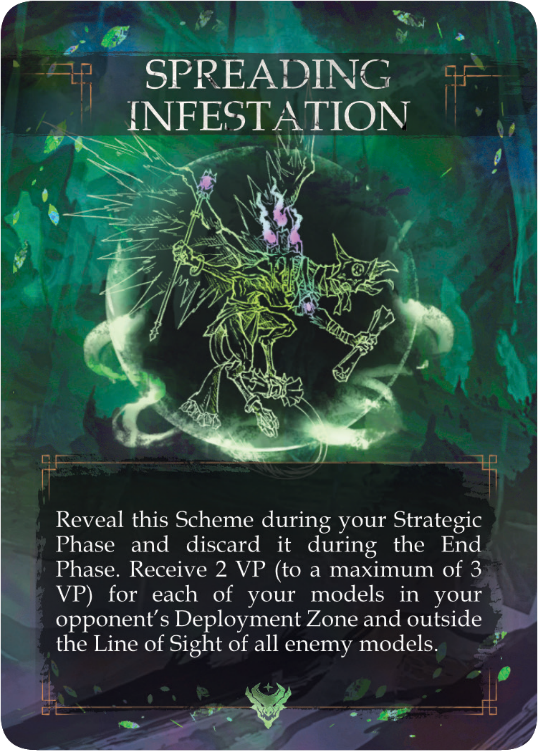Schemes are Classified objectives, known only to the player who receives them. At the end of the game, all the Schemes are revealed and the player receives a number of Victory Points as a reward for
>
> completing the objective listed on the Scheme card.
>
> Each Scheme can only be completed once.
>
> If you draw two Schemes of the same name, discard one and draw a new Scheme.
>
> Schemes in the deck differ depending on the faction you choose. Each faction has access to 6 Common Schemes and 6 Unique Schemes, available only to that faction (the number of cards are subject to change).
>
> In order to “draw” a Scheme, roll a die and look up the result in the relevant chart.

<figure>

<figcaption><blockquote>

<strong>SCHEMES</strong>

</blockquote></figcaption>
</figure>

Quest-Specific Upgrade and Scheme cards take on properties that are described in related Quests. They are marked with the symbol in their main text box.

> If you cannot find a Scheme you are looking for in this rulebook, please check online at **eldfall-chronicles.com**, under “Resources”.

######### 80

> **NEUTRAL SCHEMES**
>
> **ASSASSinAtion ContrACt** Receive 3 VP for killing an enemy Leader (rendering it Dead).
>
> **MArtiAl vAlor**
>
> Reveal this when your model Incapacitates an enemy model that costs more Recruitment Points; receive 2 VP. If another of your models Incapacitates a
>
> model that costs more RP, score an additional 1 VP.
>
> **no quArter**
>
> Receive 1VP for every Dead enemy model at the end of the game (to the max of 3VP).
>
> **oPPortuniStiC MAniPulAtion** You may reveal this at the start of your Strategic Phase. Receive 1 VP
>
> for each of the following:

- There is an enemy not in the Dead State in the enemy Deployment Zone.

- There is an enemy not in the Dead State on your half of the field.

- There is an ally in the Incapacitated State on the enemy half of the field.

> **StAnD your grounD**
>
> Reveal this Scheme during your Strategic Phase and discard it at the start of your next Strategic Phase. Receive 1 VP (to a maximum of 3 VP) for each model that did not move this round.
>
> **virtuouS CoMMAnDer** Receive 1 VP (to a maximum of 3 VP) for each of your models that is Alive at the end of the game.
>
> **SCHEMES**

81

> **EMPIRE OF SOGA**
>
> **HeAD Hunt**
>
> Receive 1VP (to the max of 3VP) for every Deathblow you perform against enemy models.
>
> **oPen AggreSSion**
>
> Reveal this Scheme during your Strategic Phase and discard it during the End Phase; receive 1VP for every Wound you deal to enemy models this turn (to the max of 3VP).
>
> **PurSuit oF glory**
>
> Reveal this Scheme during your Strategic Phase and discard it during the End Phase. Receive 1VP (to the max of 3VP) during the end Phase of that turn for every Alive party member outside the Awareness of other party members.
>
> **engetSu ForMAtion**
>
> Receive 1VP (to the max of 3VP) for each party member in your Deployment Zone at the end of the game.
>
> **FierCe AS Fire, iMMovAble AS A**
>
> **MountAin**
>
> Reveal this card when one of your models first Wounds an enemy model in Reaction. Place a token on this card. When your model Wounds an enemy model in Reaction, place another token on this card. Score 1 VP for every token on this card (maximum of 3 VP).
>
> **StAlWArt DeFenDer**
>
> Receive 3VP if there are no enemy models in your Deployment Zone at the end of the game.
>
> **SCHEMES**

<table style="width:42%;">
<colgroup>
<col style="width: 10%" />
<col style="width: 30%" />
</colgroup>
<thead>
<tr>
<th style="text-align: center;"><blockquote>

<strong>roll reSult</strong>

</blockquote></th>
<th style="text-align: center;"><blockquote>

<strong>SCHeMe</strong>

</blockquote></th>
</tr>
</thead>
<tbody>
<tr>
<td style="text-align: center;">1</td>
<td><blockquote>

Opportunistic Manipulation

</blockquote></td>
</tr>
<tr>
<td style="text-align: center;">2</td>
<td style="text-align: center;"><blockquote>

Assassination Contract

</blockquote></td>
</tr>
<tr>
<td style="text-align: center;"><blockquote>

3-4

</blockquote></td>
<td style="text-align: center;"><blockquote>

Virtuous Commander

</blockquote></td>
</tr>
<tr>
<td style="text-align: center;"><blockquote>

5-6

</blockquote></td>
<td style="text-align: center;"><blockquote>

Martial Valor

</blockquote></td>
</tr>
<tr>
<td style="text-align: center;"><blockquote>

7-8

</blockquote></td>
<td style="text-align: center;"><blockquote>

No Quarter

</blockquote></td>
</tr>
<tr>
<td style="text-align: center;"><blockquote>

9-10

</blockquote></td>
<td style="text-align: center;"><blockquote>

Stand Your Ground

</blockquote></td>
</tr>
<tr>
<td style="text-align: center;"><blockquote>

11-12

</blockquote></td>
<td style="text-align: center;"><blockquote>

Head Hunt

</blockquote></td>
</tr>
<tr>
<td style="text-align: center;"><blockquote>

13-14

</blockquote></td>
<td style="text-align: center;"><blockquote>

Open Aggression

</blockquote></td>
</tr>
<tr>
<td style="text-align: center;"><blockquote>

15-16

</blockquote></td>
<td style="text-align: center;"><blockquote>

Pursuit of Glory

</blockquote></td>
</tr>
<tr>
<td style="text-align: center;"><blockquote>

17-18

</blockquote></td>
<td><blockquote>

Fierce as Fire, Immovable as a Mountain

</blockquote></td>
</tr>
<tr>
<td style="text-align: center;"><blockquote>

19

</blockquote></td>
<td style="text-align: center;"><blockquote>

Engetsu Formation

</blockquote></td>
</tr>
<tr>
<td style="text-align: center;"><blockquote>

20

</blockquote></td>
<td style="text-align: center;"><blockquote>

Stalwart Defender

</blockquote></td>
</tr>
</tbody>
</table>

> **COALITION OF THENION**
>
> **unMAtCHeD FlAnKing**
>
> Reveal this Scheme during your Strategic Phase and discard it during the End Phase; receive 1VP for every Attack against an enemy model that has no LoS to your model before the Resolution Step of the Activation in this turn (to the max of 3VP).
>
> **leAve unnotiCeD**
>
> Receive 1VP (to the max of 3VP) for every party member outside enemy models’ LoS at the end of the game.
>
> **Cunning tenACity**
>
> Receive 2VP for every model that did not lose HP throughout the game (to a maximum of 3).
>
> **breACH tHeir DeFenSeS** Receive 2 VP for every party member in the enemy Deployment Zone (up to max of 3VP) at the end of the game.
>
> **ASSASSinAtion ContrACt** Receive 3 VP for killing an enemy Leader (rendering it Dead).
>
> **blooD For blooD**
>
> Reveal this Scheme during your Strategic Phase and discard it during the End Phase; select one of your models that suffered a Wound from an enemy model. Receive 3VP if
>
> you Incapacitate the enemy model that wounded your selected model this turn.
>
> **SCHEMES**

<table style="width:41%;">
<colgroup>
<col style="width: 11%" />
<col style="width: 29%" />
</colgroup>
<thead>
<tr>
<th style="text-align: center;"><blockquote>

<strong>roll reSult</strong>

</blockquote></th>
<th style="text-align: center;"><blockquote>

<strong>SCHeMe</strong>

</blockquote></th>
</tr>
</thead>
<tbody>
<tr>
<td style="text-align: center;">1</td>
<td><blockquote>

Opportunistic Manipulation

</blockquote></td>
</tr>
<tr>
<td style="text-align: center;">2</td>
<td><blockquote>

Assassination Contract

</blockquote></td>
</tr>
<tr>
<td style="text-align: center;"><blockquote>

3-4

</blockquote></td>
<td><blockquote>

Virtuous Commander

</blockquote></td>
</tr>
<tr>
<td style="text-align: center;"><blockquote>

5-6

</blockquote></td>
<td><blockquote>

Martial Valor

</blockquote></td>
</tr>
<tr>
<td style="text-align: center;"><blockquote>

7-8

</blockquote></td>
<td><blockquote>

No Quarter

</blockquote></td>
</tr>
<tr>
<td style="text-align: right;">9-10</td>
<td><blockquote>

Stand Your Ground

</blockquote></td>
</tr>
<tr>
<td style="text-align: right;">11-12</td>
<td><blockquote>

Unmatched Flanking

</blockquote></td>
</tr>
<tr>
<td style="text-align: right;">13-14</td>
<td><blockquote>

Leave Unnoticed

</blockquote></td>
</tr>
<tr>
<td style="text-align: right;">15-16</td>
<td><blockquote>

Cunning Tenacity

</blockquote></td>
</tr>
<tr>
<td style="text-align: right;">17-18</td>
<td><blockquote>

Breach Their Defenses

</blockquote></td>
</tr>
<tr>
<td style="text-align: center;"><blockquote>

19

</blockquote></td>
<td><blockquote>

Assassination Contract

</blockquote></td>
</tr>
<tr>
<td style="text-align: center;"><blockquote>

20

</blockquote></td>
<td><blockquote>

Blood for Blood

</blockquote></td>
</tr>
</tbody>
</table>

> **HELIAN LEAGUE**
>
> 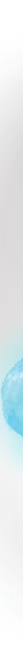
>
> **SCHEMES**

**DeCiSive viCtory**

> Receive 3VP if all of your party members are alive at the end of the game.
>
> **virtuouS CoMMAnDer** Receive 1 VP (to a maximum of 3 VP) for each of your models that is Alive at the end of the game.
>
> **relentleSS ADvAnCe**
>
> Reveal this Scheme during your Strategic Phase and discard it during the End Phase; receive 1 VP (to the max of 3) for every party member beyond the middle of the field at the end of this turn.
>
> **FierCe AS Fire, iMMovAble AS A**
>
> **MountAin**

<table style="width:42%;">
<colgroup>
<col style="width: 10%" />
<col style="width: 30%" />
</colgroup>
<thead>
<tr>
<th style="text-align: center;"><blockquote>

<strong>roll reSult</strong>

</blockquote></th>
<th style="text-align: center;"><blockquote>

<strong>SCHeMe</strong>

</blockquote></th>
</tr>
</thead>
<tbody>
<tr>
<td style="text-align: center;">1</td>
<td><blockquote>

Opportunistic Manipulation

</blockquote></td>
</tr>
<tr>
<td style="text-align: center;">2</td>
<td style="text-align: center;"><blockquote>

Assassination Contract

</blockquote></td>
</tr>
<tr>
<td style="text-align: center;"><blockquote>

3-4

</blockquote></td>
<td style="text-align: center;"><blockquote>

Virtuous Commander

</blockquote></td>
</tr>
<tr>
<td style="text-align: center;"><blockquote>

5-6

</blockquote></td>
<td style="text-align: center;"><blockquote>

Martial Valor

</blockquote></td>
</tr>
<tr>
<td style="text-align: center;"><blockquote>

7-8

</blockquote></td>
<td style="text-align: center;"><blockquote>

No Quarter

</blockquote></td>
</tr>
<tr>
<td style="text-align: right;">9-10</td>
<td style="text-align: center;"><blockquote>

Stand Your Ground

</blockquote></td>
</tr>
<tr>
<td style="text-align: right;">11-12</td>
<td style="text-align: center;"><blockquote>

Decisive Victory

</blockquote></td>
</tr>
<tr>
<td style="text-align: right;">13-14</td>
<td style="text-align: center;"><blockquote>

Virtuous Commander

</blockquote></td>
</tr>
<tr>
<td style="text-align: right;">15-16</td>
<td style="text-align: center;"><blockquote>

Last Warning

</blockquote></td>
</tr>
<tr>
<td style="text-align: right;">17-18</td>
<td><blockquote>

Fierce as Fire, Immovable as a Mountain

</blockquote></td>
</tr>
<tr>
<td style="text-align: center;"><blockquote>

19

</blockquote></td>
<td style="text-align: center;"><blockquote>

Relentless Advance

</blockquote></td>
</tr>
<tr>
<td style="text-align: center;"><blockquote>

20

</blockquote></td>
<td style="text-align: center;"><blockquote>

Peacekeeping Paragon

</blockquote></td>
</tr>
</tbody>
</table>

Reveal this card when one of your models first Wounds an enemy model in Reaction. Place a token on this card. When your model Wounds an enemy model in Reaction, place another token on this card. Score

> 1 VP for every token on this card (maximum of 3 VP).
>
> **PeACeKeePing PArAgon** Receive 1 VP for each enemy model that is Alive at the end of the game (to a maximum of 3 VP).
>
> **lASt WArning**
>
> Reveal this Scheme during your Strategic Phase and discard it during the End Phase; if your models do not declare Attack until your next Strategic Phase, you receive 3VP.
>
> **SAND KINGDOMS**
>
> **StAlWArt DeFenDer**
>
> Receive 3VP if there are no enemy models in your Deployment Zone at the end of the game.
>
> **APPeAr WeAK WHen you Are Strong**
>
> Receive 1VP for every Wound you
>
> deal to enemy models with Melee Attack (to a maximum of 3.)
>
> **unHinDereD exPeDition** Reveal this Scheme during your Strategic Phase and discard it during the End Phase. Receive 2 VP if you have 3 models outside your Deployment Zone (excluding summoned creatures) at the end of the turn, and an additional 1 VP if at least 1 of those models is in the opponent’s Deployment Zone.
>
> **StrengtH in nuMberS**

<table style="width:42%;">
<colgroup>
<col style="width: 11%" />
<col style="width: 29%" />
</colgroup>
<thead>
<tr>
<th style="text-align: center;"><blockquote>

<strong>roll reSult</strong>

</blockquote></th>
<th style="text-align: center;"><blockquote>

<strong>SCHeMe</strong>

</blockquote></th>
</tr>
</thead>
<tbody>
<tr>
<td style="text-align: center;">1</td>
<td><blockquote>

Opportunistic Manipulation

</blockquote></td>
</tr>
<tr>
<td style="text-align: center;">2</td>
<td style="text-align: right;">Assassination Contract</td>
</tr>
<tr>
<td style="text-align: center;"><blockquote>

3-4

</blockquote></td>
<td style="text-align: right;">Virtuous Commander</td>
</tr>
<tr>
<td style="text-align: center;"><blockquote>

5-6

</blockquote></td>
<td><blockquote>

Martial Valor

</blockquote></td>
</tr>
<tr>
<td style="text-align: center;"><blockquote>

7-8

</blockquote></td>
<td><blockquote>

No Quarter

</blockquote></td>
</tr>
<tr>
<td style="text-align: center;"><blockquote>

9-10

</blockquote></td>
<td><blockquote>

Stand Your Ground

</blockquote></td>
</tr>
<tr>
<td style="text-align: center;"><blockquote>

11-12

</blockquote></td>
<td><blockquote>

Stand Your Ground

</blockquote></td>
</tr>
<tr>
<td style="text-align: center;"><blockquote>

13-14

</blockquote></td>
<td><blockquote>

Appear weak when you are strong

</blockquote></td>
</tr>
<tr>
<td style="text-align: center;"><blockquote>

15-16

</blockquote></td>
<td style="text-align: right;">Unhindered Expedition</td>
</tr>
<tr>
<td style="text-align: center;"><blockquote>

17-18

</blockquote></td>
<td><blockquote>

Strength in Numbers

</blockquote></td>
</tr>
<tr>
<td style="text-align: center;"><blockquote>

19

</blockquote></td>
<td><blockquote>

Steadfast Expansion

</blockquote></td>
</tr>
<tr>
<td style="text-align: center;"><blockquote>

20

</blockquote></td>
<td><blockquote>

Stalwart Defender

</blockquote></td>
</tr>
</tbody>
</table>

Receive 2 VP if you have more alive models (including summoned creatures) than your opponent at

> the end of the game. Receive an additional 1 VP if you have at least twice as many models alive as your opponent.
>
> **SteADFASt exPAnSion**
>
> Receive 1VP (to the max of 3VP) for every party member beyond the middle of the field at the end of the
>
> game (not counting your summoned creatures).
>
> **StAnD your grounD**
>
> Reveal this Scheme during your Strategic Phase and discard it at the start of your next Strategic Phase. Receive 1 VP (to a maximum of 3 VP) for each model that did not move this round.
>
> **SCHEMES**

###  UPGRADES 

> Quest-Specific Upgrade and Scheme cards take on properties that are described in related Quests.
>
> They are marked with the  symbol in their main text box.
>
> On the next pages are lists of Upgrades (which excludes the Quest-Specific cards) for each faction in case you do not possess physical cards.

######### 

> **SCHEMES**

86

> **NEUTRAL UPGRADES**

1.  **PouCH (1PtS)** Limit: -

> Model’s Inventory is increased by 2. The model may receive another Upgrade.

2.  **ADDitionAl ProteCtion (1PtS)** Limit: - The model receives +2 ARM, -2 AG.

3.  **utility tool (1PtS)** Limit: - The model receives a Dagger:

<table style="width:88%;">
<colgroup>
<col style="width: 10%" />
<col style="width: 21%" />
<col style="width: 9%" />
<col style="width: 8%" />
<col style="width: 7%" />
<col style="width: 11%" />
<col style="width: 8%" />
<col style="width: 9%" />
</colgroup>
<thead>
<tr>
<th style="text-align: center;"><blockquote>

NAME

</blockquote></th>
<th><blockquote>

EFFECTS

</blockquote></th>
<th style="text-align: right;">PW</th>
<th style="text-align: center;"><blockquote>

RCH

</blockquote></th>
<th><blockquote>

STK

</blockquote></th>
<th><blockquote>

TYPE

</blockquote></th>
<th style="text-align: center;"><blockquote>

QTY

</blockquote></th>
<th style="text-align: center;"><blockquote>

WGT

</blockquote></th>
</tr>
</thead>
<tbody>
<tr>
<td><blockquote>

Dagger

</blockquote></td>
<td><blockquote>

Throwing,

+1 Strike when used against a model in the Crouched State.

</blockquote></td>
<td>T-3</td>
<td>0</td>
<td><blockquote>

</blockquote></td>
<td><blockquote>

Melee, Weapon

</blockquote></td>
<td>1</td>
<td><blockquote>

0

</blockquote></td>
</tr>
</tbody>
</table>

4.  **FirSt AiD (2PtS)** Limit: 2

> When a model (including this model) would perform a Recovery Check while within Awareness of this model, you may discard this Upgrade; if you do, that model automatically succeeds the T roll. Alternatively, you may discard this Upgrade during the Strategic Phase to remove all States except Engaged, Crouched, Flying or Shrouded from an Alive model within Awareness.

5.  **iMPorteD CASting AMPliFier (4PtS)** Limit: 1 The model receives a Casting Amplifier:

<table style="width:88%;">
<colgroup>
<col style="width: 12%" />
<col style="width: 19%" />
<col style="width: 8%" />
<col style="width: 8%" />
<col style="width: 8%" />
<col style="width: 13%" />
<col style="width: 8%" />
<col style="width: 9%" />
</colgroup>
<thead>
<tr>
<th><blockquote>

NAME

</blockquote></th>
<th><blockquote>

EFFECTS

</blockquote></th>
<th style="text-align: center;"><blockquote>

PW

</blockquote></th>
<th style="text-align: center;"><blockquote>

RCH

</blockquote></th>
<th style="text-align: center;"><blockquote>

STK

</blockquote></th>
<th style="text-align: center;"><blockquote>

TYPE

</blockquote></th>
<th style="text-align: center;"><blockquote>

QTY

</blockquote></th>
<th style="text-align: center;"><blockquote>

WGT

</blockquote></th>
</tr>
</thead>
<tbody>
<tr>
<td><blockquote>

Casting

Amplifier

</blockquote></td>
<td><blockquote>

Wearer has

+4 RCH when casting Spells.

</blockquote></td>
<td><blockquote>

-

</blockquote></td>
<td>-</td>
<td>-</td>
<td><blockquote>

Accessory

</blockquote></td>
<td>1</td>
<td>0</td>
</tr>
</tbody>
</table>

6.  **iMPorteD CroSSboW (5PtS)** Limit: 1 The model receives a Crossbow:

<table style="width:88%;">
<colgroup>
<col style="width: 13%" />
<col style="width: 18%" />
<col style="width: 7%" />
<col style="width: 11%" />
<col style="width: 7%" />
<col style="width: 12%" />
<col style="width: 9%" />
<col style="width: 9%" />
</colgroup>
<thead>
<tr>
<th style="text-align: center;"><blockquote>

NAME

</blockquote></th>
<th style="text-align: center;"><blockquote>

EFFECTS

</blockquote></th>
<th style="text-align: center;"><blockquote>

PW

</blockquote></th>
<th><blockquote>

RCH

</blockquote></th>
<th style="text-align: center;"><blockquote>

STK

</blockquote></th>
<th><blockquote>

TYPE

</blockquote></th>
<th style="text-align: center;"><blockquote>

QTY

</blockquote></th>
<th style="text-align: center;"><blockquote>

WGT

</blockquote></th>
</tr>
</thead>
<tbody>
<tr>
<td style="text-align: center;"><blockquote>

Crossbow

</blockquote></td>
<td style="text-align: center;"><blockquote>

Two-Handed

</blockquote></td>
<td style="text-align: center;"><blockquote>

13

</blockquote></td>
<td><blockquote>

0-24: +3

25-48: -3

</blockquote></td>
<td style="text-align: center;">1</td>
<td><blockquote>

Ranged, Weapon

</blockquote></td>
<td style="text-align: center;">1</td>
<td style="text-align: center;">2</td>
</tr>
</tbody>
</table>

######### 

> **SCHEMES**

87

> **UPGRADES**

**CAMArADerie (5PtS)** Limit: 3

> A Neutral or Semi-Neutral model with this Upgrade can benefit from Authority
>
> Stratagems of its Party Leader.

7.  **King oF tHe bAttleFielD (2PtS)** Limit: -

> The model receives a Spear:

<table style="width:88%;">
<colgroup>
<col style="width: 12%" />
<col style="width: 15%" />
<col style="width: 8%" />
<col style="width: 9%" />
<col style="width: 9%" />
<col style="width: 13%" />
<col style="width: 9%" />
<col style="width: 9%" />
</colgroup>
<thead>
<tr>
<th style="text-align: right;">NAME</th>
<th style="text-align: center;"><blockquote>

EFFECTS

</blockquote></th>
<th style="text-align: center;"><blockquote>

PW

</blockquote></th>
<th style="text-align: center;"><blockquote>

RCH

</blockquote></th>
<th><blockquote>

STK

</blockquote></th>
<th><blockquote>

TYPE

</blockquote></th>
<th style="text-align: center;"><blockquote>

QTY

</blockquote></th>
<th style="text-align: center;"><blockquote>

WGT

</blockquote></th>
</tr>
</thead>
<tbody>
<tr>
<td style="text-align: right;">Spear</td>
<td style="text-align: center;"><blockquote>

Throwing

</blockquote></td>
<td style="text-align: center;">T</td>
<td style="text-align: center;">2</td>
<td><blockquote>

</blockquote></td>
<td><blockquote>

Ranged, Weapon

</blockquote></td>
<td style="text-align: center;"><blockquote>

1

</blockquote></td>
<td style="text-align: center;"><blockquote>

2

</blockquote></td>
</tr>
</tbody>
</table>

8.  **SMoKeSCreen (2PtS)** Limit: 2

> The model receives a Haze Bomb:

<table style="width:88%;">
<colgroup>
<col style="width: 9%" />
<col style="width: 25%" />
<col style="width: 6%" />
<col style="width: 9%" />
<col style="width: 6%" />
<col style="width: 13%" />
<col style="width: 7%" />
<col style="width: 8%" />
</colgroup>
<thead>
<tr>
<th><blockquote>

NAME

</blockquote></th>
<th><blockquote>

EFFECTS

</blockquote></th>
<th style="text-align: center;"><blockquote>

PW

</blockquote></th>
<th><blockquote>

RCH

</blockquote></th>
<th style="text-align: center;"><blockquote>

STK

</blockquote></th>
<th><blockquote>

TYPE

</blockquote></th>
<th style="text-align: center;"><blockquote>

QTY

</blockquote></th>
<th style="text-align: center;"><blockquote>

WGT

</blockquote></th>
</tr>
</thead>
<tbody>
<tr>
<td><blockquote>

Haze Bomb

</blockquote></td>
<td><blockquote>

Targetless. When using this Item, the model may reroll up to 1 failed roll.

AOE becomes Hazy Environment until users’ next

Strategic Phase.

</blockquote></td>
<td><blockquote>

0

</blockquote></td>
<td><blockquote>

Circular

L

</blockquote></td>
<td>1</td>
<td><blockquote>

Ranged,

Consumable

</blockquote></td>
<td>1</td>
<td>0</td>
</tr>
</tbody>
</table>

9.  **exPeDition leADer (5PtS)** Limit: -

> This model has the following Stratagems:

- Advance! (Authority): All models gain +1 SPD.

- Back to Back (Authority): All models gain Vigilance.

10. **rAiD leADer (4PtS)** Limit: -

> This model has the following Stratagems:

- Formation Spearhead (Authority): Target model gains Dash.

- Rallying Command (Authority): All models gain Fearless.

> **EMPIRE OF SOGA**

1.  **bujutSu exPertiSe (3PtS)** Limit: 2

> The model gains Armsmaster Class and the Fencing I Combat Art. If the model already has the Fencing Combat Art, it gains access to the next rank of the art.

2.  **KyujutSu exPertiSe (3PtS)** Limit: 2

> The model gains Marksman Class and Archery I Combat Art. If the model already has Archery Combat Art, it gains access to the next rank of the art.

3.  **luCKy CHArM (3PtS)** Limit: 1

> During its Strategic Phase, this model generates 1 Luck counter (up to a maximum of 3). The model may expend a Luck counter to reroll one die in an Activation Sequence or force an enemy model attacking it to reroll one Damage roll.

4.  **KASSen buKi: yAri-tSuKAi (2PtS)** Limit: -

> Only a Warrior can receive this Upgrade. Replace the Primary Weapon in the model’s Inventory with the Lance. If the model’s primary weapon is Spear, this Upgrade costs only 1pts:

<table style="width:88%;">
<colgroup>
<col style="width: 13%" />
<col style="width: 22%" />
<col style="width: 8%" />
<col style="width: 7%" />
<col style="width: 7%" />
<col style="width: 12%" />
<col style="width: 7%" />
<col style="width: 8%" />
</colgroup>
<thead>
<tr>
<th><blockquote>

NAME

</blockquote></th>
<th><blockquote>

EFFECTS

</blockquote></th>
<th style="text-align: right;">PW</th>
<th style="text-align: center;"><blockquote>

RCH

</blockquote></th>
<th><blockquote>

STK

</blockquote></th>
<th><blockquote>

TYPE

</blockquote></th>
<th style="text-align: center;"><blockquote>

QTY

</blockquote></th>
<th style="text-align: center;"><blockquote>

WGT

</blockquote></th>
</tr>
</thead>
<tbody>
<tr>
<td><blockquote>

Lance

</blockquote></td>
<td><blockquote>

Two-Handed, Throwing

</blockquote></td>
<td style="text-align: right;">T+2</td>
<td style="text-align: center;"><blockquote>

2

</blockquote></td>
<td><blockquote>

</blockquote></td>
<td><blockquote>

Melee, Weapon

</blockquote></td>
<td style="text-align: center;"><blockquote>

1

</blockquote></td>
<td style="text-align: center;">2</td>
</tr>
</tbody>
</table>

5.  **KASSen buKi: nAgAMAKi-tSuKAi (2PtS)** Limit: -

> Only a Warrior can receive this Upgrade. Replace the Primary Weapon in the model’s Inventory with the Longhilted Sword:

<table style="width:87%;">
<colgroup>
<col style="width: 14%" />
<col style="width: 19%" />
<col style="width: 7%" />
<col style="width: 7%" />
<col style="width: 7%" />
<col style="width: 12%" />
<col style="width: 9%" />
<col style="width: 9%" />
</colgroup>
<thead>
<tr>
<th><blockquote>

NAME

</blockquote></th>
<th><blockquote>

EFFECTS

</blockquote></th>
<th style="text-align: right;">PW</th>
<th style="text-align: center;"><blockquote>

RCH

</blockquote></th>
<th><blockquote>

STK

</blockquote></th>
<th><blockquote>

TYPE

</blockquote></th>
<th style="text-align: center;"><blockquote>

QTY

</blockquote></th>
<th style="text-align: center;"><blockquote>

WGT

</blockquote></th>
</tr>
</thead>
<tbody>
<tr>
<td><blockquote>

Longhilted Sword

</blockquote></td>
<td><blockquote>

Sweep I, Two-Handed,

Bleed

</blockquote></td>
<td>T+2</td>
<td><blockquote>

1

</blockquote></td>
<td><blockquote>

</blockquote></td>
<td><blockquote>

Melee, Weapon

</blockquote></td>
<td><blockquote>

1

</blockquote></td>
<td><blockquote>

2

</blockquote></td>
</tr>
</tbody>
</table>

6.  **KASSen buKi: DAiKyuu-tSuKAi (3PtS)** Limit: -

> Only a Warrior can receive this Upgrade. Replace the Primary Weapon in the model’s Inventory with a War Bow. If the model’s primary weapon is Short Bow, this Upgrade costs only 2pts:

<table style="width:88%;">
<colgroup>
<col style="width: 11%" />
<col style="width: 17%" />
<col style="width: 7%" />
<col style="width: 11%" />
<col style="width: 7%" />
<col style="width: 12%" />
<col style="width: 9%" />
<col style="width: 10%" />
</colgroup>
<thead>
<tr>
<th style="text-align: center;">NAME</th>
<th><blockquote>

EFFECTS

</blockquote></th>
<th style="text-align: right;">PW</th>
<th><blockquote>

RCH

</blockquote></th>
<th style="text-align: right;">STK</th>
<th><blockquote>

TYPE

</blockquote></th>
<th style="text-align: center;"><blockquote>

QTY

</blockquote></th>
<th style="text-align: center;"><blockquote>

WGT

</blockquote></th>
</tr>
</thead>
<tbody>
<tr>
<td style="text-align: center;">War Bow</td>
<td><blockquote>

Two-Handed, Stun

</blockquote></td>
<td style="text-align: right;">T+4</td>
<td><blockquote>

0-24: 0

25-48: -6

</blockquote></td>
<td style="text-align: right;"> -1</td>
<td><blockquote>

Ranged, Weapon

</blockquote></td>
<td style="text-align: center;">1</td>
<td style="text-align: center;">2</td>
</tr>
</tbody>
</table>

> **UPGRADES**

**KASSen buKi: KAnAbou-tSuKAi (3PtS)** Limit: -

<table style="width:88%;">
<caption><blockquote>

</blockquote></caption>
<colgroup>
<col style="width: 19%" />
<col style="width: 19%" />
<col style="width: 7%" />
<col style="width: 7%" />
<col style="width: 7%" />
<col style="width: 11%" />
<col style="width: 6%" />
<col style="width: 7%" />
</colgroup>
<thead>
<tr>
<th style="text-align: center;"><blockquote>

NAME

</blockquote></th>
<th style="text-align: center;"><blockquote>

EFFECTS

</blockquote></th>
<th><blockquote>

PW

</blockquote></th>
<th style="text-align: center;"><blockquote>

RCH

</blockquote></th>
<th style="text-align: right;">STK</th>
<th><blockquote>

TYPE

</blockquote></th>
<th style="text-align: center;"><blockquote>

QTY

</blockquote></th>
<th style="text-align: center;"><blockquote>

WGT

</blockquote></th>
</tr>
</thead>
<tbody>
<tr>
<td>Heavy Bludgeon</td>
<td style="text-align: center;"><blockquote>

Two-Handed, Armor-Piercing, Stagger, Stun

</blockquote></td>
<td><blockquote>

T+4

</blockquote></td>
<td>1</td>
<td>-1</td>
<td><blockquote>

Melee, Weapon

</blockquote></td>
<td>1</td>
<td>3</td>
</tr>
</tbody>
</table>

Only a Warrior can receive this Upgrade. Replace the Primary Weapon in the model’s Inventory with a Heavy Bludgeon:

######### 89

7.  **trAveling DueliSt (3PtS)** Limit: 2

> Only a model of the Warrior Class may benefit from this upgrade.
>
> The model receives the Duelist Trait.
>
> Duelist: When this model combats an enemy model, the enemy model cannot use its Combat Arts of level III or below.

8.  **SeASoneD CoMbAtAnt (2PtS)** Limit: - The model receives the Fearless Trait.

> **UPGRADES**

90

########  COALITION OF THENION 

1.  **PoiSoneD WeAPonS (2PtS)** Limit: -

> The model receives the Poison I Trait. If it already has Poison I Trait, it gains access to the next level of the Trait. Poison I/II: I: Weak Poison; If a model suffers a Wound by this Trait, it becomes Weakened (State) until its next Strategic Phase. II: Strong Poison; If a model suffers a Wound by this Trait, it becomes Weakened and Poisoned (States).

2.  **MuFFleD MoveMent (2PtS)** Limit: -

> The model receives the Stealth I Skill. Stealth I: This model does not provoke Reaction when activated within the enemy model’s Awareness, if the enemy model has no Line of Sight towards it.

3.  **CliMbing exPertiSe (2PtS)** Limit: -

> The model receives the Climbing Skill. Climbing: This model can perform the Climb Special Movement as if it were a Normal Movement, ignoring Movement penalties. While performing Climb, its SPD is not halved.

4.  **FAngS oF tiAMAt (2PtS)** Limit: - The model receives War Darts:

<table style="width:88%;">
<colgroup>
<col style="width: 9%" />
<col style="width: 20%" />
<col style="width: 6%" />
<col style="width: 13%" />
<col style="width: 7%" />
<col style="width: 15%" />
<col style="width: 7%" />
<col style="width: 7%" />
</colgroup>
<thead>
<tr>
<th><blockquote>

NAME

</blockquote></th>
<th style="text-align: center;"><blockquote>

EFFECTS

</blockquote></th>
<th style="text-align: center;"><blockquote>

PW

</blockquote></th>
<th><blockquote>

RCH

</blockquote></th>
<th><blockquote>

STK

</blockquote></th>
<th><blockquote>

TYPE

</blockquote></th>
<th style="text-align: center;"><blockquote>

QTY

</blockquote></th>
<th style="text-align: center;"><blockquote>

WGT

</blockquote></th>
</tr>
</thead>
<tbody>
<tr>
<td><blockquote>

War Darts

</blockquote></td>
<td style="text-align: center;"><blockquote>

Targetless.

Bleeding. When used, the user receives +3 ACC.

</blockquote></td>
<td>8</td>
<td><blockquote>

T, AoE:

Circular L

</blockquote></td>
<td>1</td>
<td><blockquote>

Ranged, Consumable

</blockquote></td>
<td>1</td>
<td>1</td>
</tr>
</tbody>
</table>

5.  **ConCeAleD APProACH (3PtS)** Limit: -

> The model can begin the game Shrouded.

6.  **Devotion: tiAMAt (1PtS)** Limit: -

> The model receives +1T. If the model is a Warrior or a Rogue, it also receives +1OFF.
>
> Cannot be assigned to a model with the Demon Trait.

7.  **Devotion: AnrAS (1PtS)** Limit: - The model receives +1 DEF. If the model has the Duelist Trait, it instead has +2DEF.

> Cannot be assigned to a model with the Demon Trait.
>
> **UPGRADES**

**Devotion: PAiMon (2PtS)** Limit: - The model receives +1INT. When purchased; reduce cost of all other Upgrades by 1 (to a minimum of 1). Cannot be assigned to a model with the Demon Trait.

> 91

########  HELIAN LEAGUE 

1.  **tACtiCAl exPertiSe (3PtS)** Limit: 1 The model receives the Tactician Trait.

> Tactician: The Deployment Zone of the party in which this model is present is extended for 5 inches.

2.  **SeASoneD CoMbAtAnt (2PtS)** Limit: - The model receives the Fearless Trait.

3.  **CoMPAnion oF HAiron (2PtS)** Limit: 2

> Only a model of the Soldier Class may benefit from this Upgrade.
>
> When using the Soldier Class ability, the model also counts itself towards receiving
>
> +1 OFF, DEF, ACC, INT, M bonus.

4.  **giFt oF longevity (1PtS)** Limit: 2 The model receives +1 INT.

5.  **ADePt SHAPer (3PtS)** Limit: 2

> The model gains access to the next level of one of its selected Spellcrafts.

6.  **glyPHSCribe: reDuCe WeigHt (3PtS)** Limit: - Choose one:

- **Inscribed Item:** Select a Weapon or a Shield in the model’s Inventory; its WGT is reduced by 1 and Strike increased by 1.

- **Inscribed Armor:** The model receives +1 AG, +1 SPD and its Inventory is increased by 1.

  1.  **glyPHSCribe: HyPeriA’S ProviDenCe (3PtS)** Limit: -

> If the upgraded model is a target of a Melee Attack, the attacker must make an AG roll. If failed, the attacker suffers -1 Strike (to a minimum of 1). If the upgraded model has a Shield equipped, it additionally imposes a -3 Attack modifier to Ranged Attacks to its Front.

2.  **exPeDitionAry tACtiCS: Double tiMe (3PtS)** Limit: 1

> Remove this Upgrade during the Initiative
>
> Check; if you do, add +6 to your Initiative Check result.

3.  **exPeDitionAry tACtiCS: Surge orDer (3PtS)** Limit: 1

> **UPGRADES**

Remove this Upgrade during the Strategic

> Phase; if you do, up to 3 of your Party members with the Affiliation: Helian League, may each perform one of the following Movements: Walk, Climb, Jump. This is performed during the Strategic Phase, therefore it does not provoke Reaction.
>
> 92
>
> **UPGRADES**

SAND KINGDOMS

1.  **MAnA CAtAlySt (1PtS)** Limit: -

> You may change one of the model’s default Affinities with one of the following ones:
>
> Fire, Water, Earth, Air.

2.  **eleMentAl lineAge (4PtS)** Limit: 2

> The model receives 1 of the following Traits: Affinity (Fire), Affinity (Water), Affinity (Earth), Affinity (Air).

3.  **ArCAne toMe (4PtS)** Limit: -

> The model gains access to the next level of one of its selected Spellcrafts.

4.  **Flying CArPet (4PtS)** Limit: 1

> The model receives a Flying Carpet. This Upgrade may be equipped by a model of Size Medium or smaller.

<table style="width:88%;">
<colgroup>
<col style="width: 16%" />
<col style="width: 19%" />
<col style="width: 6%" />
<col style="width: 7%" />
<col style="width: 7%" />
<col style="width: 13%" />
<col style="width: 8%" />
<col style="width: 8%" />
</colgroup>
<thead>
<tr>
<th style="text-align: center;"><blockquote>

NAME

</blockquote></th>
<th><blockquote>

EFFECTS

</blockquote></th>
<th style="text-align: center;"><blockquote>

PW

</blockquote></th>
<th style="text-align: center;"><blockquote>

RCH

</blockquote></th>
<th style="text-align: center;"><blockquote>

STK

</blockquote></th>
<th style="text-align: center;"><blockquote>

TYPE

</blockquote></th>
<th style="text-align: center;"><blockquote>

QTY

</blockquote></th>
<th style="text-align: center;"><blockquote>

WGT

</blockquote></th>
</tr>
</thead>
<tbody>
<tr>
<td style="text-align: center;"><blockquote>

Flying Carpet

</blockquote></td>
<td><blockquote>

Model may use the Flight Skill.

</blockquote></td>
<td style="text-align: center;">-</td>
<td style="text-align: center;">-</td>
<td style="text-align: center;">-</td>
<td style="text-align: center;"><blockquote>

Accessory

</blockquote></td>
<td style="text-align: center;">1</td>
<td style="text-align: center;">0</td>
</tr>
</tbody>
</table>

5.  **ConjureD retinue (3PtS)** Limit: 1

> Tier I and II creatures, summoned by the upgraded model, receive the Soldier Class.

6.  **PerSonAl guArD (3PtS)** Limit: -

> During the deployment, assign this Upgrade to a summoned creature; it receives the Sentinel Class but may not fully leave the model’s Awareness. If the summoned creature is removed from the field, you may return this Upgrade to the model originally assigned with it and re-assign it to another summoned creature.

7.  **CASting AMPliFier (2PtS)** Limit: - The model receives a Casting Amplifier:

<table style="width:88%;">
<colgroup>
<col style="width: 16%" />
<col style="width: 19%" />
<col style="width: 6%" />
<col style="width: 7%" />
<col style="width: 7%" />
<col style="width: 13%" />
<col style="width: 8%" />
<col style="width: 8%" />
</colgroup>
<thead>
<tr>
<th><blockquote>

NAME

</blockquote></th>
<th><blockquote>

EFFECTS

</blockquote></th>
<th style="text-align: center;"><blockquote>

PW

</blockquote></th>
<th style="text-align: center;"><blockquote>

RCH

</blockquote></th>
<th style="text-align: center;"><blockquote>

STK

</blockquote></th>
<th style="text-align: center;"><blockquote>

TYPE

</blockquote></th>
<th style="text-align: center;"><blockquote>

QTY

</blockquote></th>
<th style="text-align: center;"><blockquote>

WGT

</blockquote></th>
</tr>
</thead>
<tbody>
<tr>
<td><blockquote>

Casting

Amplifier

</blockquote></td>
<td><blockquote>

Wearer has

+4 RCH when casting Spells.

</blockquote></td>
<td>-</td>
<td>-</td>
<td>-</td>
<td><blockquote>

Accessory

</blockquote></td>
<td>1</td>
<td>0</td>
</tr>
</tbody>
</table>

###  SAMPLE QUESTS 

#### OPEN HOSTILITIES

> *While the four great factions are currently at peace, Calad is no stranger to skirmishes and covert engagements between rivals vying for power.*

####### SETUP 

> Standard Deployment: 8” Deployment Zones.

####### RESULTS 

> Gain 1 VP for rendering an enemy with a Recruitment Cost of 16 or less Incapacitated or Dead.
>
> Gain 2 VP for rendering an enemy with a Recruitment Cost between 17 and 21 Incapacitated or Dead.
>
> Gain 3 VP for rendering an enemy with a Recruitment Cost between 22 and 29 Incapacitated or Dead.
>
> Gain 4 VP for rendering an enemy with a Recruitment Cost of 30 or more Incapacitated or Dead.
>
> Gain 1 VP for rendering an enemy Leader Incapacitated or Dead.

####### QUEST RULES 

> **SCHeMeS**
>
> Before the Initiative Check, each player receives 1 Scheme Card. When drawing Schemes:

- If the Leader has INT 13 or less, draw 2 cards and choose 1 to keep.

- If the Leader has INT 14 or 15, draw 3 cards and choose 1 to keep.

- If the Leader has INT 16 or more, draw 4 cards and choose 1 to keep.

> 94

#### AWAITING REINFORCEMENTS

> *Skirmishes over newly discovered ruins are not uncommon, as various factions compete to be*
>
> *the first to explore them. Hold out a while longer—reinforcements are on their way!*

####### 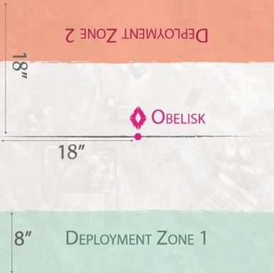SETUP 

> **Obelisk:** There is 1 Objective Marker at the center of the field.
>
> **Standard Deployment:** 8” Deployment Zones.

####### RESULTS 

> Gain **1 VP** if you have **at least one model within 6”** of the Obelisk at the end of the round.
>
> Gain **1 V**P if you have a **Stronger Presence within 6”** of the Obelisk at the end of the round.
>
> Gain **1 VP** if you have **a model within 6”** of the Obelisk and your **opponent has none** within that range at the end of the round.

####### QUEST RULES 

> **SCHeMeS**
>
> Before the Initiative Check, each player receives 1 Scheme Card. When drawing Schemes:

- If the Leader has INT 13 or less, draw 2 cards and choose 1 to keep.

- If the Leader has INT 14 or 15, draw 3 cards and choose 1 to keep.

- If the Leader has INT 16 or more, draw 4 cards and choose 1 to keep.

> **Stronger PreSenCe**
>
> Stronger Presence is determined by calculating a party’s **Recruitment Point** total **within the specified area**. Add together the Recruitment Points of all **Alive** Party Members in that area (*do not include Upgrades*).
>
> Compare this total to that of the other player(s). The player with the **higher Recruitment Point count** has the Stronger Presence.
>
> **1St rounD CeASeFire**
>
> Players **cannot score VP** during the **first round**. If a model targets an enemy model with an Attack or damages an enemy model with an
>
> Action during **Round 1**, that player’s party receives a **–4 VP penalty**.
>
> **Summoned** models are an **exception**
>
> to this rule and can be targeted and damaged.
>
> (*A player’s VP score may drop below 0 as a result.*)
>
> **no MorAle loSS**
>
> Models ignore the **Broken Morale**
>
> rule during this Quest.

> 95

#### TOXIC INFESTATION

> *The ancient taint never lingers. It spreads, corrupting the very elements that shape the land. Curseridden vines rapidly consume the earth, choking forests, poisoning wildlife, and giving rise to aberrations. Ordinary blades cannot cut the accursed growth. The vines can only be severed and culled through arcane means.*
>
> *A curse to some, a treasure to others. Both the vines themselves and the rewards offered for its culling fetch a handsome sum.*
>
> 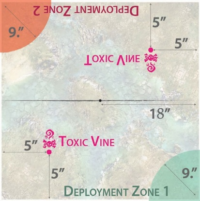
>
> **SCHeMeS**
>
> Before the Initiative Check, each player receives 1 Scheme Card. When drawing Schemes:

- If the Leader has INT 13 or less, draw 2 cards and choose 1 to keep.

- If the Leader has INT 14 or 15, draw 3 cards and choose 1 to keep.

- If the Leader has INT 16 or more, draw 4 cards and choose 1 to keep.

> **toxiC vineS** *(Objective Markers)*
>
> *As the growth spreads, hunting parties are dispatched to cull and harvest the vines.*
>
> Objective Markers can be either **Neutral** or **Controlled**. At the start of the game, all Objective Markers are Neutral.
>
> Toxic Vine Objective Markers may be Interacted with.
>
> By performing an **Interact** Action with
>
> a marker and spending **1 Mana**, a player takes control of it. If the marker is already Controlled, performing an Interact Action with it reverts it
>
> to Neutral.
>
> At the end of each round *(after both players have completed their turns)*, **move each Controlled marker 5”** directly toward the center of the field, then revert it to Neutral.
>
> Summoned models may not Interact with Objective Markers.
>
> **toxiC SPoreS**
>
> The area within 2” of an Objective Marker is considered **Toxic Environment**.

######### 96

> If a model cannot generate its own Mana, it can gain Mana by causing Wounds to the Tier III Hostile (Avatar of the Infestation) that spawns during Round 2. This Mana can then be used to cull a Vine (take control of an Objective Marker).

**AvAtAr oF tHe inFeStAtion**

> At the beginning of **Round 2**, place a **Tier III** Hostile at the center of the field, facing the 1st Player’s Deployment Zone.
>
> This Hostile gains **Survival (Toxic)**. Whenever a model causes a Wound to this Hostile while within 6” of it, that model gains **1 Mana**.
>
> If there is no Avatar of the Infestation on the field during the Strategic Phase of any turn, spawn one facing the Active Player’s Deployment Zone.

#### TREASURE HUNT

> *Whether a lord or a common adventurer, one can always benefit from more coin.*

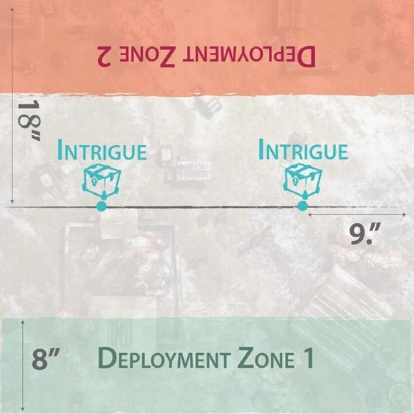

####### SPECIAL END CONDITIONS 

> The Quest ends when both Treasures leave the field.
>
> If a player’s party is in a state of Broken Morale at the start of their Strategic phase, the Quest ends at the end of that Turn.
>
> 97

####### QUEST RULES 

> **SCHeMeS**
>
> Before the Initiative Check, each player receives 1 Scheme Card. When drawing Schemes:

- If the Leader has INT 13 or less, draw 2 cards and choose 1 to keep.

- If the Leader has INT 14 or 15, draw 3 cards and choose 1 to keep.

- If the Leader has INT 16 or more, draw 4 cards and choose 1 to keep.

> **treASure (CACHe)**
>
> A Treasure is represented by a Cache Token. Models may not Interact with Cache during Round 1. To access
>
> the Treasure, a player’s model must first reveal the Intrigue Token by successfully performing the Perceive Action. An Intrigue Token is also automatically revealed if a model comes into Base Contact with it.
>
> When revealed, the Intrigue Token is replaced with a Sigil Token.
>
> A model in Base Contact with a Cache token may declare an Interact Action. By performing a successful AG roll, the model unlocks the Cache, takes the Treasure and places it into its Inventory. Once
>
> the Cache is unlocked, it cannot be unlocked again.
>
> Summoned models may not interact with Cache Tokens.
>
> A player whose model has this Item in its Inventory at the end of the game gains 2 VP. A model with a Treasure in its Inventory may
>
> voluntarily leave the field via its own Deployment Zone. A model carrying a Treasure cannot be Shrouded or Flying. Treasure is an Item with Qty 1 and Wgt 1.
>
> From round 4 onward, a model with a Treasure in its Inventory may
>
> voluntarily leave the field via its own
>
> Deployment Zone.
>
> (Note: If the model becomes Incapacitated or Dead, the Treasure is removed from
>
> its Inventory and placed in Base Contact with the model. Models that leave the field voluntarily are still considered present and alive for the purposes of Loss of Morale.)
>
> **ClASS bonuS: rogue, rAnger, AlCHeMiSt**
>
> Models with the Rogue, Ranger, or Alchemist Class add +3 to their AG roll when interacting with a Cache.
>
> **SigilS**
>
> Sigils don’t trigger in Round 1.
>
> Each Sigil Token has a specific Spell assigned to it, determined by rolling a die and consulting the chart. The Spell is triggered when a model comes into Base Contact with either the Sigil Token or the Cache Token beneath it. When triggered, the Spell is considered successfully cast and will hit all models within its AoE, unless they perform a successful Dodge. These Spells have PW 14.
>
> After the Spell is triggered and resolved, remove the Sigil Token.

<table style="width:39%;">
<colgroup>
<col style="width: 16%" />
<col style="width: 22%" />
</colgroup>
<thead>
<tr>
<th style="text-align: center;"><strong>ROLL RESULT</strong></th>
<th style="text-align: right;"><strong>SPELL</strong></th>
</tr>
</thead>
<tbody>
<tr>
<td style="text-align: center;"><blockquote>

1-4

</blockquote></td>
<td><blockquote>

Inferno

</blockquote></td>
</tr>
<tr>
<td style="text-align: center;">5-8</td>
<td style="text-align: right;">Glacier Circle</td>
</tr>
<tr>
<td style="text-align: center;"><blockquote>

9-12

</blockquote></td>
<td><blockquote>

Claws of Earth

</blockquote></td>
</tr>
<tr>
<td style="text-align: center;">13-16</td>
<td style="text-align: right;">Thunderstorm</td>
</tr>
<tr>
<td style="text-align: center;"><blockquote>

17-18

</blockquote></td>
<td><blockquote>

Mass Mindbreak

</blockquote></td>
</tr>
<tr>
<td style="text-align: center;">19</td>
<td style="text-align: right;">Corroding Embrace</td>
</tr>
<tr>
<td style="text-align: center;"><blockquote>

20

</blockquote></td>
<td style="text-align: center;"><blockquote>

Smite

</blockquote></td>
</tr>
</tbody>
</table>

> These were example Quests.
>
> For more adventures, visit the “Resources” section on our website, where you will find a variety of PvP, co-op, and campaign Quests.
>
> 98

###  USEFUL TIPS 

- The game will get expansions and new editions that will feature new models and their profiles. However, if you are unsure of which models to pick when starting out, certain

> 3 models of the first edition (listed below) that make up under 60 pts are a good start.
>
> **liSt**
>
> **Helian League:** Expeditionary Hierophant, Flameshaper, Citadel Guard.
>
> **The Empire of Soga:** Clan Champion, Onitaoshi, Bushi Attendant.
>
> **Coalition of Thenion:** Nightshade, Rangers-Guild Hunter, Thenrin Swashbuckler.
>
> **The Sand Kingdoms:** Vizier of Conjurations, Taskmage Explorer, Academy Expeditioner.
>
> Note that Competitive Play is played at 85 pts.

- Sticking with the same Faction and a similar build of the party is useful to get to know the intricacies of the Faction’s play style and synergy.

> It will be useful even when you eventually play against that same Faction. However, try out all of the Factions at your own pace and
>
> you will find the specialties of each one. This can be especially useful to know when choosing a Quest, and exciting to find out your favorite play-style.

- See “Factions & Their Play-Styles” for a summary of each Faction and the tips on how to play them.

- Pay special attention to the Engaged State. It can lock down ranged models, rendering them unable to perform a Ranged Attack.

- Try using the Reach advantage. An enemy without Reach cannot fight back.

<!-- -->

- You can protect yourself by being in Base Contact with the enemy model, so that other ranged enemy models cannot target you without risking to hit their allies.

- Dodge can be very useful not only to escape from your enemies but also to move closer to enemy models, even engaging them (or just moving).

- Do not forget to use your Stratagems and Class abilities!

- When allying with another player, their models become you allies. Therefore, all allied models may benefit from certain Skills and Abilities (for example: Chain Attack). However, allied models without the same Affiliation as the Leader cannot benefit from that Leader’s Authority Stratagems.

- When you ally with the other player, you can still react to their models’ Activations. This might be especially useful if you want to move and reposition your models (with

> Dodge etc.).

- Remember that you can always Duel, especially if winning a Duel would mean turning the tide of the battle.

- If you get the feeling that your party members are lacking something important when compared to the opponent’s team, try looking into Upgrades. Perhaps you can spot

> a certain combo to counter the enemy’s strengths.

- Pay attention to Rewards and Penalties of the Quest you’re playing, when coming up with your strategy. Fighting is not always the best option towards victory.

99

###  GLOSSARY 

> **Ability**
>
> An umbrella term for things a model can do (Class, Skill, Trait, Combat Art, Spellcraft, Special).
>
> **ACtivAtion**
>
> The spending of an Activation Point of a model and the initiation of an Activation Sequence.
>
> **ACtivAtion SequenCe**
>
> One Activation Sequence consists of an Active model activating, performing a Movement, getting reacted to by the Reactive models, performing an Action and resolving the situation.
>
> **ACtivAte**
>
> A player spends an Activation Point to activate a model.
>
> **ACtivAteD MoDel**
>
> A model that declared Activation.
>
> **ACtive MoDel**
>
> A model in its Active Role.
>
> **AllieD/FrienDly MoDel**
>
> A model that is either in your party or is a model of an ally - an allied player (and not of an opponent).
>
> **Alive MoDel**
>
> A model that is neither Dead nor Incapacitated.
>
> **AWAy**
>
> When a model moves away from an object, the distance between the model and the object must continuously increase.
>
> **DAMAge**
>
> Wounds dealt to a model.
>
> **DireCtly toWArD**
>
> When a model moves directly toward an object, it must move along the shortest possible path between itself and the object.
>
> **eneMy/HoStile MoDel** Describes a model that isn’t an ally or a member of your party; it is the opponent’s/enemy’s/hostile model.
>
> **Hit**
>
> A successful Attack Roll is considered as delivering a Hit to the attacked model.
>
> **HP vS WounD**
>
> HP (Health Points): The health of a model, representing how many Wounds it can withstand before becoming Incapacitated. A Wound is the Damage a model takes
>
> from a Hit.
>
> **MoDel**
>
> A model is an individual entity which has its own profile and is represented by a miniature or a token on the field. Players recruit models into their Parties.
>
> **MoDiFieD (Attribute)**
>
> When various Abilities, Items, Spells etc. modify attributes, the attribute that has been modified is called “modified attribute”. Modifiers
>
> are numbers that are added to or subtracted from the model’s default attribute value. Modifiers can also double or halve attribute values.
>
> **PArty**
>
> The group of models a player has under their control.
>
> **PASSive eFFeCt**
>
> A continuous effect.
>
> **PlAyer**
>
> A person playing the game.
>
> **reACt**
>
> To spend an Activation Point and declare Reaction against an activated model.

######### 100

> **reACtive MoDel**
>
> A model in its Reactive Role.
>
> **reACting MoDel**
>
> A model that declared Reaction.
>
> **SeCret/PrivAte inForMAtion** Information that does not need to be disclosed to other players.
>
> **SPellCASting**
>
> Another word for Casting Spells.
>
> **SPellCrAFt**
>
> Knowledge of magic and Spells.
>
> **StriKe**
>
> The number of rolls a model can perform when targeting either a foe or an ally with the Attack or Assist Actions. Oftentimes, when
>
> performing an Attack/Assist, the roll itself can also be called a Strike.
>
> **tArget**
>
> The model that is targeted.
>
> **to DeClAre**
>
> To irrevocably commit or decide something. (For example, to declare an Attack means that the model will perform an Attack no matter what. This cannot be changed after the declaration was clearly set.)
>
> **to tArget**
>
> To designate a certain model to be the target (often of an Attack or other Action). Sometimes a part of terrain or scenery can be targeted instead
>
> of a model.
>
> **toWArD**
>
> When a model moves toward an object, the distance between the model and the object must continuously decrease.
>
> **vAlue (Attribute vAlue)** The number that represents something, commonly a stat
>
> (statistic) found in the profiles.
>
> **WeArer**
>
> The model with an equipped Item in question.
>
> **(x)**
>
> A variable, that can be found with some abilities and effects.
>
> Throughout the text of a certain ability or effect, the X is substituted with a word (commonly a number, Trait,
>
> Size, Type, etc.) found in the brackets of that ability on the model’s profile.

> 101

#####  MAJOR FACTIONS & PLAY-STYLES

> **COALITION OF THENION**

EMPIRE OF SOGA

> The Empire boasts the best military
>
> equipment, which will delight any commander.
>
> The Empire’s warriors and combatants are widely known for their martial prowess, and are heavily trained in physical combat. Their widely-available armor makes them the most resilient of the four dominant factions; they are sturdy enough to face mostly anything quite head-on.
>
> Because of this, the faction is the most straightforward in its play-style, however, it truly shines under a capable command. Because the Empire’s models have the least magical support, their commander might have to be careful of some more unusual magical shenanigans.
>
> Thenrin are not familiar with the concept of professional standing armies, which reflects in their play.
>
> The coalition’s fighters are the fastest and most mobile, excelling at roguish and guerrilla tactics. They should allow their commander to engage
>
> the enemy from multiple directions, and employ all sorts of cunning and stealth against them. Take note,
>
> however, that thenian parties are not particularly resilient, which should be taken into account when devising the strategies and tactics.
>
> **tiPS on PlAying tHe eMPire oF**
>
> **tiPS on PlAying CoAlition oF**
>
> **tHenion**
>
> **SogA** Most models of the Coalition excel at

102

This faction will allow the commander to quickly bridge the gap to the opponent and in most cases, this is advised as most models of the Empire excel in close combat. Beware of Ranged Attacks and plan your advance around these. Use the advantages of the weapons with longer reach such as polearms or greatswords and the variety of combat arts of the models.

> ambushing and guerrilla tactics. Take advantage of the various abilities that can help conceal your models from the enemy, such as Stealth. The models are very mobile
>
> and quick; they can be used to Attack from long or close combat and quickly retreat to safety. Take note that most models are scarcely clad and are not very resilient to attacks.

########  SAND KINGDOMS 

> The Kingdoms are home to the most prominent arcanists (magic users).
>
> The power and damage yield of these can be momentous; thus it is advised that even a lone arcanist is taken seriously.
>
> Those that can summon and conjure various creatures will prove to be vital members of the party as they give access to various creatures, which may fight and take the brunt of the enemy force.
>
> While the models are all very powerful, they lack armor and resilience. Knowing the models, their Spells and how to keep the party safe will play a crucial Role in the success of their commander.

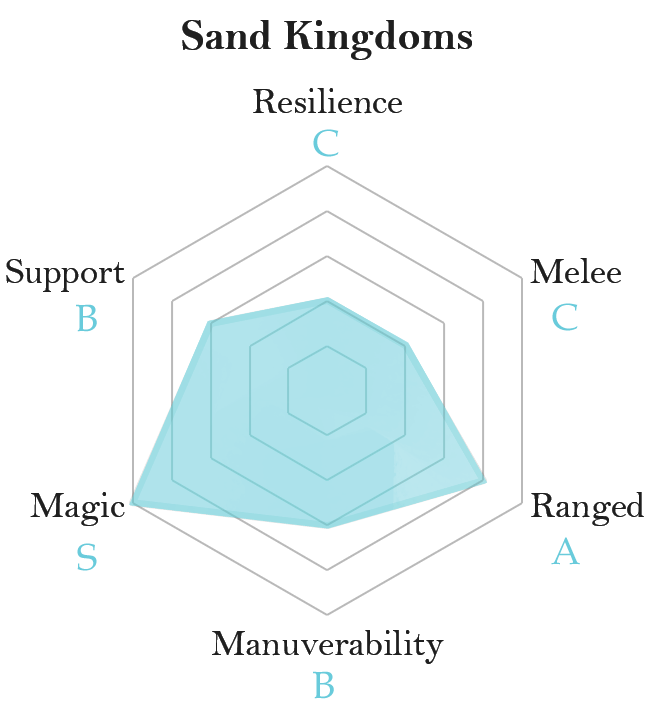

> **tiPS on PlAying tHe SAnD KingDoMS**
>
> Magic offers the Sand Kingdoms lots of variety. Some models can summon creatures and employ
>
> them for protection and offence. The summoner should be protected at all times, as they can offer you numerical superiority. Take a look at all the Spells the models have in their repertoires; they can turn the tide in a pinch.

######## \
HELIAN LEAGUE 

> The Helian League is, regarding its play-style, the most balanced of the four factions.
>
> It boasts proficient magic users,
>
> martial prodigies,
>
> and quality gear. The models share a form of synergy that can be
>
> used to overcome any opponent if utilized correctly and their abilities make their parties powerful and versatile. However, this might change if the number of the models under your command starts to dwindle.

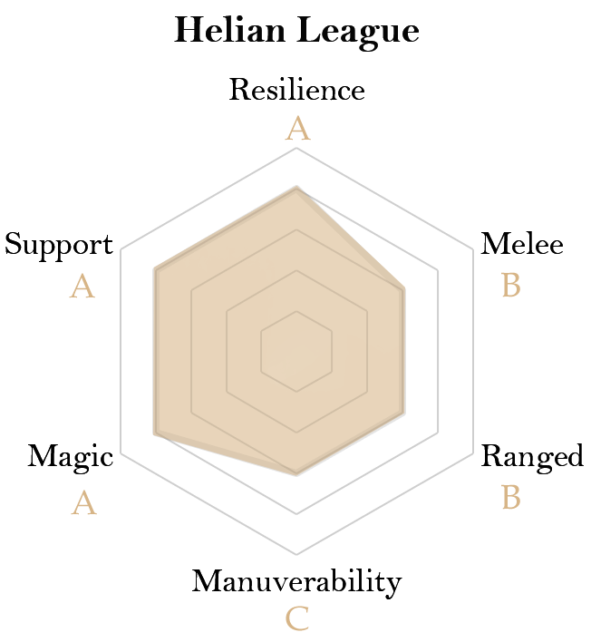

> **tiPS on PlAying tHe HeliAn leAgue**
>
> Models of the Helian League should stick together, employ synergies among the models (like the Chain Attack Skill etc.) and remain preferably in mid-ranged combat.
>
> Take advantage of healing Spells, the Protector ability and powerful offensive Spells like Smite!

########  NAUTRAL MODELS 

> Mercenaries, otherwise known as neutral models, can be recruited into any party.

<figure>

<figcaption>
103
</figcaption>
</figure>

103

###  WHAT NEXT? 

> **viSit tHe elDFAll CHroniCleS WebPAge AnD SoCiAl MeDiA to leArn More!**

########  WEBPAGE 

> The webpage is an extension of the game.
>
> Find online resources, the store, blogs, lore, tutorials, the gallery, and more!
>
> **ONLINE RESOURCES**
>
> Looking for more content? Visit the “Resources” section on our website to access free Quests, model profiles, cards, abilities, the latest versions of all game documents, and more.
>
> You’ll also find print-ready files for improved accessibility and ease of use.
>
> Future translations and localized resources will be added here as they become available.
>
> **GUILD HALL**

To access free online resources, scan the QR code.

> Access rules, unit profiles, and updates online through the free Guild Hall companion app. Scan the QR code to access it.
>
> **ORGANIZED PLAY RULES**
>
> Eldfall Chronicles features a living rulebook—while the core rules remain stable, additional complimentary documents are frequently added and expanded.
>
> Please note that printed materials may not always include the most up- to-date content.
>
> You can find the latest Errata, Organized Play Rules, and related documents online by scanning
>
> **HOW TO EXPAND THE SKIRMISH**

the QR code.

> **COMPETITIVE PLAY**
>
> Test your skills in competitive play and see how you rank against players from around the world!
>
> The Skirmish Wargame is built for competitive 1v1 play. Each season features its own leaderboards and evolving competitive Quests.
>
> To expand your faction, we recommend Expansions.
>
> These range from larger expansions that introduce new gameplay options to Reinforcement Packs that add additional models and tactical flexibility to your warbands.

######### 104

> **GUILDMASTER PROGRAM**

Any dedicated player or store representative interested in hosting events can become a Guildmaster and enjoy a variety of associated benefits.

> Guildmasters are the official community leaders of Eldfall Chronicles.
>
> You can learn about the terms, conditions, and benefits of becoming a Guildmaster by scanning
>
> the QR code.

######### 105

> **DUNGEON-CRAWL**
>
> **SOCIAL MEDIA**
>
> Eldfall Chronicles – Dungeon Crawl is a narrative-driven tabletop experience where small groups of characters venture into perilous locations, overcome monsters, solve
>
> quests, and progress through stories that evolve over multiple sessions with agency.
>
> Dungeon Crawl primarily emphasizes cooperative and solo storytelling adventures with campaign progression and character development.
>
> Eldfall Chronicles dungeon crawl campaigns are a perfect entry into tactical dungeon-crawlers,
>
> combining rich lore, exploration, and dynamic combat.
>
> Eldfall Chronicles: Northern Wind

106

###  INDEX 

###### A

> ABILITIES 9
>
> ACC (ACCURACY) 8
>
> ACCESSORY 14
>
> ACTION 22
>
> ACTION STEP 41
>
> ACTIVATION 24, 37
>
> ACTIVATION POINTS (AP) 23
>
> ACTIVATION SEQUENCE 39
>
> ACTIVATION STEP 39
>
> ACTIVE PLAYER 24
>
> ACTIVE ROLE 22, 24, 37
>
> ACUTE SENSES 68
>
> ADVANCED 47
>
> ADVANTAGE (X) 68
>
> AFFILIATION 16
>
> AFFINITY (ELEMENT) 30, 68
>
> AG (AGILITY) 8
>
> ALCHEMIST 63
>
> AOE 25
>
> AQUATIC 74
>
> ARCHERY 73
>
> AREA OF EFFECT 25
>
> AREA OF EFFECT (AOE) 47
>
> ARM (ARMOR) 8
>
> ARMOR-PIERCING 68
>
> ARMSMASTER 63
>
> ARTIFICER 63
>
> ASSASSIN 63
>
> ASSASSINATION 73
>
> ASSIST 51
>
> ASSISTED MODE 19
>
> ATTACK 17, 26, 51
>
> ATTACK OF OPPORTUNITY. 40, 41
>
> ATTACK ROLL 17
>
> ATTRIBUTE ROLL 17
>
> ATTRIBUTES 8
>
> AUTHORITY STRATAGEMS 12
>
> AWARENESS 22

###### B

> BACK 21
>
> BACKSTAB 65
>
> BASE CONTACT 19
>
> BERSERK 73
>
> BERSERKER 63
>
> BLEED 68
>
> BLEEDING 59
>
> BLINDED 59
>
> BROKEN MORALE 47
>
> BRUTE 68
>
> BURN (X) 68

C

> CACHE 13
>
> CASTER 30
>
> CASTING 30
>
> CASTING AURA 24
>
> CASTING AURA REACH 24
>
> CHAIN ATTACK 65
>
> CHARACTER 47
>
> CHARM I/II 65
>
> CIRCULAR 25
>
> CIVILIAN 63
>
> CLAIRVOYANCE 65
>
> CLASS 8
>
> CLASSES (LIST) 63
>
> CLEAVE 68
>
> CLIMB 49
>
> CLIMBING 65
>
> COMBAT ARTS 11
>
> COMBAT ARTS (LIST) 73
>
> CONDITION 44
>
> CONFRONTATION 28
>
> CONFRONTATION ROLL 27, 28
>
> CONFUSED 59
>
> CONJURATION 32
>
> CONSTRUCT 68
>
> CONSUMABLES 14
>
> CONTINUOUS 68
>
> COUP DE ’GRACE 55
>
> COVER 54
>
> CREATURE 63
>
> CRIPPLED 59
>
> CRIPPLING 68
>
> CRITICAL HIT 27
>
> CROUCHED 59

###### D

> D20 17
>
> DAMAGE 28
>
> DAMAGE ROLL 17, 28
>
> DANGEROUS 75
>
> DARK 75
>
> DASH 65
>
> DEAD (STATE) 29, 61
>
> DEATHBLOW 55
>
> DEEP 74

######### 107

> DEF (DEFENSE) 8
>
> DEMON 68
>
> DENSE 75
>
> DEPLOYMENT 36
>
> DEPLOYMENT ZONE 36
>
> DICE ROLL 17
>
> DIFFICULT 75
>
> DISENGAGE 55
>
> DISMOUNTING 77
>
> DISTANCE 18
>
> DODGE 55
>
> DRUID 63
>
> DUAL WIELD 65
>
> DUELIST 69

###### E

> ELEMENT 30
>
> ELEMENTAL 69
>
> ELEMENTAL ESSENCE 69
>
> ENCHANTER 63
>
> ENCHANTMENT 31, 63
>
> END PHASE 38
>
> ENGAGED 60
>
> ENGAGED (STATE) 52
>
> ENLIST 33
>
> ENVIRONMENTS (LIST) 74
>
> EQUIP 13

###### F

> FACTION 33
>
> FACTIONS & THEIR PLAY-STYLES 99
>
> FALL DAMAGE 29
>
> FAMILIAR 69
>
> FATIGUED 60
>
> FEARLESS 69
>
> FENCING 73
>
> FIELD 34
>
> FIELD SETUP 79
>
> FINISHING STRIKE 65
>
> FLICKER 66
>
> FLIGHT 66
>
> FLYING 60
>
> FOCUS 69
>
> FOLLOW-UP 66
>
> FORESIGHT 66
>
> FOREST 75
>
> FORMAT OF PLAY 35
>
> FREEZING 75
>
> FRIENDLY FIRE 47, 55
>
> FRONT ARC 20
>
> FROSTBITE 69
>
> G
>
> GAME SEQUENCE 34
>
> GAME SIZE 33, 34
>
> GUILD HALL 6
>
> GUILDSWORN 35

###### H

> HAZY 75
>
> HEALING 30, 64
>
> HEAVY COVER 54
>
> HIERARCHY 44
>
> HIGHER GROUND 54
>
> HIT 26
>
> HIT AND RETREAT 66
>
> HITBOX 9
>
> HOSTILE 43
>
> HOSTILE BEHAVIOR 43
>
> HOSTILES TURN 43
>
> HP (HEALTH POINTS) 8

###### I

> IDLE 49
>
> IGNORE ARMOR 69
>
> IGNORE SHIELD 69
>
> IMMOBILIZED 61
>
> IMPEDE 66
>
> INCAPACITATED 29, 61
>
> INCORPOREAL 69
>
> INFILTRATION 66
>
> INITIATIVE CHECK 36, 92
>
> INSPIRING I 69
>
> INTERACT 56
>
> INTERVAL 24
>
> INTIMIDATING 69
>
> INT (INTELLECT) 8
>
> INVENTORY 13
>
> ISSUE A DUEL 57
>
> ITEMS 13

###### J

> JUMP 50

###### K

> KNOCKBACK (X) 70
>
> KNOCKDOWN 70

###### L

> LADDER 20
>
> LEADER 12, 34
>
> LEADER OF A PARTY 12

######### 108

> LEAP 66
>
> LIGHT COVER 54
>
> LIMIT 9
>
> LINE OF SIGHT 20
>
> LINE OF SIGHT ARC 21
>
> LOOT 13

###### M

> MAGE 30, 63
>
> MAGIC 30
>
> MANA 63
>
> MANA COST 32, 58, 70
>
> MANA COUNTER 30, 63
>
> MANAGMATIC 75
>
> MARKSMAN 63
>
> MELEE ATTACK 52
>
> MENACING (X) 70
>
> MINDGAME 70
>
> M (MORALE) 8
>
> MODEL 6
>
> MODEL PROFILE 6
>
> MODES OF MEASURING 18
>
> MODIFIERS 18
>
> MONSTER 48
>
> MOUNTAINOUS 75
>
> MOUNT (CLASS) 77
>
> MOUNTED RULES 77
>
> MOUNTING 77
>
> MOVEMENT 20
>
> MOVEMENT STEP 39
>
> MULTIPLAYER 35
>
> MYSTIC 64

###### N

> NAME 8
>
> NEUTRAL AFFILIATION 16
>
> NEUTRAL MODEL 33
>
> NORMAL ACTION 22
>
> NORMAL ACTION (LIST) 51
>
> NORMAL MOVEMENT 20
>
> NORMAL MOVEMENT (LIST) 49
>
> NOTHING 56

###### O

> OVER-ENCUMBERED 13

###### P

> PANICKED 61
>
> PANICKED STATE 47
>
> PARTY 33
>
> PERCEIVE 56, 62
>
> PLAYER COUNT 35
>
> PLAYING THE GAME 24
>
> POISONED 61
>
> POISON I/II 70
>
> POWER (PW) 17
>
> PRE-MEASURING 18
>
> PRIMARY WEAPON 13
>
> PRIORITY 48
>
> PROFANE MIASMA 75
>
> PROFILE CARD 6
>
> PROTECTOR 66

###### Q

> QTY (QUANTITY) 13
>
> QUANTITY 13
>
> QUEST 33
>
> QUESTS (LIST) 94
>
> QUEST-SPECIFIC 80, 86

###### R

> RANGED 51
>
> RANGED ATTACK 53
>
> RANGED FRIENDLY FIRE 54
>
> RANGER 64
>
> REACH (RCH) 24
>
> REACTING 23
>
> REACTION STEP 40
>
> REACTIVE PLAYER 24
>
> REACTIVE ROLE 22, 24, 37
>
> REALISM MODE 19
>
> RECOVERY CHECK 48
>
> RECRUITMENT COST 9, 33
>
> RECRUITMENT POINT 33
>
> REGENERATION (X) 67
>
> REROLL 17
>
> RESISTANCE I/II (X) 70
>
> RESOLUTION STEP 43, 55, 83
>
> RESOLUTION STEP 42
>
> RESOURCEFUL I/II 70
>
> RESOURCES 35
>
> RICOCHET (X) 70
>
> RIDER 77
>
> RITUAL 32, 58
>
> RIVALRY 35
>
> ROGUE 64
>
> ROUND 37
>
> RUN 50, 61

###### S

> SACRED GROUND 76
>
> SCHEMES (LIST) 80
>
> SCORCHING 76
>
> SENTINEL 64
>
> SHALLOW 74

######### 109

> SHIELDS 14
>
> SHROUDED 62
>
> SIZE 9
>
> SKILL 10
>
> SKILLS (LIST) 65
>
> SLOWED 62
>
> SNIPE 67
>
> SOLDIER 64
>
> SOLO 35
>
> SORCERER 64
>
> SORCERY 30
>
> SPD (SPEED) 8
>
> SPECIAL 11
>
> SPECIAL ACTIONS 22
>
> SPECIAL ACTIONS (LIST) 57
>
> SPECIAL BEHAVIOR 44
>
> SPECIAL MOVEMENT 20, 39
>
> SPECIAL MOVEMENTS (LIST) . 49 SPELL 30
>
> SPELLBOUND (X) 70
>
> SPELLCRAFT 11
>
> SPRAY 26
>
> STAGGER 70
>
> STANDARD MODE 19
>
> STA (STAMINA) 8
>
> STATE 22
>
> STATES (LIST) 59
>
> STATS 8
>
> STEALTH 67
>
> STRATAGEMS 12
>
> STRATEGIC PHASE 38
>
> STRATEGIST 70
>
> STRIKE 26
>
> STRIKE VALUE (STK) 26
>
> STRONG POISON 70
>
> STUN 71
>
> SUBTERFUGE STRATAGEMS 12
>
> SUMMONED CREATURE 32
>
> SUMMONER 64
>
> SUMMONING LIMIT 32
>
> SUPPLEMENTARY RULE 35
>
> SURPRISE ATTACK 71
>
> SURVIVAL 71
>
> SWAMP 76
>
> SWEEP I/II 71

###### T

> TABLE 34
>
> TACTICAL PHASE 38, 39
>
> TACTICIAN 71
>
> TARGETLESS 71
>
> TARGET PRIORITY 44
>
> TAUNT 67
>
> TEMPLATE 25
>
> TERRAIN 34, 79
>
> THROWING 71
>
> TIER 44
>
> TOXIC 76
>
> TRACKING 67
>
> TRADE 56
>
> TRAITS 9
>
> TRAITS (LIST) 68
>
> TRAMPLE 71
>
> TRANSMUTATION 31
>
> T (TOUGHNESS) 8
>
> TURN 37
>
> TURN ORDER 36
>
> TWO-HANDED 71

###### U

> UNCOVER 58
>
> UNDEAD 71
>
> UNEQUIP 13
>
> UNKEEN 72
>
> UNSCALABLE 76
>
> UNSTOPPABLE 72
>
> UNWIELDY 72
>
> UPGRADES 34
>
> UPGRADES (LIST) 86
>
> UPKEEP PHASE 38

###### V

> VICTORY POINTS (VP) 47
>
> VIGILANCE 72
>
> VITALIST 64

###### W

> WALK 49
>
> WARRIOR 64
>
> WATCHFUL 72
>
> WEAKENED 62
>
> WEAKENING 72
>
> WEAK POISON 70
>
> WEAPONS 14
>
> WEIGHT 13
>
> WGT (WEIGHT) 13
>
> WIZARD 64
>
> WOUND 28

######### 110

> 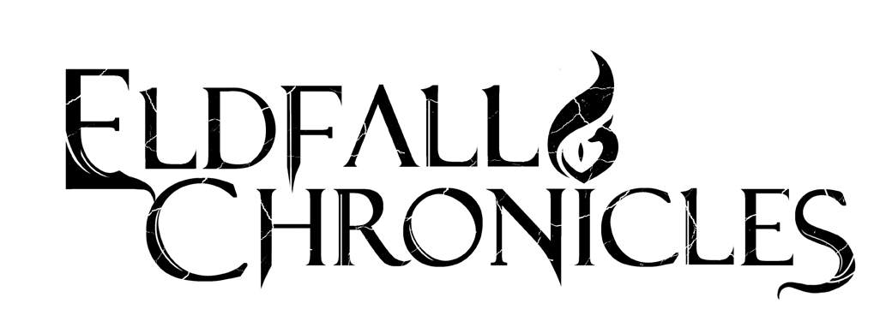
>
> Eldfall Chronicles is in its core a competitive wargame with organized tournament play in mind. Thus, it will gain new expansions and models to present players with fresh content and new challenges.
>
> The rules, profiles of models and other documents will change or update if the need arises (to ensure the general balance of the game). Any such changes to the rules, profiles of models, or important documents will appear on our webpage eldfall-chronicles.com under “resources” and will be featured
>
> in newer editions of the game. These documents take priority over any past editions and their use is mandatory for participation on tournaments, competitions and organized play.
>
> The use of past (out-dated) documents is, however, allowed in casual play.
>
> Published by Freecompany d.o.o. \| eldfall-chornicles.com
>
> **© Copyright 2026 Freecompany d.o.o.**
>
> Eldfall Chronicles and Freecompany, and all associated logos, names, designs, and other creative content are either Trademark or Copyright of Freecompany d.o.o., Inc. 2020 Ljubljana, Slovenia,
>
> European Union. Designed in Slovenia.
>
> Eldfall Chronicles Rulebook,
>
> 1.6 Edition.
>
> Eldfall Chronicles is a work of fiction. The story, all names, characters, and incidents portrayed in this production are fictitious.
>
> **CREDITS**
>
> Written by: Žiga Gantar,
>
> Tjaša Gaber.
>
> Edited and designed by: Tjaša Gaber, Gabr Forjan.
>
> Developed by: Žiga Gantar, Tjaša Gaber, Aljaž Šikovec, Samo Planinc. Character and other in-game art: Žiga Gantar, Alex Malveda.
>
> Landscape art by: Žiga Gantar.
>
> Photography: Tjaša Gaber.
>
> 111

> 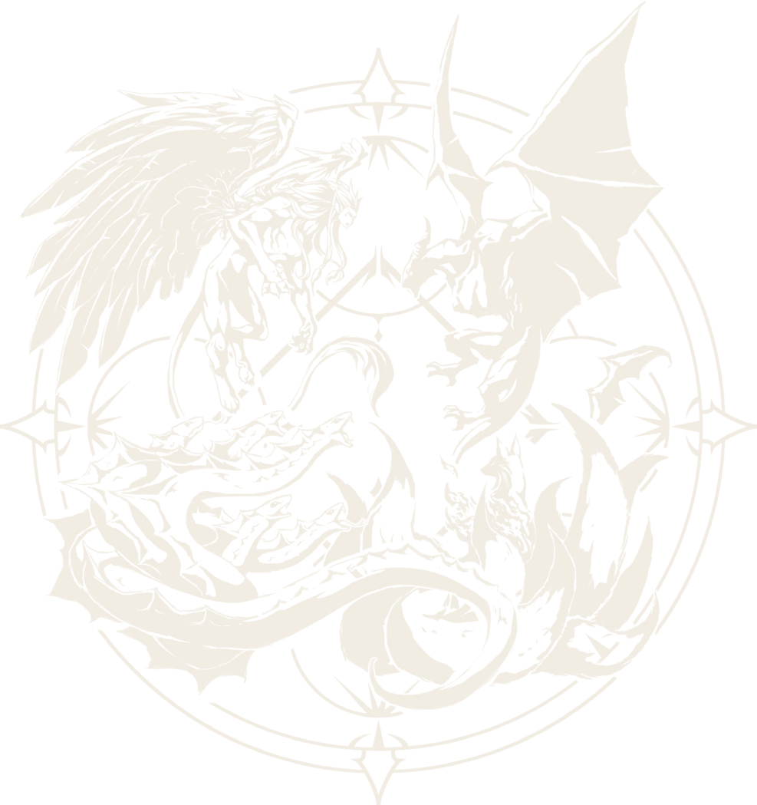
>
> 112
